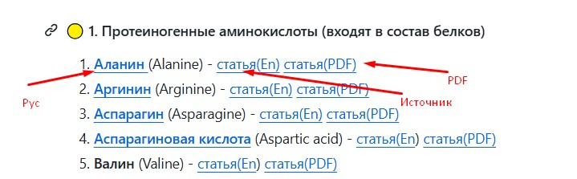

### 🧚‍♂️Максимально полный список аминокислот, включая стандартные, редкие, непротеиногенные, синтетические и модифицированные. Перечень охватывает и природные, и полученные искусственно.

#### 🟡 1. Протеиногенные аминокислоты (входят в состав белков)

1. [**Аланин** ](Аланин.md)(Alanine) - [статья(En)](https://storm.genie.stanford.edu/article/alanine-1146711) [статья(PDF)](PDF/Alanine.pdf)
2. **[Аргинин](Аргинин.md)** (Arginine) - [статья(En)](https://storm.genie.stanford.edu/article/arginine-1146749) [статья(PDF)](PDF/Arginine.pdf)
3. **[Аспарагин](Аспаргин.md)** (Asparagine) - [статья(En)](https://storm.genie.stanford.edu/article/asparagine-1146852) [статья(PDF)](PDF/Asparagine.pdf)
4. **[Аспарагиновая кислота](Аспарагиновая_кислота.md)** (Aspartic acid) - [статья(En](https://storm.genie.stanford.edu/article/aspartic-acid-1147096)) [статья(PDF)](PDF/Aspartic_acid.pdf)
5. **Валин** (Valine) - [статья(En](https://storm.genie.stanford.edu/article/valine-1147161)) [статья(PDF)](PDF/Valine.pdf)
6. **Гистидин** (Histidine) - [статья(En](https://storm.genie.stanford.edu/article/histidine-1147214)) [статья(PDF)](PDF/Histidine.pdf)
7. **Глицин** (Glycine) - [статья(En](https://storm.genie.stanford.edu/article/glycine-1147231)) [статья(PDF)](PDF/Glycine.pdf)
8. **Глутамин** (Glutamine) - [статья(En](https://storm.genie.stanford.edu/article/glutamine-1149680)) [статья(PDF)](PDF/Glutamine.pdf)
9. **Глутаминовая кислота** (Glutamic acid) - [статья(En)](https://storm.genie.stanford.edu/article/glutamic-acid-1149685) [статья(PDF)](PDF/Glutamic_acid.pdf)
10. **Изолейцин** (Isoleucine) - [статья(En)](https://storm.genie.stanford.edu/article/isoleucine-1150289) [статья(PDF)](PDF/Isoleucine.pdf)
11. **Лейцин** (Leucine) - [статья(En)](https://storm.genie.stanford.edu/article/leucine-1150295) [статья(PDF)](PDF/Leucine.pdf)
12. **Лизин** (Lysine) - [статья(En](https://storm.genie.stanford.edu/article/lysine-1150414)) [статья(PDF)](PDF/Lysine.pdf)
13. **Метионин** (Methionine) - [статья(En](https://storm.genie.stanford.edu/article/methionine-1150727)) [статья(PDF)](PDF/Methionine.pdf)
14. **Пролин** (Proline) - [статья(En](https://storm.genie.stanford.edu/article/proline-1150733)) [статья(PDF)](PDF/Proline.pdf)
15. **Серин** (Serine) - [статья(En](https://storm.genie.stanford.edu/article/serine-1153083)) [статья(PDF)](PDF/Serine.pdf)
16. **Треонин** (Threonine) - [статья(En](https://storm.genie.stanford.edu/article/threonine-1153090)) [статья(PDF)](PDF/Threonine.pdf)
17. **Триптофан** (Tryptophan) - [статья(En)](https://storm.genie.stanford.edu/article/tryptophan-1153095) [статья(PDF)](PDF/Tryptophan.pdf)
18. **Тирозин** (Tyrosine) - [статья(En)](https://storm.genie.stanford.edu/article/tyrosine-1153269) [статья(PDF)](PDF/Tyrosine.pdf)
19. **Фенилаланин** (Phenylalanine) - [статья(En)](https://storm.genie.stanford.edu/article/phenylalanine-1153321) [статья(PDF)](PDF/Phenylalanine.pdf)
20. **Цистеин** (Cysteine) - [статья(En)](https://storm.genie.stanford.edu/article/cysteine-1153667) [статья(PDF)](PDF/Cysteine.pdf)

---

#### 🟡 2. Условно протеиногенные (входят в некоторые организмы или в специфические белки)

21. Селеноцистеин (Selenocysteine) - [статья(En)](https://storm.genie.stanford.edu/article/selenocysteine-1158689) [статья(PDF)](PDF/Selenocysteine.pdf)
22. Пирролизин (Pyrrolysine) - [статья(En)](https://storm.genie.stanford.edu/article/pyrrolysine-1153731) [статья(PDF)](PDF/Pyrrolysine.pdf)

---

#### 🟡 3. Непротеиногенные природные аминокислоты

23. Орнитин (Ornithine) - [статья(En)](https://storm.genie.stanford.edu/article/ornithine-1154037) [статья(PDF)](PDF/Ornithine.pdf)
24. Цитруллин (Citrulline) - [статья(En)](https://storm.genie.stanford.edu/article/citrulline-1154044) [статья(PDF)](PDF/Citrulline.pdf)
25. Таурин (Taurine) - [статья(En)](https://storm.genie.stanford.edu/article/taurine-1155976) [2](https://storm.genie.stanford.edu/article/how-does-taurin-influence-metabolic-syndrom%2C-insulin-sensitivity%2C-diabetes-and-fat-metabolism-571521) [статья(PDF)](PDF/Taurine.pdf)
26. Гамма-аминомасляная кислота (GABA, Gamma-aminobutyric acid) - [статья(En)](https://storm.genie.stanford.edu/article/gaba%2C-gamma-aminobutyric-acid-1155997) [статья(PDF)](PDF/GABA_Gamma-aminobutyric_acid.pdf)
27. Бета-аланин (Beta-Alanine) - [статья(En)](https://storm.genie.stanford.edu/article/beta-alanine-1156017) [статья(PDF)](PDF/Beta-Alanine.pdf)
28. Гомоцистеин (Homocysteine) - [статья(En)](https://storm.genie.stanford.edu/article/homocysteine-1156031) [статья(PDF)](PDF/Homocysteine.pdf)
29. Лантионин (Lanthionine) - [статья(En)](https://storm.genie.stanford.edu/article/lanthionine-1158627) [статья(PDF)](PDF/Lanthionine.pdf)
30. Канаванин (Canavanine) - [статья(En)](https://storm.genie.stanford.edu/article/canavanine-1158666) [статья(PDF)](PDF/Canavanine.pdf)
31. Саркозин (Sarcosine) - [статья(En)](https://storm.genie.stanford.edu/article/sarcosine-1158683) [статья(PDF)](PDF/Sarcosine.pdf)
32. Дейдроаланин (Dehydroalanine) - [статья(En)](https://storm.genie.stanford.edu/article/dehydroalanine-1158694) [статья(PDF)](PDF/Dehydroalanine.pdf)
33. Гидроксипролин (Hydroxyproline) - [статья(En)](https://storm.genie.stanford.edu/article/hydroxyproline-1158698) [статья(PDF)](PDF/Hydroxyproline.pdf)
34. Гидроксилизин (Hydroxylysine) - [статья(En)](https://storm.genie.stanford.edu/article/hydroxylysine-1162232) [статья(PDF)](PDF/Hydroxylysine.pdf)
35. Эрготионин (Ergothioneine) - [статья(En)](https://storm.genie.stanford.edu/article/ergothioneine-1162241) [статья(PDF)](PDF/Ergothioneine.pdf)
36. Бета-метилгистидин (Beta-methylhistidine) - [статья(En)](https://storm.genie.stanford.edu/article/beta-methylhistidine-1162246) [статья(PDF)](PDF/Beta-methylhistidine.pdf)
37. Цистатинин (Cystathionine) - [статья(En)](https://storm.genie.stanford.edu/article/cystathionine-1162255) [статья(PDF)](PDF/Cystathionine.pdf)
38. Норлейцин (Norleucine) - [статья(En)](https://storm.genie.stanford.edu/article/norleucine-1162261) [статья(PDF)](PDF/Norleucine.pdf)
39. Норвалин (Norvaline) - [статья(En)](https://storm.genie.stanford.edu/article/norvaline-1166374) [статья(PDF)](PDF/Norvaline.pdf)
40. Тионин (Thionine) - [статья(En)](https://storm.genie.stanford.edu/article/thionine-1166378) [статья(PDF)](PDF/Thionine.pdf)
41. Селенометионин (Selenomethionine) - [статья(En)](https://storm.genie.stanford.edu/article/selenomethionine-1166384) [статья(PDF)](PDF/Selenomethionine.pdf)
42. Дезаминированная тирозин (Dityrosine) - [статья(En)](https://storm.genie.stanford.edu/article/dityrosine-1166389) [статья(PDF)](PDF/Dityrosine.pdf)
43. Фосфосерин (Phosphoserine) - [статья(En)](https://storm.genie.stanford.edu/article/phosphoserine-1166393) [статья(PDF)](PDF/Phosphoserine.pdf)
44. Фосфотреонин (Phosphothreonine) - [статья(En)](https://storm.genie.stanford.edu/article/phosphothreonine-1166401) [статья(PDF)](PDF/Phosphothreonine.pdf)
45. Фосфотирозин (Phosphotyrosine) - [статья(En)](https://storm.genie.stanford.edu/article/phosphotyrosine-1166403) [статья(PDF)](PDF/Phosphotyrosine.pdf)
46. Карбокси-глутамат (Carboxyglutamate) - [статья(En)](https://storm.genie.stanford.edu/article/carboxyglutamate-1166406) [статья(PDF)](PDF/Carboxyglutamate.pdf)

---

#### 🟡 4. Синтетические аминокислоты и производные (созданы человеком или получены модификацией)

47. Альфа-аминоизомасляная кислота (α-Aminoisobutyric acid) - [статья(En)](https://storm.genie.stanford.edu/article/alfa-aminoisobutyric-acid-1166412) [статья(PDF)](PDF/alfa_Aminoisobutyric_acid.pdf)
48. Альфа-метилаланин (α-Methylalanine) - [статья(En)](https://storm.genie.stanford.edu/article/alfa-methylalanine-1166601) [статья(PDF)](PDF/alfa_Methylalanine.pdf)
49. Бета-метилаланин (β-Methylalanine) - [статья(En)](https://storm.genie.stanford.edu/article/b-methylalanine-1170502) [статья(PDF)](PDF/b_Methylalanine.pdf)
50. Норсерин (Norserine) - [статья(En)](https://storm.genie.stanford.edu/article/norserine-amino-acid-1170510) [статья(PDF)](PDF/Norserine_amino_acid.pdf)
51. Норлизин (Norlysine) - [статья(En)](https://storm.genie.stanford.edu/article/norlysine-1170518) [статья(PDF)](PDF/Norlysine.pdf)
52. Пентафторфенилаланин (Pentafluorophenylalanine) - [статья(En)](https://storm.genie.stanford.edu/article/pentafluorophenylalanine-1170793) [статья(PDF)](PDF/Pentafluorophenylalanine.pdf)
53. Фтораланин (Fluoroalanine) - [статья(En)](https://storm.genie.stanford.edu/article/fluoroalanine-1186973) [статья(PDF)](PDF/Fluoroalanine.pdf)
54. Азидоаланин (Azidoalanine) - [статья(En)](https://storm.genie.stanford.edu/article/azidoalanine-1186976) [статья(PDF)](PDF/Azidoalanine.pdf)
55. Фотоактивная аминокислота (Photoleucine) - [статья(En)](https://storm.genie.stanford.edu/article/photoleucine-1186983) [статья(PDF)](PDF/Photoleucine.pdf)
56. Диазоаланин (Diazoalanine) - [статья(En)](https://storm.genie.stanford.edu/article/diazoalanine-1186989) [статья(PDF)](PDF/Diazoalanine.pdf)
57. Циклогексилаланин (Cyclohexylalanine) - [статья(En)](https://storm.genie.stanford.edu/article/cyclohexylalanine-1187000) [статья(PDF)](PDF/Cyclohexylalanine.pdf)
58. Пара-нитрофенилаланин (p-Nitrophenylalanine) - [статья(En)](https://storm.genie.stanford.edu/article/p-nitrophenylalanine-1187007) [статья(PDF)](PDF/p_Nitrophenylalanine.pdf)
59. Альфа-аминоадипиновая кислота (α-Aminoadipic acid) - [статья(En)](https://storm.genie.stanford.edu/article/alfa-aminoadipic-acid-1187018) [статья(PDF)](PDF/alfa_Aminoadipic_acid.pdf)
60. Альфа-аминокапроновая кислота (α-Aminocaproic acid) - [статья(En)](https://storm.genie.stanford.edu/article/alfa-aminocaproic-acid-1187032) [статья(PDF)](PDF/alfa_Aminocaproic_acid.pdf)
61. Альфа-аминопимелиновая кислота (α-Aminopimelic acid) - [статья(En)](https://storm.genie.stanford.edu/article/alfa-aminopimelic-acid-1187040) [статья(PDF)](PDF/alfa_Aminopimelic_acid.pdf)
62. О-метилтирозин (O-Methyltyrosine) - [статья(En)](https://storm.genie.stanford.edu/article/o-methyltyrosine-1187044) [статья(PDF)](PDF/O_Methyltyrosine.pdf)
63. Нитротирозин (Nitrotyrosine) - [статья(En)](https://storm.genie.stanford.edu/article/nitrotyrosine-1208872)
64. Азотирозин (Azotyrosine) - [статья(En)](https://storm.genie.stanford.edu/article/azotyrosine-1208879)

---

#### 🟡 5. Экзотические аминокислоты из природных источников (бактерии, растения, морские организмы)

65. Стрептозамин (Streptozamine) - [статья(En)](https://storm.genie.stanford.edu/article/streptozamine-1208887)
66. Пара-аминосалициловая кислота (p-Aminosalicylic acid) - [статья(En)](https://storm.genie.stanford.edu/article/p-aminosalicylic-acid-1208892)
67. Дезоксирибозилглицин (Deoxyribosylglycine) - [статья(En)](https://storm.genie.stanford.edu/article/deoxyribosylglycine-1208895)
68. Креатинин (Creatinine) - [статья(En)](https://storm.genie.stanford.edu/article/creatinine-1208899)
69. Никотиниламинокислота (Nicotinylamino acid) - [статья(En)](https://storm.genie.stanford.edu/article/nicotinylamino-acid-1208903)
70. Мирозмин (Myrosmine) - [статья(En)](https://storm.genie.stanford.edu/article/myrosmine-1208914)
71. Пиперазиновая кислота (Piperazine acid) - [статья(En)](https://storm.genie.stanford.edu/article/piperazine-acid-1208920)

---

#### 🟡 6. Редкие аминокислоты, найденные в метеоритах и космических объектах

72. Изовалин (Isovaline) - [статья(En)](https://storm.genie.stanford.edu/article/isovaline-1208928)
73. Псевдолевцин (Pseudoleucine) - [статья(En)](https://storm.genie.stanford.edu/article/pseudoleucine-1220715)
74. Аминокислоты с D-конфигурацией (D-Amino acids) – почти все стандартные L-аминокислоты имеют D-аналоги в природе

---

#### 🟡 7. Аминокислотные аналоги, использующиеся в биотехнологиях и исследованиях

75. Азааланин (Azaalanine) - [статья(En)](https://storm.genie.stanford.edu/article/azaalanine-1220884)
76. 2-аминобутират (2-Aminobutyrate) - [статья(En)](https://storm.genie.stanford.edu/article/2-aminobutyrate-1220891)
77. Пирувоил (Pyruvoyl) – ковалентно модифицированный серин в ферментах - [статья(En)](https://storm.genie.stanford.edu/article/pyruvoyl-1220900)
78. Оксетанилаланин (Oxetanylalanine) - [статья(En)](https://storm.genie.stanford.edu/article/oxetanylalanine-1220909)

---

**Итого**: более 75 различных аминокислот, многие из которых встречаются либо в природе, либо синтезированы человеком для специальных целей.
