### **Почему люди плотоядны**

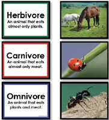

Травоядное животное – это животное, которое питается только растениями. Плотоядное животное — это животное, которое ест почти исключительно мясо. Всеядность – это животное, которое питается как растениями, так и мясом. Однако это определение может быть проблематичным. Например, кошачьи известны как облигатные плотоядные, потому что почти каждое растение убьет их или причинит серьезный вред. Тем не  менее, они могут есть некоторые растения, а домашних кошек часто кормят зерноми растительными гранулами. Это показывает, что они могут выживать и на растительной пище. Делает ли это их всеядными?

Нам нужно определить, что является оптимальным для животного — что для него лучше всего питаться и выживать в дикой природе. Мы также можем думать о всеядности и по-другому. Единственное функциональное определение слова «всеядный», которое имеет смысл, заключается в следующем: либо вы получаете как можно больше питательных веществ как от растений, так и от животных, употребляя их в пищу без разбора, либо в растениях есть необходимые питательные вещества, которые вы не можете получить из мяса, и наоборот, что требует потребления и того, и другого.

Люди не попадают ни в одну из этих категорий. В мясе есть питательные вещества, которые мы должны и не можем получить из растений, но в растениях или грибах нет ничего, что мы должны иметь и не можем получить из мяса. Это правда, что если вы едите разные продукты, вы измените потребности вашего организма в различных питательных веществах, и именно отсюда берутся RDA (рекомендуемые диетические нормы). Тем не менее, они основаны на смешанной диете. Все совсем по-другому, когда вы едите исключительно мясо.

Растения – это живые существа, и они хотят оставаться живыми. Если вы их съедите, они умрут. У всех живых существ есть защита. Животные могут убегать или сопротивляться, но растения используют яд и другие механизмы, чтобы отпугнуть животных и насекомых от их поедания. Яд является основным защитным механизмом.

Это важно, потому что, говоря об оптимальном образе жизни, нужно питаться оптимально. Если мясо обеспечивает оптимальное питание, а растения могут причинять вред благодаря своим защитным химическим веществам, то быть так называемым всеядным не оптимально. Эта концепция играет важную роль в медицине и в нашем понимании хронических заболеваний, которые, как я утверждаю, не являются болезнями как таковыми. Это токсичность и недоедание, а именно накопление токсинов из-за неподходящей для вида диеты и недостатка видоспецифичного питания — слишком много растений, недостаточно животного белка и жира.

Рассмотрим животных в зоопарке. На табличках часто написано: «Не кормите животных». Если кормить этих животных чем-то, что они не едят в дикой природе, они заболевают. Любой приличный смотритель зоопарка знает, что это правда. Но чем они болеют? Ожирение, болезни сердца, диабет, рак, аутоиммунные заболевания, артрит — все эти состояния. Эти болезни не существуют в дикой природе и не существуют у животных, которые питаются оптимальной, биологически адаптированной пищей.

Собаки и кошки известны как плотоядные животные, но мы кормим их зерновыми и растительными гранулами, потому что они дешевые и являются наполнителем. Они тоже болеют и развивают те же болезни, что и мы. Ветеринары в настоящее время показывают, что домашние животные имеют гораздо более высокий уровень так называемых заболеваний человека. Они болеют диабетом, раком и многим другим, как и мы. Это увеличение прекрасно коррелирует с появлением упакованных кормов для собак, которые стали основным способом кормления домашних животных, что привело к резкому росту этих заболеваний.

Средняя продолжительность жизни золотистого ретривера в Америке в 1970-х годах составляла 17 лет. Теперь это 9 лет. Некоторые люди могут сказать, что это связано с агрессивными программами разведения, но золотистый ретривер уже был чистой породой. Я не вижу, как простое разведение большего количества таких особей могло бы сократить продолжительность их жизни вдвое, не вызвав серьезных проблем в других направлениях.

С биологической точки зрения мы можем взглянуть на это несколькими способами. Например, наши зубы сильно изменились за последние восемь миллионов лет, став меньше, потому что мы пережевываем более мягкую пищу. Мы больше не жуем палочки весь день, как это делает горилла. Мы получаем плотоядные приспособления к нашим зубам, и наш мозг становится больше, потому что мы можем поддерживать больший мозг. Нам также нужен больший мозг, чтобы понять, как получать белок животного происхождения и питательные вещества. Мы не можем убить мастодонта или лося голыми руками, мы не можем разорвать его на части и съесть без инструментов. Вот почему мы разработали инструменты и тактики, и вот почему вместо когтей и зубов вырос наш мозг. Вот почему мы живем в домах, а львы — нет, и поэтому мы развили свой интеллект в большей степени, чем шимпанзе и гориллы, хотя они тоже довольно умны.

Если посмотреть на желудочно-кишечный тракт, то pH нашего желудка очень низкий, в среднем от 1,4 до 1,5, ниже, чем у других плотоядных животных (2,2 + - 0,44); Львам обычно около 2 лет. Канюки, грифы и другие падальщики имеют pH от 1,3 до 1,8, потому что их пища имеет высокую бактериальную нагрузку, и им необходимо убивать мясные патогены, чтобы не заболеть. В нашем эволюционном прошлом мы, кажется, вышли из среды падальщиков, поедая остатки добычи, сделанной другими, более физически приспособленными животными. Именно отсюда появились оригинальные каменные орудия — с использованием больших прудовых камней, чтобы вскрывать черепа животных и добраться до мозга, который был очень питательным и содержал много калорий и жира. Тем не менее, травоядные и всеядные животные имеют pH желудка от 3,4 до 5,9 и от 2,8 до 5,9 соответственно, что значительно выше, чем у человека.

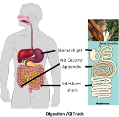

[Источник](https://www.researchgate.net/publication/367308098_Deja_vu_on_the_use_of_meat_resources_by_sabretooth_cats_hominins_and_hyaenas_in_the_Early_Pleistocene_site_of_Fuente_Nueva_3_Guadix-Baza_Depression_SE_Spain)

У нас есть пять органов, которые работают согласованно, чтобы поглощать жир: желудок начинает расщеплять пищу; печень вырабатывает желчь; желчный пузырь хранит эту желчь; Поджелудочная железа вырабатывает ферменты, такие как липазы, которые расщепляют жир; А тонкий кишечник его поглощает. Этот процесс требует много энергии и координации, что указывает на то, что жир чрезвычайно важен.

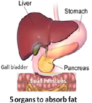

Кроме того, мы не можем расщеплять клетчатку. Травоядные, которые едят пищу с высоким содержанием клетчатки, получают большую часть питательных веществ из расщепления этой клетчатки бактериями в их кишечнике. Ни одно позвоночное животное не может расщеплять волокна, поэтому они выращивают бактерии, которые это делают. Эти бактерии расщепляют клетчатку, поедают ее и выделяют короткоцепочечные жирные кислоты, которые животное затем поглощает. Эти жирные кислоты на 100% состоят из насыщенных жиров. Даже гориллы, которые едят зеленые листья, получают около 70% калорий из насыщенных жиров. Коровы получают до 80% калорий из насыщенных жиров. Эти бактерии также погибают, и животные поглощают из них белок. Мы утратили эту способность миллионы лет назад.

Об этом свидетельствует тот факт, что у нас есть то, что называется аппендиксом. У других приматов и животных, которые переваривают заднюю кишку, аппендикс на самом деле представляет собой очень длинную слепую кишку. Именно там клетчатка распадается на короткоцепочечные жирные кислоты, благодаря которым они получают большую часть питательных веществ и калорий. У нас больше нет такой возможности. Аппендикс представляет собой рудиментарную слепую кишку. «Рудиментарный» означает, что миллионы лет назад это был большой орган, который мог это делать, но поскольку мы не использовали его в течение миллионов лет, он сморщился и исчез. Ваш кишечник имеет очень высокую потребность в энергии, поэтому, если вы не используете часть кишечника, он тратит энергию впустую, что вредно в дикой природе.

Вы также можете посмотреть на это с точки зрения заболеваний толстой кишки и дивертикулеза. Дивертикулез имеет всего несколько коррелирующих факторов. Тем не менее, запоры, диеты с высоким содержанием жиров и мясные диеты не имеют никакой связи с дивертикулезом. На самом деле, было проведено исследование с участием тысяч пациентов и колоноскопия, которое показало, что единственное, что связано с дивертикулезом, который включает в себя выпячивание и разрушение дистального отдела толстой кишки, — это увеличение количества клетчатки и увеличение количества дефекации в день. Чем больше клетчатки люди ели, тем больше они испражнялись и тем больше вероятность заболевания толстой кишки и ее разрушения. Это можно рассматривать как отказ органов. Так же, как и сердечная недостаточность, когда сердце перегружено, недостаточность толстой кишки происходит, когда толстая кишка перегружена и начинает разваливаться.

Когда у людей есть дивертикулит, аппендицит, рак или другие проблемы с кишечником, хирурги часто сажают их на диету с низким содержанием шлаков, которая, по сути, является диетой с низким содержанием клетчатки. Это необходимо для того, чтобы дать кишечнику отдых, снизить его нагрузку, чтобы он мог зажить. Несмотря на заявления о том, что клетчатка полезна для здоровья кишечника, во время проблем с кишечником врачи избегают клетчатки, чтобы помочь кишечнику отдохнуть. Если бы клетчатка была действительно полезной, она должна была бы быть полезной и в этих обстоятельствах, но это не так.

Противоречие очевидно: если предполагается, что клетчатка полезна для вас, почему мы избегаем ее, когда возникает проблема? Не имеет смысла причинять вред и без того поврежденному кишечнику. Людям часто советуют есть клетчатку, но когда возникает проблема, им советуют избегать ее. Эта непоследовательность связана с укоренившимися убеждениями, а не с практикой, основанной на фактических данных.

Кроме того, клетчатка — это отходы, которые ваш организм не может использовать. Если клетчатка полезна для нас, почему наш организм выводит ее любой ценой? Клетчатка вызывает микроссадины в слизистой оболочке кишечника, увеличивая секрецию слизи и воспалительные реакции. Он также блокирует всасывание питательных веществ в тонком кишечнике, что затрудняет усвоение организмом того, что мы едим. В чем заключается эта выгода? С эволюционной точки зрения, не имеет смысла в том, чтобы блокирование поглощения питательных веществ давало преимущество. Когда вы рассматриваете эти вопросы с точки зрения первых принципов, становится ясно, что клетчатка может быть не такой полезной, как принято считать.

Зубы менялись на протяжении миллионов лет. Люди часто говорят, что у нас плоские зубы, потому что спереди они выглядят плоскими. Однако на самом деле это двустворчатые зубы. Плоские зубы, как жернов, могут скользить друг относительно друга и измельчать волокнистые растения в более легкоусвояемую кашу, которая затем может быть проглочена и лучше расщеплена организмом. В отличие от них, наши двустворчатые зубья не позволяют использовать этот скользящий механизм. Если вы сжимаете зубы и пытаетесь двигать челюстью из стороны в сторону, она вообще не двигается. Это связано с тем, что у нас нет плоских зубов. Животные с плоскими зубами, такие как лошади и коровы, обладают этой способностью скольжения. На самом деле, скрежетание зубами у людей может вызвать серьезные проблемы со здоровьем и фактически изнашивает эмаль зубов.

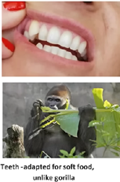

Кроме того, у нас маленькие зубы, меньшие челюсти и меньшие жевательные мышцы. Если вы посмотрите на гориллу, то увидите, что большая часть ее головы состоит из больших височных мышц, которые являются большими жевательными мышцами. Череп гориллы имеет огромный гребень, к которому прикрепляются все эти мышцы, благодаря чему он выглядит как шар мышц на голове.

Наши плечи обладают вращательной способностью, которая позволяет нам очень сильно и быстро бросать предметы, такие как камни, копья или бумеранги, для охоты на животных. Шимпанзе, наши ближайшие родственники в животном мире, не обладают такой способностью. В то время как средний взрослый самец может бросать бейсбольный мяч со скоростью около 60 миль в час (а тренированные особи могут бросать еще быстрее), самый сильный и искусный шимпанзе может бросать бейсбольный мяч только со скоростью около 20 миль в час. Это связано с отсутствием у них вращательной способности в плечах.

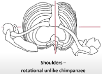

У нас также совсем другие глаза по сравнению с животными-жертвами. Хищные животные, в том числе люди, имеют направленные вперед глаза, которые обеспечивают 3D-зрение, позволяя им фокусироваться на добыче и выслеживать ее. Животные-жертвы обычно имеют более широко посаженные глаза, что дает им более широкое поле зрения для обнаружения приближающихся хищников. Люди часто обсуждают цветовое зрение, предполагая, что оно эволюционировало, чтобы различать разноцветные фрукты и растения. Хотя это возможно, это не имеет большого значения, потому что мы родом из травоядного прошлого. Мы не теряем генетическую черту, если для этого нет эволюционного преимущества. Поскольку потери цветового зрения не было существенного преимущества, мы его сохранили.

Мы все еще можем двигать челюстями из стороны в сторону, что является чертой нашего травоядного прошлого. Не было никаких эволюционных преимуществ в потере этой способности, поэтому она сохранялась. У некоторых людей развился красно-зеленый дальтонизм, который может быть полезным, поскольку улучшает зрение при слабом освещении и улучшает способность видеть контраст между животными и растениями, помогая в охоте. Тем не менее, цветовое зрение остается полезным для других целей, поэтому преимущества сохранения цветового зрения перевешивают преимущества полного дальтонизма.

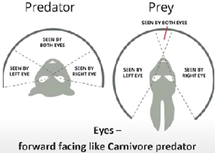

Около восьми миллионов лет назад мы отделились от других приматов, потому что начали есть мясо. По мере того, как мы потребляли больше мяса, мы начали подвергаться генетическим и физическим адаптациям, которые очевидны в летописи окаменелостей. Мы стали более прямостоячими, высокими, у нас уменьшились зубы, челюсти и мозг увеличились. Это изменение в рационе питания также привело к использованию инструментов, поскольку нам нужно было выяснить, как уничтожать больших, мощных животных, таких как мастодонты или даже олени, которые превосходили нас по всем физическим показателям.

Инструменты стали неотъемлемой частью нашего выживания. Первые каменные орудия, известные как фунтовые камни, появились миллионы лет назад, а первое каменное орудие датируется примерно 3,3 миллионами лет назад. Со временем эти инструменты стали более изощренными и использовались для убийства и расчленения животных.

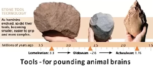

Существенным фактором, подтолкнувшим нас к чистому плотоядности, стало наступление ледниковых периодов около двух-двух с половиной миллионов лет назад. До этого периода полярных ледяных шапок не было. Ледниковые периоды принесли ледяные щиты, которые убили растения и животных, которые от них зависели, оставив только крупную мегафауну, такую как мастодонты и гигантские ленивцы, которые смогли выжить в суровых условиях.

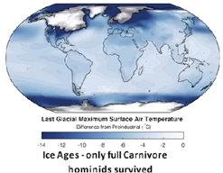

Наши предки, которые уже привыкли есть мясо, стали еще больше зависеть от животного питания в это время, потому что растений было мало. Предки, которые процветали, были теми, кто полностью принял плотоядную диету, что привело к эволюции современных людей.

Летопись окаменелостей и исследования стабильных изотопов дают дополнительные доказательства этого. Исследования стабильного азота, которые анализируют кости животных для определения их рациона, показывают, что ранние люди и неандертальцы были высшими хищниками. У них был более высокий рейтинг плотоядности, чем даже у львов, лис и гиен того же периода и места обитания. Это указывает на то, что наши предки питались не только травоядными, но и нападали на других плотоядных животных, таких как львы, гиены, лисы и волки.

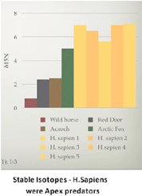

С точки зрения эволюции, мы можем видеть доказательства различных исследований, указывающие на то, что люди были сверхплотоядными хищниками на протяжении как минимум двух миллионов лет. Важное [исследование ](https://onlinelibrary.wiley.com/doi/10.1002/ajpa.24247), проведенное в Университете Тель-Авива в Израиле под руководством профессора Мики Бен-Дора, подтверждает это утверждение.

Исследование показало, что люди являются высшими хищниками, что ставит их на вершину пищевой цепи. Анализ стабильных изотопов это наглядно демонстрирует. Высшие хищники не пасутся; Они не потребляют растительное сырье для грубых кормов. Например, большие белые акулы не едят ламинарию, а львы не едят траву. Эти животные, находящиеся на вершине пищевой цепи, поедают других животных, стоящих ниже их, и это поведение согласуется с тем, что израильское исследование обнаружило о ранних людях.

В дополнение к исследованиям стабильных изотопов, другие показатели также подтверждают, что люди были в основном плотоядными, сосредоточившись на охоте, а не на собирательстве. Это согласуется с временной шкалой ледниковых периодов, начавшихся около двух миллионов лет назад. Во время этих ледниковых периодов фрукты и овощи были дефицитом из-за холодного климата. Аргумент о том, что люди просто двигались к экватору во время ледниковых периодов, не подтверждается научной литературой. Палеонтологическая летопись указывает на то, что по мере того, как шельфовые ледники двигались на юг, люди двигались на север, вероятно, следуя за своей предпочтительной добычей, такой как мастодонты и другие представители мегафауны.

Эти данные свидетельствуют о том, что люди приспособились к плотоядной диете, в значительной степени полагаясь на животные белки и жиры. Эти пищевые привычки значительно повлияли на нашу эволюцию, способствуя развитию наших физических и когнитивных особенностей.

Мы также можем взглянуть на летопись окаменелостей и увидеть, что произошло после сельскохозяйственной революции. Палеоантрополог может определить по окаменелостям, черепу и зубам, жил ли человек до или после сельскохозяйственной революции. Зубы и челюсти правильно развиваются только при правильном питании. Кривые зубы, маленькие челюсти и микрогнатия — все это результат недоедания. Неполучение достаточного количества необходимых питательных веществ делает невозможным правильное развитие нашего организма. Другие факторы, такие как дыхание ртом, сосание большого пальца и использование бутылочки, также могут повлиять на развитие полости рта. Пережевывание самой пищи стимулирует развитие челюстей. С точки зрения питания, для ровных зубов необходимы определенные питательные вещества, такие как витамин K2, K1, кальций, витамин D и другие. Сегодня это явление широко задокументировано в стоматологических журналах. Кривые зубы – это не генетическая проблема, а проблема питания, вызванная недостаточным количеством питательных веществ.

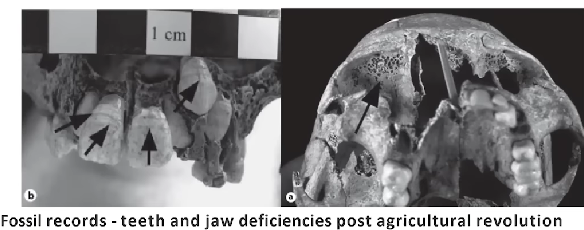

Когда мы изучаем палеонтологическую летопись до сельскохозяйственной революции, мы видим широкие челюсти с прямыми зубами. Зубы мудрости были удобно расположены, а челюсти были большими, прямыми, широкими и выпуклыми. Это не были короткие, скученные челюсти с зубами. Почему сегодня почти никто не вставляет зубы мудрости, в то время как пару сотен лет назад большинство людей делали это, получая правильное питание? Некоторые утверждают, что мы уходим от этого. Однако эволюция занимает гораздо больше времени, чем несколько сотен лет или даже нескольких поколений. Всего поколение или два назад зубы мудрости не обзавелись реже, чем сегодня. Рост в летописи окаменелостей также показывает, что люди в доисторические эпохи были выше и имели больший размер мозга. Средний размер мозга Homo sapiens до сельскохозяйственной революции был на 11% больше, чем сегодня. Мозг неандертальцев был даже больше, чем 50 000 лет назад.

Эта разница, вероятно, связана с тем, что еще до сельскохозяйственной революции людям, возможно, приходилось добавлять собирательство к своим ролям охотников-собирателей. Это было связано с недостаточным питанием животных, которыми они питались, так как мегафауна вымирала. Они искали другие источники питания, чтобы смягчить эту проблему. До этого изменения наш мозг был больше, а люди — выше. Есть регионы, где люди, как известно, охотились на мамонтов, и есть свидетельства, свидетельствующие об их рационе. Некоторые из этих популяций имели средний рост шесть футов два дюйма или даже шесть футов четыре дюйма. Это значительно выше, чем средний рост взрослого мужчины в пять футов восемь дюймов в Америке или пять футов шесть дюймов в Китае, Монголии и других странах, где половина населения ниже этого роста.

В регионах, богатых мясом, таких как те, где люди охотились на крупных мастодонтов, средний рост составлял шесть футов два дюйма или выше. Различные африканские племена, которые в основном потребляют мясо, имеют средний рост от шести футов двух дюймов до шести футов четырех дюймов. Средний рост населения отражает его общее состояние здоровья. Существуют географические и популяционные различия, например, у пигмеев в Африке, которые заметно ниже. И наоборот, в Азии те, кто пережил голод Мао Цзэдуна, страдали от задержки роста. Их потомки в Америке могут достигать роста 6 футов 4 дюйма, что подчеркивает роль питания над генетикой в определении роста.

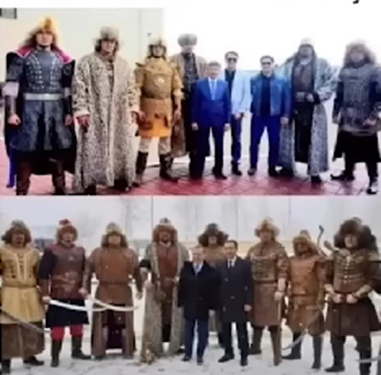

Этот график отслеживает рост мозга за последние 10 миллионов лет, постепенно увеличиваясь, постепенно увеличиваясь, а затем, примерно два-два с половиной миллиона лет назад, внезапно произошел этот всплеск.

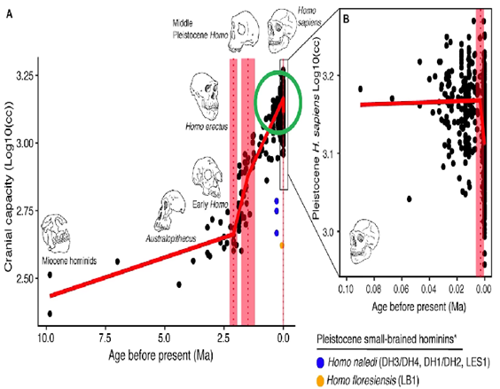

Во время этого постепенного роста мы потребляли больше мяса и жира, стимулируя рост мозга, поскольку мы улучшали качество пищи и разрабатывали инструменты. Затем, когда мы были вынуждены стать полноценными плотоядными из-за ледниковых периодов, развитие нашего мозга взлетело до небес с экспоненциальным ростом вплоть до самого конца. Вы можете хорошо видеть, что в конце также наблюдается резкий спад вниз. Вы не можете утверждать, что это генетическое изменение; Гены не меняются так быстро. Если смотреть пропорционально на этой небольшой площади, то это почти прямая линия, а затем почти прямая линия вниз. Это резкое, резкое снижение.

Там что-то произошло, что-то не было выгодно для нас. Если вы внимательно изучите это, то увидите, что это совпадает с развитием сельского хозяйства и растущей распространенностью растительной пищи, еще до того, как она стала доминирующей, как сегодня, размер нашего мозга уменьшился. Это не идеально. Это явное доказательство того, что это не оптимальный способ питания для нас.

В биохимии мы обсуждаем сытое состояние в сравнении с натощак. Традиционно, состояние кормления — это то, как выглядит ваша биохимия, когда вы поели, а затем, когда вы прекращаете есть, ваша биохимия переключается на другую программу для поддержания жизни и функционирования без поступающей пищи. Я думаю, что это совершенно неправильно. Я считаю, что наше так называемое состояние голодания на самом деле является нашим основным метаболическим состоянием, которое верно для всех диких животных. Это понимание подтверждается исследованиями, проведенными в начале 1980-х годов с участием волков. Первоначально считалось, что волкам необходимо потреблять углеводы, чтобы сжигать углеводы. Тем не менее, наблюдения показали, что волки не нагружаются углеводами перед погоней за карибу в течение десяти часов. Вместо этого они поддерживают постоянный уровень сахара в крови и гликогена в мышцах и печени, оставаясь в стабильном состоянии натощак. Это позволяет их организму мобилизовать энергию и питательные вещества из жировых запасов. Это состояние голодания также является нашим основным метаболическим состоянием.

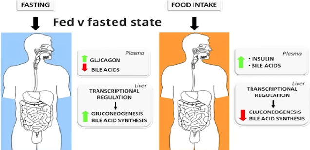

Когда углеводы потребляются, они повышают уровень инсулина, что, в свою очередь, подавляет обмен веществ. В среднем, инсулин снижает скорость основного метаболизма примерно на 300 килокалорий в день. Таким образом, если вы потребляете 2000 калорий с углеводами и 2000 калорий без углеводов, вы будете сжигать на 300 калорий больше пищи в день без углеводов. Концепция калорий на входе и на выходе становится более сложной, потому что то, что вы едите, влияет на скорость метаболизма и расход энергии. Углеводы, белки и жиры — это не просто источники калорий; Они обладают различными химическими эффектами и функциями в организме. Инсулин, в частности, создает проблемы, поскольку он подавляет высвобождение энергии из клеток, блокируя такие процессы, как липолиз, необходимые для расщепления жира для производства энергии через глюконеогенез, синтез гликогена и производство кетонов для функций мозга и тела. Инсулин также влияет на лептин, гормон из жировых запасов, который сигнализирует мозгу о доступных уровнях энергии, действуя как топливный манометр. Когда инсулин (и фруктоза) блокируют лептин, мозг ощущает нехватку энергии, даже если жировые запасы в изобилии. Это приводит к колебаниям уровня сахара в крови, вызывая сигналы голода несколько раз в день, создавая ощущение острой потребности в пище.

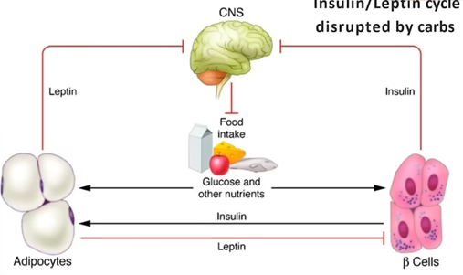

Это изображает лептин-инсулиновый цикл, который нарушается углеводами. Когда вы потребляете углеводы, уровень сахара в крови естественным образом повышается. Однако это не так выгодно, как принято считать; Высокий уровень сахара в крови на самом деле вреден для вашего организма. Молекулы глюкозы могут химически связываться с другими молекулами, вызывая повреждение или нарушение функционирования — этот процесс известен как гликация. Фруктоза усугубляет этот эффект. В ответ на это уровень инсулина повышается, чтобы справиться с повышенным уровнем сахара в крови. Хронический высокий уровень сахара в крови вреден и является основной причиной осложнений у диабетиков. Эта модель токсичности показывает, как определенные продукты питания могут нанести вред организму. Научная литература, охватывающая более ста лет, поддерживает эффективность кетогенной диеты в лечении диабета. Исключив углеводы, сахара и алкоголь — факторы, провоцирующие такие заболевания, как рак, — вы создаете благоприятную окружающую среду.

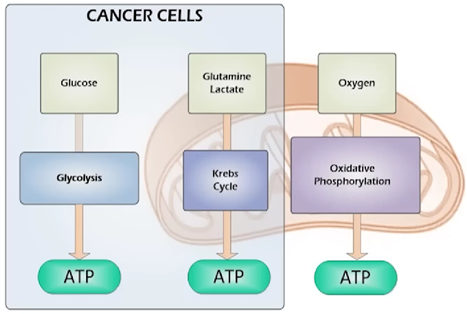

Исследования Отто Варбурга в 1930-х и 40-х годах, за которые он получил Нобелевскую премию по медицине, показали, что раковые клетки процветают на глюкозе. Им требуется примерно в 400 раз больше глюкозы, чем нормальным клеткам, потому что их митохондрии повреждены. Варбург продемонстрировал, что здоровые митохондрии предотвращают развитие рака. Эта концепция была подкреплена современными исследователями, такими как профессор Томас Сейфрид из Бостонского колледжа, который написал книгу «Рак как метаболическое заболевание». Если ваши митохондрии работают правильно, они остаются в окислительном фосфорилировании. В этом процессе используется кислород для производства большого количества АТФ. Когда митохондрии повреждаются, они больше не могут выполнять окислительное фосфорилирование.
Вместо этого они переключаются на ферментативный процесс, который требует гораздо больше глюкозы для производства АТФ — около 36 АТФ аэробно против 2 АТФ анаэробно. В этом процессе также вырабатывается лактат, который вызывает ощущение жжения в мышцах во время интенсивных тренировок. Раковые клетки вырабатывают много лактата, создавая враждебную среду, которая затрудняет атаку других клеток.

Профессор Сейфрид показал, что принятие кетогенной диеты может привести к истощению раковых клеток, ограничивая их поступление глюкозы. Раковые клетки, которые гораздо менее эффективны в производстве глюкозы и бесконтрольно растут из-за поврежденных митохондрий, нуждаются в этом избытке глюкозы. Митохондрии регулируют рост клеток, поэтому, когда они повреждены и не могут функционировать, клетки выходят из-под контроля, что приводит к раку.

На кетогенной диете вы уменьшаете количество энергии, доступной для раковых клеток, и потенциально улучшаете здоровье митохондрий. Хотя для некоторых митохондрий в раковых клетках может быть уже слишком поздно, остальные митохондрии получают пользу. Многочисленные исследования показывают, что частота дыхания и здоровье митохондрий в клетках на кетогенной диете в четыре раза выше, чем у тех, кто находится на диете, включающей углеводы. Кроме того, люди с кетозом имеют примерно в четыре раза больше митохондрий, что повышает их эффективность и численность. Такой диетический подход не только полезен для общего состояния здоровья, но и является перспективным в профилактике и потенциальной борьбе с раком.

До сих пор мы говорили, что мы облигатные плотоядные животные с одной оптимальной диетой. Хотя мы можем выжить, питаясь другими продуктами, мы не будем процветать. Это не будет оптимальным для нас. Не имеет значения, в каком вы состоянии, на каком этапе жизни вы находитесь, что угодно. Мы люди. Мы – Homo sapien sapiens. Биологически, анатомически, эволюционно, антропологически, метаболически мы можем показать, что люди являются плотоядными. Растения будут использовать оборонные химикаты, потому что они не хотят умирать. И если это вы или они, они убедятся, что это вы. Это убийство или смерть в дикой природе, даже для растений и животных. Вы когда-нибудь видели наскальную картину с изображением салата?

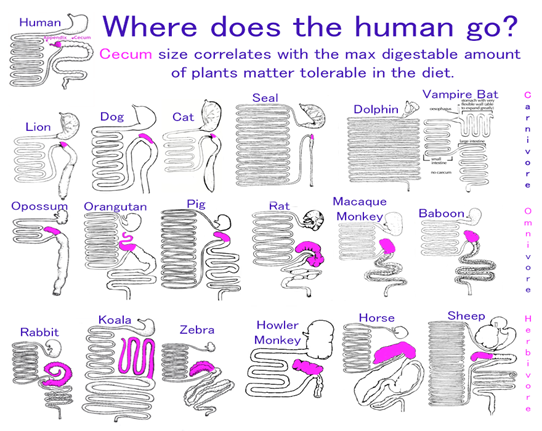
