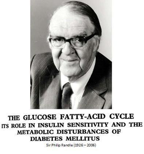
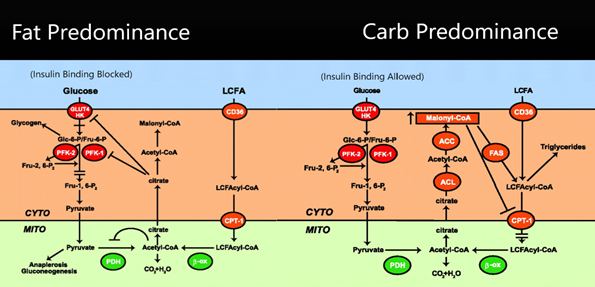
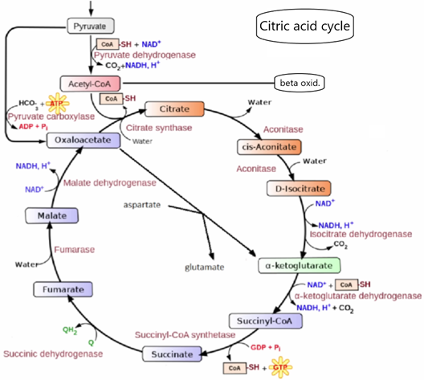
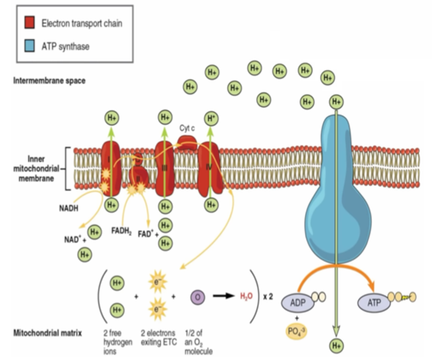

### **Цикл Рэндла**

Это сэр Филип Рэндл (1926-2006), и он предложил цикл Рэндла в статье, опубликованной в апреле 1963 года. 

Таким образом, идея цикла Рэндла не нова; Это не какая-то потрясающая идея. Мы знаем об этом с 1963 года, и по какой-то непонятной причине это в значительной степени игнорируется пищевым братством в целом.

Цикл Рэндла предлагает нам ряд вещей, в том числе абсолютно недвусмысленную, определенную причину, почему это абсолютно, определенно противопоказано, что является другим словом, означающим «не делайте этого, это плохо для вас».

По сути, мы должны рассматривать углеводы в рационе так, что мы должны рассматривать их как то, чем они являются, и это токсин, это яд. В рационе человека нет места для экзогенных углеводов. Вообще никаких. И цикл Рэндла объясняет нам, почему это так.

В течение последних четырех с половиной миллионов лет, плюс-минус, люди и непосредственно до человеческие виды жили на этой планете в соответствии с определенным образом жизни, который был облигатным гиперплотоядным. Откуда мы знаем, что это правда? Откуда мы знаем, что это точно так? Никто из нас не жил в живых четыре с половиной миллиона лет назад. Это всего лишь предположение? Нет, вот почему бы и нет.

Мы можем сделать то, что называется испытанием стабильных изотопов. В частности, тестирование изотопов азота-14 и азота-15, которое было проведено на скелетных останках человека и почти человека, дает нам ответ на этот вопрос. Мы можем найти человеческие и непосредственно до человеческие останки, их скелетные структуры, длинные кости, которые остались. Мы можем найти их по всему миру, и мы можем вскрыть эти длинные кости и получить немного коллагена из этих костей. Коллаген – это белок; Это самый распространенный белок в организме человека, и вы найдете значительное количество коллагена в длинных костях.

Коллаген является очень стабильным белком; Очевидно, что после смерти тела он высыхает, но остается нетронутым в течение десятков и сотен тысяч лет, без каких-либо проблем. Тысячелетия спустя мы все еще можем найти жизнеспособный коллаген в длинных костях, и мы можем проанализировать состав этого коллагена с точки зрения состава стабильных изотопов, с точки зрения углерода и азота, обнаруженных в коллагене в этих длинных костях.

И это говорит нам: «Слэм-данк, никаких вопросов, никаких дебатов, никаких «может быть», «если», «но». Она говорит нам о том, что особь определенно ела в течение своей жизни, вплоть до конкретного видоположения животных, на которых этот человек охотился и ел. И эти данные говорят нам о том, что человеческие существа, по крайней мере, в течение 350 000 лет, то есть столько, сколько люди существуют в нашей нынешней форме, мы определенно и однозначно питались пищей, которая на 80 процентов состояла из мяса и жира крупных жвачных животных, с несколькими другими животными, добавленными тут и там.  и 20 процентов очень, очень волокнистые, очень, очень бедные крахмалом корни и клубни, в основном очень волокнистые материалы. И эти 20 процентов волокнистых материалов были материалом, который мы выкапывали, собирали, забирали домой, варили, наверное, и ели как какую-то кашу, чтобы выжить, когда охота не увенчалась успехом или не было животных, на которых можно было бы охотиться.

Он не был богат крахмалом, как нынешние клубни и корнеплоды, которые были селекционно выведены для этого. В основном это была клетчатка, которую ели эти люди. Сейчас, как известно, клетчатка разрушается в кишечной системе только под воздействием бактерий, которые в основном немного ее расщепляют. И то, что они производят для нас, — это короткоцепочечные жирные кислоты, а не углеводы.
В течение 350 000 лет до момента начала аграрной революции около 8 000 лет назад люди питались пищей, которая, по сути, состояла на 100 процентов из белков и жиров, учитывая, что клетчатка расщеплялась на короткоцепочечные жирные кислоты, а не углеводы.

Для некоторых людей было несколько недель в году, когда вокруг росли ягоды. Люди, очевидно, воспользовались этим; Они ели ягоды. Большую часть года углеводы вообще никакие, ноль. У нас все еще был ген амилазы слюны, потому что нет негативного давления отбора, чтобы выбить его. По мере того, как мы углубляемся в цикл Рэндла, вы поймете, почему это могло быть очень, очень важной вещью, и это также может быть тем, что помогло понять, как цикл Рэндла развивался и у людей.

Цикл Рэндла не является циклом в том типичном смысле, в котором его представляют под биологическим циклом. Например, цикл ТСА, также известный как цикл Кребса, цикл трикарбоновых кислот или цикл лимонной кислоты, представляет собой серию метаболических химических реакций, которые начинаются в определенной точке и заканчиваются в той же точке, развиваясь в зависимости от доступности субстрата и других факторов. Цикл Рэндла не является таковым. Это не цикл, поэтому непонятно, почему он так называется.

Цикл Рэндла — это набор метаболических компонентов, битов метаболических механизмов, которые взаимодействуют в каждой из нескольких триллионов клеток вашего тела для обеспечения оптимального функционирования. Эти компоненты похожи на ползунки или фейдеры на аудиоплате или переменные резисторы в электрической цепи, а не на переключатели включения-выключения.

Основными компонентами являются жирные кислоты и углеводы, используемые для производства энергии в клетках. Это топливо химически окисляется с выделением свободной энергии Гиббса, которая затем улавливается для производства АТФ для последующего использования.

Различные трансмембранные белки-транспортеры охватывают клеточные мембраны и регулируют прохождение химических веществ в клетки и из них. Они действуют как ворота, позволяя веществам двигаться в соответствии с градиентами концентрации. Эти белки могут регулироваться вверх или вниз, что влияет на их эффективность в транспортировке веществ.

Различные ферменты катализируют реакции в метаболических путях, превращая одно вещество в другое. Ферменты могут усиливать или подавлять эти реакции, гарантируя, что метаболические процессы протекают по мере необходимости.

Различные метаболические посредники действуют как переносчики силы между ферментами и другими компонентами в метаболических путях. Они играют решающую роль в облегчении химических реакций и поддержании метаболического баланса.

Цикл Рэндла существует в цитозоле клетки и на мембранах митохондрий. Цикл Рэндла существует, потому что он пережил 3,8 миллиарда лет эволюции, закодированной в нашей генетической структуре. Он управляет топливом и защищает элементы от повреждений, которые могут быть вызваны неконтролируемыми источниками топлива. Этот цикл представляет собой невероятную эволюционную адаптацию, которая смягчает отбор топлива и защищает клетки от вреда.

Как это работает? Как он делает то, что делает для выбора топлива и защиты элемента от повреждений? Если в вашем кровотоке есть углеводы, эти углеводы попадут в клетки, при условии, что инсулин также есть в вашей крови, другими словами, если вы не являетесь диабетиком 1 типа, например, или если вы диабетик 1 типа и вы принимали экзогенный инсулин путем его инъекции. В этом случае углевод будет попадать в клетки и окисляться этими клетками, митохондриями в этих клетках, для получения энергии, другими словами, для производства АТФ. И это не будет проблемой, до тех пор, пока утечка энергии митохондриями, потребность в производстве энергии, достаточна для поддержания уровня углеводов в клеточной жидкости от начала накопления.

Факторы, которые могут привести к тому, что углеводы начнут накапливаться или накапливать свою концентрацию в клеточной жидкости: во-первых, у вас может быть очень высокий уровень глюкозы и инсулина в крови, что приведет к тому, что уровень сахара в клетке будет расти выше уровня, на котором он выводится митохондриями, использующими его для производства энергии. Другой способ, которым это может произойти, — это если у вас есть селектор топливной смеси углеводов и жиров, который по своей сути является частью цикла Рэндла, и на самом деле является его целью. Этот топливный селектор может быть сильно подталкнут к использованию жира, а использование углеводов может быть, во всех смыслах и целях, строго запрещено или даже заблокировано на максимальном уровне.

Что подталкивает этот ползунок к использованию жира? Это очень большое количество жира в крови и в клеточной жидкости. Или, допустим, вы неактивны. В этом случае абсолютное потребление энергии уменьшается. Следовательно, при прочих равных условиях абсолютное употребление углеводов было бы меньше. И потом, если поступление углеводов в кровь высокое, потому что, скажем, вы съели пищу, богатую углеводами, тогда, здравствуйте, цикл Рэндла! Он заблокирует этот карбюратор. Почему так происходит? Избыток углеводов в клеточной жидкости любой клетки вызовет гликаторное повреждение структур в этой клетке. Эта глюкоза будет химически связываться с белками, с жирами и т. д. и химически изменять их таким образом, что это будет вредно. Это не очень хорошо. Вы не хотите, чтобы это происходило. Гликаторное повреждение – это очень, очень серьезно.

Таким образом, если бы сахару было позволено проникать в клетку в соответствии с градиентом его концентрации, и не было бы никакого контроля над поступлением этого углевода, то он просто вливался бы в клетку каждый раз, когда вы едите пищу, содержащую какие-либо углеводы, о которых можно было бы говорить. И это будет повреждать ваши клетки каждый раз.

Таким образом, должен быть способ удерживать этот сахар вне клеток крови, чтобы он мог поступать только тогда, когда это необходимо. Вот что такое цикл Рэндла, в двух словах.

До тех пор, пока потребляемая энергия достаточна для того, чтобы концентрация углеводов в клетке не повышалась, клетка с радостью позволит сахару проникнуть в организм под действием инсулина. Как только у вас появится какое-либо значительное количество жира для использования, он будет использован, и это заблокирует сахар. Или, если вы неактивны, это также начнет блокировать сахар.

Жир будет попадать в клетки и окисляться для получения энергии, до тех пор, пока утечка энергии достаточна для предотвращения накопления жира в клетке. Факторы, которые могут привести к тому, что жир начнет накапливаться в клетках: Возможно, у вас чрезмерно высокий уровень жира в крови. Как это могло произойти? Ну, вы съели чрезмерное количество жира или вы съели немного углеводов, которые ваше тело не может использовать, потому что цикл Рэндла блокирует их, поэтому они возвращаются в печень и превращаются в жир. Или в вашей крови много жира, потому что вы голодали.

Когда этот жир нужно использовать, он будет использован, а сахар будет сохранен, заблокирован. Поскольку мы эволюционировали, по крайней мере, в течение последних 350 000 лет, а точнее последних четырех с половиной миллионов, углеводы на самом деле не были особенно доступны для человека. Мы не могли его достать. Там было не так уж и много. И как таковой, когда мы смогли его достать, ну, его немного держали в резерве.
Жир всегда будет проходить через него первым, при условии, что уровень углеводов не является чрезмерным. Еще одна вещь, которая может привести к накоплению жира в клетках, заключается в том, что селектор топлива сильно подталкивает к углеводам очень высоким уровнем углеводов. И тогда жир будет заблокирован.

В случае, когда жир начинает накапливаться, ряд предохранительных клапанов постепенно закрывается и блокирует поступление углеводов в клетку. По той же причине, по которой мы не хотим, чтобы углеводы прокладывали себе путь в клетку под действием собственного градиента концентрации, мы также не хотим, чтобы углеводы вливались в эту клетку и отравляли ее, когда мы закаляемся в употреблении жиров. Таким образом, он блокируется. Это другой способ, в котором цикл Рэндла блокирует углеводы.

Если вы окисляете жир, потому что в нем много жира, который можно окислить, это ослабит окисление углеводов, и это приведет к тому, что углеводы будут все больше и больше блокироваться, тем сильнее и тверже, чем больше жира проходит через клетку. Фактическое влияние на углевод определяется уровнем жира. Очень высокий уровень жира полностью блокирует углеводы. Умеренный уровень жира будет в некоторой степени блокировать углеводы, а очень низкий уровень жира в крови будет означать, что углеводы могут поступать в соответствии с градиентом концентрации, если они не начнут накапливаться в клетках.

Когда уровень жира падает, если он был высоким, эти скользящие эффекты обращаются вспять. Тем не менее, клетке требуется некоторое время, чтобы изменить направление метаболизма, вернуть эти фейдеры назад и отсортировать их. Есть время задержки. В дополнение к этому, если уровень углеводов превышает способность окислять их в это время, то углеводы блокируются, в основном, чтобы защитить клетку от гликаторного повреждения.

Вывод из всего этого таков: если вы придерживаетесь диеты, состоящей исключительно из жиров, без углеводов, цикл Рэндла не будет проблемой. Если вы придерживаетесь диеты, состоящей только из углеводов, то же самое верно. У вас не будет проблем с циклом Рэндла до тех пор, пока уровень глюкозы в крови не подскочит, что будет происходить каждый раз, когда вы едите. Таким образом, у вас все еще будут проблемы с циклом Рэндла на полностью углеводной диете, и они будут длиться в течение нескольких часов после еды, каждый раз после того, как вы съедите углеводы, по крайней мере, иногда дольше.

Если у вас смешанная диета, которая содержит как жиры, так и углеводы, это абсолютная метаболическая катастрофа. Это вызовет самое сильное и продолжительное перекрестное торможение жира, блокируя углеводы, и углеводы, блокирующие жир одновременно. И это приведет к ситуации воспаления и тенденции к набору жира в организме, а также к страданию от всех тех вторичных эффектов воспаления, которыми являются болезни сердца, атеросклероз, диабет 2 типа, склонный к диабету 1 типа, хронические воспалительные проблемы, такие как активация иммунной системы, которую вы не хотите, большинство форм деменции,  большинство форм рака — все большие убийцы.

То, что мы видим здесь, слева, — это ситуация, в которой преобладает жир, когда в клетку поступает много жирных кислот. Синяя полоса в верхней части диаграммы — это ваш кровоток. Желтовато-коричневая средняя зона этого газона представляет собой межклеточную жидкость, цитозоль. А в нижней части экрана, светло-зеленым цветом, изображена жидкость внутри митохондрий, где происходит производство энергии.

Слева мы видим ситуацию с преобладанием жиров, когда большое количество LCFA (длинноцепочечных жирных кислот) транспортируется в клетку в соответствии с градиентом их концентрации из крови с помощью белкового транспортера под названием CD36. Затем он проходит через цитозоль и захватывает коэнзим А в результате ряда реакций в цитозоле клетки, и он трансмутируется в длинноцепочечный жирный ацилкоэнзим А (LCFAcyl-CoA).

Затем это вещество, которое транспортер CPT-1 транспортирует в митохондриальное пространство, где бета-окисление — это процесс, который расщепляется на ацетиловый коэнзим А (ацетил-КоА), который является частью первого промежуточного звена трикарбонового кислотного цикла, также известного как цикл Кребса, цикл ТСА.

В цикле Кребса второй промежуточный продукт называется цитратом. Если цитрат накапливается в концентрации, он начинает поступать обратно из митохондрий в цитозоль клетки, и он начинает накапливаться там.

Когда это происходит, цитрат аллостерически связывается с ферментом фосфофруктокиназы один (PFK-1) и GLUT4 на клеточной мембране. Когда происходит это аллостерическое ингибирование, цитрат химически связывается с этим белком и, таким образом, останавливает транспортировку этого вещества. Двойные линии означают, что путь заблокирован в этой точке. Чем больше жира проходит через митохондриальную жидкость, тем больше цитрата накапливается. Это означает, что чем больше цитрата выливается обратно в цитозоль, тем больше блокирует левую часть этой диаграммы, через которую глюкоза проходила бы, если бы ей это позволено. Нет. Вот такой ползунок на этом поворачивают.

В правой части этой диаграммы мы видим ситуацию с преобладанием углеводов, когда уровень глюкозы в крови высок, уровень инсулина в крови высок, и инсулин связывается с транспортером GLUT4, сообщая ему о необходимости транспортировки глюкозы в клетку. Именно связывание цитрата с ним останавливает связывание инсулина с ним и блокирует его в GLUT4 слева. В данном случае этого не происходит, поэтому GLUT4 может транспортировать глюкозу в клетку, а ферменты PFK-1 и PFK-2 могут свободно делать свое дело. Затем мы получаем пируват, и пируват транспортируется в митохондрии, где пируватдегидрогеназный комплекс расщепляет его до ацетил-КоА. Таким образом, при этом образуется некоторое количество цитрата, но не в таком количестве, как при преобладании жиров.

Затем цитрат будет поступать в цитозоль клетки точно так же, как это было в левой ситуации. Затем другой фермент, который блокируется в левом пути, может свободно действовать. Таким образом, цитрат трансмутируется в ацетил-КоА, а затем происходит еще одна трансмутация в ACC, в результате которой образуется вещество под названием малонил-КоА. Затем он блокирует транспортер CPT-1 и останавливает попадание жирных кислот в митохондрии, вместо этого направляя их на образование триглицеридов.

Многие люди думают, что это ситуация «или-или» — либо преобладает жир, и происходит левостороннее явление, либо углеводы преобладают, а правостороннее — правое.

Люди, кажется, не понимают, что обе эти чаши являются скользящими весами, в зависимости от того, насколько преобладают жиры или сколько углеводов. Любая смесь углеводов и жиров вызовет некоторое перекрестное торможение обоих, а это означает, что все блокируется, и именно это приводит к проблеме.

Уровень цитозольного цитрата — это то, что на самом деле определяет предпочтения источника топлива слева, и он делает это, блокируя GLUT4 и PFK-1 слева. Отток митохондриального цитрата в цитозоль, клеточную жидкость, выше, потому что поток цитратов через цикл Кребса или цикл ТСА не рекомендуется. И ступень малонилного коэнзима, который бы выводил этот цитрат, как это происходит с правой стороны, блокируется, потому что слева есть вещество под названием АМФ-киназа, которое его блокирует. АМФ-киназа деактивируется с правой стороны в результате ряда других реакций.

Как только мы опустимся ниже уровня, который мы только что рассмотрели, мы исследуем цикл лимонной кислоты. Итак, мы видим, что в верхней части у нас есть ацетил-КоА, то же самое, что и на предыдущей диаграмме. Первый посредник может быть обеспечен пируватом здесь (как в левой части последнего графика) или он может быть получен путем бета-окисления (т.е. в правой части последнего графика). Неважно; это тот же Ацетил-КоА. Пируват препятствует бета-окислению; Бета-окисление будет препятствовать выработке пирувата.

Итак, когда мы опускаемся до уровня цикла лимонной кислоты, нам нужно понять, что именно цитрат накапливается в концентрации и вливается обратно в цитозоль клетки, что заставляет цикл Рэндла делать свое дело. Нам нужно понять, почему цитрат накапливается.

Потому что, если это цикл, в котором градиенты концентрации двигают вещество по часовой стрелке, как это и есть, почему цитрат накапливается только потому, что вы добавляете цитрат? Если вы добавите цитрат, это должно просто ускорить цикл, и концентрация цитрата должна оставаться довольно стабильной. Таков принцип работы Ле Шателье в действии.

Когда вы приступаете к бета-окислению, в качестве одного из своих видов деятельности образуется вещество под названием FADH2, которое является аналогом или другой версией NADH. FADH2 имеет тенденцию конкурировать или ингибировать дренирование NADH через цепь переноса электронов, которая фактически деактивирует фермент цис-аконитазу, тем самым блокируя прямое действие цикла лимонной кислоты по часовой стрелке от цитрата к D-изоцитрату. И поэтому вы думаете: «Ну, это останавливает цикл Кребса и приведет к вашей смерти». Так что это не может быть правдой.

Цикл лимонной кислоты не является циклом, как это показано большинством людей в виде внешнего круга. Существует ситуация, когда оксалоацетат может взаимодействовать с аспартатом и глутаматом, а также с альфа-кетоглутаратом, другими словами, это короткий путь, который проходит прямо мимо цитрата, цис-аконитата и D-изоцитрата, образуя альфа-кетоглутарат непосредственно из оксалоацетата, что означает, что вы можете продолжать жить.

Именно окисление жиров поддерживает высокий уровень цитрата, заставляет цитрат втягиваться обратно в цитозоль клетки и деактивирует поступление сахара в клетку или снижает его по скользящей шкале от отсутствия ингибирования до полного ингибирования в очень тяжелых обстоятельствах.

Цепь переноса электронов является конечным этапом на пути углеводов и жиров к производству энергии. Во внутренней митохондриальной мембране есть несколько трансмембранных белков, которые вы увидите в красном цвете. Они называются комплексом один, комплексом два, коэнзимом Q10 (показан как Q на этой диаграмме), комплексом три, цитохромом С и, наконец, комплексом четыре. Что делают эти комплексы, эти белки в совокупности? Они коллективно принимают атомы водорода из NADH и из FADH2. Они разделяют атомы водорода на протоны и электроны и переносят электроны, номинально на одной стороне мембраны и протоны на другой, поэтому зелеными стрелками показаны протоны, которые перекачиваются, и электроны, которые поддерживаются внутри этих цитохромов, этих различных пигментов, этих разных белков: один, два, Q, три и четыре.

В конце процесса у вас есть некоторое количество свободных электронов, которые могут быть переданы обратно белку синего цвета, который является вашей АТФ-синтазой. Ваша повышенная концентрация H+ на этой стороне мембраны проходит через нее, и это двигательная сила, которая вызывает производство АТФ из АДФ плюс неорганический фосфат.

Цепь переноса электронов не так уж и заботится о том, откуда берутся водороды, за исключением того, что FADH2, образующийся в результате бета-окисления жира, не присоединяется к цепи белка номер один; Он присоединяется к белку под номером два.
Затем коэнзим Q10, который на этой диаграмме называется просто Q, перемещается между одним и двумя, тремя и двумя, перемешивая электроны от одного к двум, затем к трем, или от двух к трем, в зависимости от случая, когда их огромное количество относительно входа NAD.

Если на вход поступает огромное количество ФАД, то коэнзим Q10 может быть склеен с H+ и E-, и он может начать сопротивляться выведению NADH под номером один. Таким образом, именно это приводит к накоплению соотношения NADH, которое блокирует аконитазу, как мы видели на предыдущем графике. Тем не менее, это не блокирует метаболический путь, потому что он только сейчас начинает идти прямо через путь оксалоацетата к альфа-кетоглутарату. Это приводит к потенциальному увеличению того, что они называют свободными радикалами или потенциально так называемыми вредными продуктами окисления.

Учитывая все вышесказанное, именно так механически работает цикл Рэндла: жир препятствует употреблению углеводов, употребление углеводов препятствует употреблению жиров. Вот так просто. Все остальное — это просто мелочи, просто детали того, как это происходит. Вот что вам нужно знать: жир блокирует углеводы, углеводы блокируют жир. Не добавляйте их в свой рацион. Ешьте только один из этих продуктов с белком, и способ решить, какой из них полезен для вас: плотоядная диета. Один из них не полезен для вас: веганская диета.

Некоторые говорят, что ингибирование ПДГ (пируватдегидрогеназного комплекса) за счет накопления НАДН, как это описывается через блокирование фермента аконитазы в цикле Кребса с помощью FADH2, полученного в результате бета-окисления, предотвращает окисление пирувата, и именно он фактически блокирует сахар. Что ж, это неправда. И почему это неверно? Пируват вместо того, чтобы проходить через пируватдегидрогеназный комплекс до ацетилкоэнзима А, а затем до цитрата, который блокируется — пируват может полностью обходить пируватдегидрогеназный комплекс через реакцию пируваткарбоксилазы и, тем не менее, может входить в цикл ТСА в виде оксалоацетата. Так что причина блокады не в этом. Причина блокады снова в GLUT4.
Еще одна ошибка заключается в том, что некоторые утверждают, что бета-окисление жирных кислот вызывает увеличение соотношения NAD к NADH через производство FADH, доставку восстановительных эквивалентов или атомов водорода в комплексе 2 и коэнзима Q10, и это правда. Аргумент заключается в том, что углеводы этого не делают; только при окислении жиров образуется FADH2, который также является ложным. Почему это ложь? Е3-субъединица пируватдегидрогеназного комплекса ферментов также продуцирует FADH.

На самом деле, если происходит активность пируватдегидрогеназы, то FADH проникает так же, как если бы вы использовали жиры, используя бета-окисление.

Еще больше ошибок: свободные радикалы, окисляющие повреждающие вещества, например, H2O2, является самым мощным из них, вызванным обратным транспортом электронов, который представляет собой связывание коэнзима Q10, протекающего в обратном направлении. Они говорят, что это плохо. Ну, это тоже неверно. H2O2 и ему подобные на самом деле очень полезные, очень мощные сигнальные молекулы. Они сообщаются от митохондрий обратно к клетке таким образом, чтобы сообщить ей об энергетическом состоянии митохондрий и активировать различные гены, которые активируют различные белки как в митохондриях, так и в цитозоле клетки, таким образом, чтобы наилучшим образом способствовать наилучшему здоровью, безопасности и долголетию этой клетки. Универсально говоря, что свободные радикалы — это повсеместно плохая вещь и их следует избегать? Не правда.

Также ошибочно предполагать, что ограничивающим шагом в цикле ТСА является нечто иное, чем реакция сукцинат на фумарат, по той причине, что реакция сукцинат на фумарат на самом деле напрямую физически связана с комплексом два, коэнзимом Q10, что означает, что метаболическое притяжение является тем, что контролирует скорость цикла ТСА. Конечно, да! Что еще может ускорить или замедлить цикл TCA, кроме потребности в производстве энергии? Реакция сукцината с фумаратом вступает в взаимодействие с Q, который становится QH2 или восстановленным коэнзимом Q10. Таким образом, это реальная прямая физическая, а также химическая связь с теми белками, которые связаны с мембраной митохондрий. Только когда Q способен принимать H2, цикл трикарбоновой кислоты будет протекать либо через его половину, либо более чем на половину, либо даже через весь цикл, в зависимости от доступных источников топлива. Вот ваш шаг ограничения скорости. Больше нигде. Так что любой, кто говорит вам, что стадия реакции, ограничивающей скорость в трикарбоновой кислоте, находится где-то еще, неверен. Нет.

Опять же, цикл Рэндла не является каким-то феноменом. Это означает, что он находится на скользящей шкале, а не включается или выключается. Жир препятствует углеводам, углеводы отбивают охоту у жира — уровень уныния зависит от уровня каждого из них. Разделение углеводов и жиров на несколько часов, например, один прием пищи с углеводами и один прием пищи с жиром не сработает. Это не облегчит проблему, потому что углеводы хранятся около 72 часов. Вот почему требуется примерно столько времени, чтобы войти в кетоз, когда вы перестаете есть углеводы.

Мы имеем ситуацию, когда есть аспекты всего этого цикла, когда глюкоза подавляет жир, а жир подавляет глюкозу. Таким образом, в любое время, когда у вас есть свободная энергия в виде жира и глюкозы в крови, ни одна из них не может попасть в клетку, чтобы эффективно удовлетворить потребности в ацетил-КоА. Таким образом, вы получаете снижение окислительного потенциала клетки в соответствии с митохондриальным окислительным потенциалом. Следовательно, вы получаете увеличение концентрации неорганического фосфата внутри митохондрий, что затем вызывает то же самое в цитозоле клетки.

Повышенная концентрация неорганического фосфата в клетках непосредственно активирует провоспалительные цитокины. Именно поэтому говорят, что накопление энергии всегда связано с воспалением. Если вы не можете окислять энергию для АТФ в клетке, потому что и то, и другое заблокировано из-за диеты, богатой жирами и глюкозой (жирами и углеводами), то у вас будет хроническое воспаление. Вы будете хронически накапливать жир, потому что вы можете хранить только определенное количество сахара, прежде чем он начнет превращаться в жир. Таким образом, мы становимся все толще и толще и все больше и больше хронически, системно воспаляемся с годами, что приводит к ожирению, диабету 2 типа, сердечным заболеваниям, цереброваскулярным заболеваниям, многим формам деменции и ранней смерти.

Итак, каков же ответ? Что ж, ответ заключается в том, чтобы придерживаться диеты, которая не богата как углеводами, так и жирами. Выберите одну из этих диет. Выбирайте диету, которая либо богата углеводами, но не жирами, либо диету, которая богата жирами, но не углеводами. Какую из этих диет выбрать? Ну, это очень, очень просто. Одна из таких диет содержит все, что вам нужно для того, чтобы быть здоровым и прожить долгую жизнь, и это диета, основанная на продуктах животного происхождения, то есть диета, основанная 	на мясе и животных жирах с очень-очень минимальным содержанием углеводов. Нет никаких недостатков, которые люди испытывали бы в результате употребления в пищу только мяса и жира животных. К сожалению, это не относится к диете, богатой углеводами, растительной диете, но не богатой жирами. Существует много, много питательных веществ, которые необходимы человеку ежедневно, и их можно найти только в биологически доступной эффективной форме в продуктах животного происхождения.

Это гены, отобранные под давлением положительного отбора, это системы органов, которые у нас есть, это метаболическая система, которая у нас есть. Мы просто не созданы для того, чтобы работать одновременно на глюкозе и жирах, как показано.

Инсулинорезистентность является результатом активации цикла Рэндла, а степень инсулинорезистентности зависит от градиента. Активация цикла Рэндла происходит в разных типах тканей с разной скоростью в зависимости от количества энергетических субстратов в реальных клетках. Когда вы получаете избыточную энергию, эти рецепторы, рецепторы GLUT, а также CD36 будут подавляться, потому что клетка пытается защитить себя от избытка поступающей энергии. Существуют ферменты, ограничивающие скорость, которые могут сделать не так много.

Когда вы получаете избыток энергии в кровоток, все эти клетки начинают снижать регуляцию. Они взяли достаточно, поэтому они снижают регулирование. Чтобы выскочить из этого состояния, требуется определенное количество времени, и градиент будет повышаться по мере увеличения субстратов в кровотоке. Вот почему это называется включением-выключением, а затем градиентом. Градиент и продолжительность его сохранения зависят от многих факторов, таких как мышечная масса, физическая активность, а также эффективность липопротеиновых путей и факторов транскрипции.

Как только вы достигаете определенного уровня, клетки начинают голодать. По мере того, как уровни опускаются, градиент начинает падать. Иногда, из-за гормональных факторов, цикл Рэндла может длиться немного дольше и систематически деактивироваться на срок до трех дней. Итак, ваша сухая мышечная масса и физическая активность определяют, как быстро это произойдет. Для людей, ведущих сидячий образ жизни, это может занять до трех дней. Если вы не ведете сидячий образ жизни, это может произойти гораздо раньше. Вот тут-то и приходят на помощь физические упражнения. Это не значит, что физические упражнения напрямую уменьшают вес жира; он улучшает цикл Рэндла гораздо быстрее, удаляя субстраты из кровотока, позволяя клеткам активировать рецепторные участки, расположенные близко к клеточной мембране, и фактически сигнализировать о большем количестве питательных веществ.

Многие люди на самом деле не понимают цикл Рэндла, поэтому до сих пор ведутся споры между лагерями сторонников с низким содержанием жиров и низким содержанием углеводов. Лагерь с низким содержанием жира часто приводит к дефициту минералов и микроэлементов, а также к дефициту белка. Несмотря на то, что он катаболически активен и может привести к потере веса, он также приводит к потере мышечной массы и снижению скорости метаболизма. Это очевидно в таких шоу, как «Самый большой неудачник», где участников сажают на диеты с низким содержанием жиров и они теряют как жир, так и мышцы, что приводит к снижению скорости метаболизма и возможному увеличению веса.

Плотоядная диета, с другой стороны, помогает, обеспечивая больше лейцина и таурина. Таурин является ингибитором миостатина, снижая уровень миостатина и увеличивая синтез мышечного белка, не влияя на сердце. Это позволяет увеличить мышечную массу и повысить скорость метаболизма, что со временем приводит к потере жира.

Важно нацеливаться на уровень энергии, исходя из ваших будущих целей по весу, первоначально увеличивая потребление белка для увеличения сухой мышечной массы, а затем корректируя ее для ее поддержания. Биохакинг с использованием таурина и лейцина может ускорить этот процесс, что приводит к более здоровому составу тела на плотоядной диете.

К сожалению, многие ученые и врачи не очень хорошо разбираются в цикле Рэндла, потому что он не очень хорошо освещен в литературе. Несмотря на то, что работа Филипа Рэндла была опубликована в 1963 году, она была в значительной степени забыта в академических кругах и лишь изредка цитируется косвенно. Книги по физиологии бедны на эту тему. Некоторые ученые пытались возродить интерес к циклу Рэндла с помощью обзоров и статей, но ему все еще не хватает поддержки. Акцент на калориях на входе и на выходе увековечивает это невежество, поскольку пищевая промышленность продвигает очень вкусные продукты, богатые сахаром и жиром.

Наша система когда-то знала, что в сезон есть доступный сахар. В конце лета, когда было много жирных животных, которые откормились, также было доступно большое количество фруктозы. В зависимости от сезона, мы одновременно сочетаем фрукты с животными жирами, включаем цикл Рэндла и набираем жир. Затем, в неурожайные зимние месяцы, у нас будет достаточно жировых запасов на теле, как у многих племенных народов. Вы можете увидеть их в эти периоды; На самом деле у них будет немного жира. Большинство из них довольно рваные, но вы заметите небольшую жирность в области живота. Это очень незначительно.

По мере того, как они передвигаются зимой или в более скудные и сухие месяцы в Африке, они снова высовываются. Они проходят через этот сезонный цикл, задействуя цикл Рэндла в течение ограниченного периода времени, пополняя запасы жира, а затем используя их в более скудные периоды. Так мы делаем уже очень давно, и многие животные делают то же самое. Они задействуют цикл Рэндла. В Амазонке есть рыба, которая подплывает, ест фрукты и использует их, чтобы увеличить свой вес. Он проходит путь от мелочи до огромных размеров, затем уходит в глубокую воду. Когда снова наступает сезон фруктов, два раза в год, когда поднимается Амазонка, они возвращаются на поверхность, едят плоды и снова жиреют.
