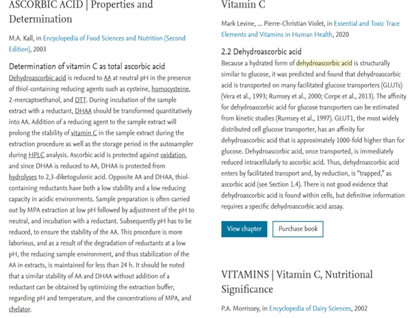

### **Витамин С и цинга**

Витамин С вообще не может быть использован внутри организма и должен быть сначала преобразован в другую форму аскорбиновой кислоты, которую легко найти в свежем мясе. ДГК (дегидроаскорбиновая кислота) не только лучше усваивается, чем витамин С, но и усваивается лучше, чем сама глюкоза. Она всасывается из кишечника гораздо легче, чем глюкоза. На самом деле, он в тысячу раз эффективнее всасывается в кровоток.

Также неверно, что нам нужен витамин С в качестве антиоксиданта, с которым он справляется очень плохо. Витамин С также может вызывать окислительное повреждение, особенно при приеме в мегадозах. Основным антиоксидантом в организме является глутатион, который содержится у людей на низкоуглеводной диете в два раза больше, чем у людей на стандартной американской диете.

Большинство людей даже не подозревают о существовании ДГК. ДГК – это дегидроаскорбиновая кислота, которую не следует путать с омега-3 жирной кислотой ДГК, которая представляет собой нечто совершенно иное. Это животная форма аскорбиновой кислоты, и она в тысячи раз лучше усваивается, чем форма, содержащаяся в растениях. На самом деле, она даже лучше усваивается кишечником, чем глюкоза — более чем в тысячу раз лучше усваивается.

Вы можете подумать, что мы тщательно измерили уровень питательных веществ в продуктах питания до точной степени и контролировали его с течением времени. На самом деле, большая часть пищевой ценности, на которую мы полагаемся при выборе продуктов питания, получена в ходе первоначальных испытаний 30-х годов и даже раньше. В то время вся пища была органической и выращивалась в естественных условиях с неистощенной почвой. Теперь это не только истощенная почва, но и искусственные условия и чрезвычайная скученность.

Та же почва, на которой выращивали одну морковь в то время, сегодня можно вырастить 100 морковей. Хуже того, такие фрукты, как черника, часто выращиваются в пластиковой мульче, а не в грязи вообще, в совершенно неестественных условиях освещения. Их накачивают химическими удобрениями, чтобы они росли, но они получают только минимум других питательных веществ. Таким образом, даже если игнорировать проблемы усвоения питательных веществ растениями, значения, которые мы имеем сегодня, сильно обманчивы.

Если вы не выращиваете ее дома, вы, вероятно, получите больше питательных веществ из одной выращенной в домашних условиях моркови, чем если бы вы ели целый пакетик каждую неделю в местном продуктовом магазине, независимо от того, органическая она или нет. Аскорбиновая кислота или витамин С вырабатывается растениями и большинством животных в самих митохондриях, а не человеком. Известно, что свежим мясом можно вылечить цингу. Но чего они не знали, так это того, что мясо было полно дегидроаскорбиновой кислоты или ДГК. Удивительно, но до последних лет эта молекула мало изучалась в науке о питании, и ни один из доступных в то время тестов на питание не смог бы обнаружить ДГК.

Внутри митохондрий аскорбиновая кислота может участвовать в нейтрализации активных форм кислорода. Но для человека основное применение заключается в производстве коллагена. Небольшое количество аскорбиновой кислоты требуется для одного из ферментов, необходимых для синтеза коллагена, но ДГК – единственный способ доставить ее в организм эффективно и безопасно. Глутатион и супероксиддисмутаза являются основными антиоксидантами человеческого организма. Это очень стабильные антиоксиданты, что немаловажно. Если они нестабильны, то вы можете чрезмерно сократить количество химических веществ, что так же плохо, как недостаток антиоксидантов в вашем организме.

К сожалению, это не относится к аскорбиновой кислоте. Вы определенно можете употреблять слишком много витамина С, и если вы принимаете добавки, то, вероятно, у вас их слишком много. На самом деле, витамин С просто не является значительной частью рациона наших предков. ДГК в тысячи раз лучше усваивается, чем витамин С, и только ДГК может проходить через гематоэнцефалический барьер или проникать через клеточную мембрану или проникать в митохондрии. Антиоксиданты важны, но аскорбиновая кислота – не единственный способ их увеличить, даже в форме ДГК, которую также не стоит принимать в больших количествах в качестве добавки. Он не только более реакционноспособен и, следовательно, потенциально вреден, но и гораздо менее эффективен, чем глутатион и другие естественные механизмы организма по нейтрализации активных форм кислорода. И это на самом деле главная причина того, что люди живут намного дольше, чем животные, потому что мы гораздо лучше очищаем все эти активные формы кислорода.

Показано, что люди, придерживающиеся низкоуглеводной диеты, имеют в два раза больше глутатиона, чем люди на стандартной американской диете. Это связано с тем, что метионин, содержащийся в мясе и отсутствующий в стандартной американской диете и почти отсутствующий в веганской диете, является тем, что требуется для производства глутатиона. Без него у вас всегда будет очень плохой антиоксидантный статус в организме. И это очень плохо, потому что именно это заставляет вас жить дольше, чем животные, потому что у них не очень хороший антиоксидантный статус в организме.

Если мы правильно питаемся, люди на самом деле имеют гораздо лучшую антиоксидантную систему, чем любое животное на Земле. Мы также можем перерабатывать аскорбиновую кислоту, что могут сделать только люди и свиньи. Вот почему нам просто не нужно много аскорбиновой кислоты, всего несколько миллиграммов в день для синтеза коллагена, и мы можем использовать ее снова и снова. Так что нам это даже не нужно ежедневно. Еще один миф заключается в том, что употребление коллагена означает, что вам не нужна аскорбиновая кислота каждый день.

Хотя на первый взгляд это может показаться логичным, коллаген не может быть усвоен кишечником до тех пор, пока он не будет расщеплен на составляющие его части. Когда организм собирает их заново, для этого требуется аскорбиновая кислота, которая может быть произведена из дегидроаскорбиновой кислоты. И на самом деле организму довольно трудно расщеплять коллаген, поэтому простой прием коллагеновых добавок не является лучшим решением. Большинство коллагеновых добавок загрязнены глифосатом. Даже если это органическая говядина, она лучше, чем свинина или курица, но даже органическая говядина травяного откорма может быть загрязнена, потому что она в основном находится в воде повсюду.

Во время длительных морских путешествий моряки заболевали цингой. В конце концов это было остановлено путем случайного распределения различных продовольственных пайков британским военным кораблям, пока не был найден один, который решал проблему. Это оказался лайм. Именно это породило миф о том, что человеку нужен витамин С из растений. Но это не так. В Англии не было цитрусовых, и на самом деле, в то время в Англии росло очень мало цитрусовых, что содержало бы значительное количество витамина С. Даже в те времена, когда было открыто сельское хозяйство, никто в северных краях не потреблял аскорбиновую кислоту в значительных количествах, не говоря уже о бесконечных веках до открытия сельского хозяйства.

Цинга возникает из-за сбоя в синтезе коллагена, самого распространенного белка в вашем организме. Если вы заболеете цингой, ваше тело начнет разрушаться. Вы можете столкнуться с кровоточивостью десен, потерей зубов, болью в суставах и деградацией мышц — это может привести к летальному исходу.

В те времена наши предки ели почти 100% мяса, а также ели органы, кожу и кости. Настоящая проблема заключалась в том, что они ели во время долгих морских путешествий. Соленая свинина была обычной пищей крестьян в Америке и на Британских островах в эпоху парусного спорта. Обычно его делали один раз в год непосредственно перед зимой, что означает, что у него был ограниченный срок годности, особенно если плавание начиналось намного позже этого времени года. Другой рацион питания был жестким снастью, который представляет собой дважды испеченные крекеры, которые могут храниться вечно, если их держать сухими.

Если вы продержитесь без аскорбиновой кислоты всего несколько недель, вы начнете болеть цингой. Поскольку это стало проблемой только через месяц, возникает вопрос, откуда это вообще взялось. Нет аскорбиновой кислоты в твердой прихватке, которая изготавливается из сушеной и молотой пшеницы. Единственное другое место, откуда она могла быть получена, — это свинина, которая была единственным источником аскорбиновой кислоты для этих мужчин в форме ДГК. Проблема с соленой свининой заключалась в том, что там не было консервирования, как сегодня, поэтому в конце концов она прогоркла. Часто он был близок к прогорклости еще до того, как корабль покидал порт, в зависимости от времени года и того, насколько честными были торговцы. Он также часто выходил из строя в очень дальние плавания.

Это означает, что они полностью полагались на зерно для своего пропитания, которое является крайне дефицитным источником пищи. Если вы будете есть только зерновые, такие как пшеница, вы умрете очень быстро. Вот почему он сильно укреплен в наше время. Такие состояния, как авитаминоз, распространены у тех, кто ест большое количество риса и белой муки, потому что они истощают витамины группы В в организме. И даже если они свежие и цельные, у вас все равно есть эта проблема, просто в меньшей степени. И хотя эти вещи убьют вас, если это все, что вы едите, на самом деле это будет цинга, которая убьет вас быстрее всего.

Хотя эту проблему часто связывают с нехваткой растительной пищи во время этих длительных путешествий, на самом деле это связано с зависимостью от крахмала как дешевого источника энергии и невозможностью в то время правильно хранить мясо. Мясо животных всех видов просто наполнено ДГК, и из-за истощения почвы и современных методов выращивания, таких как продажа незрелых фруктов, оно, вероятно, содержит намного больше, чем яблоки, которые вы покупаете в магазине на углу. Это также единственная форма аскорбиновой кислоты, которую организм может правильно усваивать и легко использовать. В то время как переносчики глюкозы предпочитают глюкозу растительной форме аскорбиновой кислоты, на самом деле они предпочитают ДГК глюкозе более чем в 1000 раз. Возможно, транспортеры GLUT-4 следует переименовать в транспортер DHAA, так как очевидно, что это его основное предназначение.

Витамин С очень сильно продвигается к нам, но на самом деле он нам не нужен. Несмотря на то, что существует длинный список предполагаемых преимуществ витамина С, на самом деле это всего лишь преимущества антиоксидантов в целом. Витамин С является антиоксидантом, но он очень бедный, очень трудноусваиваемый и слишком реактивный, что означает, что он может нанести вред вашему организму. DHHA в мясе гораздо лучше усваивается, и ее более чем достаточно даже в небольших кусках мяса для предотвращения цинги. На самом деле, это, вероятно, лучший источник аскорбиновой кислоты, чем фрукты, выращенные с использованием современных методов в истощенной почве.

Многие животные могут синтезировать свой собственный витамин С. Однако есть исключения, такие как люди и морские свинки, которые не могут вырабатывать витамин С. Это указывает на то, что в какой-то момент нашей генетической истории ген, отвечающий за синтез витамина С, был нокаутирован. Этот нокаут, вероятно, был вызван эволюционным давлением — он не позволял особям выживать достаточно долго для размножения. До наших дней дожили только люди, которые не могли вырабатывать витамин С.

Когда произошло это генетическое изменение? Вероятно, это произошло после того, как наши предки отошли от богатой фруктами диеты, начали ходить прямо, начали охотиться на животных. Избыток витамина С в нашем организме метаболизируется в оксалат – вещество, которое образует острые кристаллы при соединении с кальцием и другими электролитами в организме. Эти кристаллы оксалата могут проникать в органы, клетки и ткани, потенциально причиняя серьезный вред в любом месте тела, включая почки, мочевой пузырь или мозг.

Рекомендуемая суточная доза витамина С основана на диете, содержащей 60-65% углеводов. Такое высокое потребление компенсирует конкуренцию глюкозы с витамином С за поглощение клетками. Однако на плотоядной диете, где потребление глюкозы минимально из-за глюконеогенеза, потребность в витамине С значительно снижается.

Плотоядные животные, в том числе инуиты и исторически документально подтвержденные коренные народы, процветали без цинги на диете, основанной исключительно на мясе. Они получили достаточное количество ДГК из мяса крупных жвачных животных, которое содержит достаточное количество этого питательного вещества в более низких концентрациях, необходимых плотоядным людям. Органы не нужны для приема ДГК; Достаточно одного мышечного мяса.

Посмотрите на викингов и тому подобное. Они плавали по всему миру; они отплыли в Новый Свет. Считается, что Лейф Эриксон добрался до Северной Америки около 1100 года нашей эры, примерно во время норманнского вторжения. Итак, это было очень давно. Они не привозили с собой кучу лимонов и лаймов. У них были бочки, полные соленого мяса. Цингой они не заболели.

Цитата физика Ричарда Фейнмана: «Не имеет значения, насколько блестящая ваша теория и не имеет значения, насколько вы умны. Если это не согласуется с экспериментом, это неправильно». Говорят, что если вы едите только мясо, то через три месяца у вас появится цинга. Прекрасно. Увидимся через три месяца, четыре месяца, пять месяцев, шесть месяцев, шесть лет — никакой цинги. Ладно, они ошибаются.
