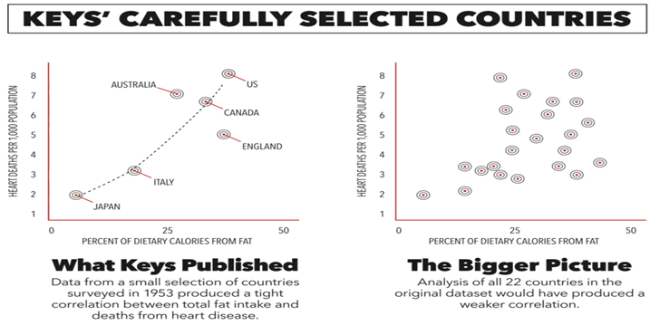

### **Холестерин и атеросклероз**

Одного этого графика достаточно, чтобы доказать, что диетические жиры не являются причиной сердечных заболеваний.

Это также показывает, что насыщенные жиры и пищевой холестерин также не могут быть основными причинами, поскольку оба эти фактора увеличиваются по мере того, как в типичной американской диете потребляется больше жиров. Часто можно услышать фразу «корреляция не подразумевает причинно-следственную связь», но это верно лишь иногда.

Вы редко услышите более сильную фразу, которая всегда верна: отсутствие корреляции всегда означает отсутствие причинно-следственной связи. Наука требует большего, чем наблюдение, чтобы сделать вывод; Это всегда требует эксперимента. Однако, когда наблюдение не верно, мы можем полностью отвергнуть гипотезу. Именно это должно было произойти с гипотезой о сердечных заболеваниях на основе диетических жиров в честном мире.

Вместо этого на сцену вышел физиолог рыб по имени Ансель Киз. Неудивительно, что его карьера с рыбой оказалась немного неудачной, поэтому он переключился на область питания человека, но остался верен своим корням и сделал довольно рыбную карьеру.

Во время войны он производил аварийный паек под названием «К-паек» для американских вооруженных сил. Он был очень дешевым, что сделало его популярным среди правительства, которое производило миллионы. К сожалению, в нем было очень мало питательных веществ и энергии, что приводило к плохим боевым качествам и сильному недоеданию у многих солдат. После войны он стал автором наблюдательного исследования под названием «Исследование семи стран», дополненного очень страшным графиком, который, казалось, показывал, что диетические жиры тесно связаны с сердечными заболеваниями. Тем не менее, этот график оказался более чем подозрительным. Из более чем 20 стран Европы, по которым имеются данные, он выбрал только те, которые соответствовали его точке зрения. Остальные страны показали совсем другую историю.

Также оказывается, что когда вы строите график смертности в зависимости от потребления сахара, используя те же данные, которые использовал Киз, вы получаете еще более страшный график с гораздо лучшей корреляцией.

Сахар сильнее, чем насыщенные жиры, коррелирует с сердечными заболеваниями, но Киз предпочел не раскрывать эти данные. Следует также отметить, что курение гораздо сильнее связано с сердечными заболеваниями, чем что-либо в рационе. Это, вероятно, было основной причиной сердечных заболеваний во времена Анселя Киза, и, вероятно, это верно и сегодня. На странице Киза в Википедии обсуждалось, что сахарная промышленность платила большие суммы за продвижение идеи о том, что потребление жира вредно, а не сахара, но это было удалено.

Гипотеза Киза о диетических жирах подверглась большой критике. Многие исследования опровергли его работу, не в последнюю очередь его собственную, которая показывает, что замена насыщенных жиров полиненасыщенными жирами (ПНЖК) имела крайне негативный эффект при экспериментальных испытаниях.

На самом деле Ансель Киз сделал очень много для продвижения интересов сахарного лобби и Procter & Gamble, создателей Crisco.

По иронии судьбы, даже его собственное исследование «Шесть стран» было неудачным и не показало, что насыщенные жиры связаны с сердечными заболеваниями; На самом деле она показала обратное. Замена насыщенных жиров линолевой кислотой показала значительное увеличение смертности среди участников, в основном от рака. Этот результат был скрыт от общественности до самой смерти Киза. Он все время обладал этой информацией, но скрывал ее. Вся его карьера была потрачена на продвижение поддельных продуктов питания среди населения, несмотря на то, что у него были долгосрочные экспериментальные данные, показывающие, что они очень опасны для здоровья человека.

Он утаил эту информацию в свою личную выгоду и на огромную пользу пищевой промышленности, в ущерб здоровью человека.

Сам Киз ясно заявил, что пищевой холестерин не связан с сердечными заболеваниями, и даже уровень холестерина ЛПНП в крови не связан с сердечными заболеваниями. На самом деле, они в целом обратно пропорциональны смертности, что означает, что они, скорее всего, оказывают положительное влияние. Мозг состоит в основном из холестерина, как и клеточная мембрана здоровой клетки. Холестерин ЛПНП также напрямую участвует в борьбе с патогенами и даже раком, поэтому неудивительно, что он положительно связан с более длительной продолжительностью жизни.

Вопрос в том, какие есть доказательства того, что высокий уровень ЛПНП убьет вас?

Систематический обзор ответил на этот вопрос. Были рассмотрены девятнадцать проспективных когортных исследований с более чем 68 000 участников, и ошеломляющим выводом стало то, что люди с самым высоким уровнем ЛПНП жили дольше всех.

Шестнадцать из девятнадцати исследований обнаружили эту взаимосвязь: чем выше уровень ЛПНП, тем ниже вероятность смерти. Этот вывод оставался неизменным даже при исключении испытуемых с неизлечимыми заболеваниями, сердечными заболеваниями или диабетом. Это исследование показало снижение вероятности смерти примерно на 50% в группе с самым высоким уровнем ЛПНП по сравнению с самой низкой. В двух словах, результаты этого систематического обзора надежны, и их игнорирование является научным мошенничеством.

Таким образом, мало того, что диетический жир не связан с сердечными заболеваниями, но и основатель гипотезы открыто признал, что пищевой холестерин вообще не связан с сердечными заболеваниями. Вдобавок ко всему, у Киза также были скрытые данные, показывающие, что замена насыщенных жиров в рационе ПНЖК была чрезвычайно вредной в экспериментальных данных. Теперь мы видим, что страшный холестерин ЛПНП является жизненно важной частью человеческого организма со многими полезными функциями. Вероятно, именно поэтому статины, используемые для его снижения, имеют такие ужасные побочные эффекты, а использование статинов связано с развитием диабета. Причина в том, что статины являются митохондриальными токсинами, которые вызывают повреждение в месте их работы с ферментом HMG-CoA редуктазой, который является митохондриальным ферментом.

Есть ли на самом деле какая-то польза от статинов, которая делает их достойными очень тяжелых побочных эффектов? Если посмотреть на первичную профилактику, то окажется, что рандомизированные контролируемые испытания не показывают никакой пользы для смертности. Среднее увеличение продолжительности жизни от лечения высокого уровня ЛПНП статинами составляет четыре дня. Ни одно из этих испытаний не уменьшило количество сердечно-сосудистых заболеваний, а некоторые препараты действительно сообщали о вреде. Глядя на смертность от всех причин и степень снижения уровня холестерина ЛПНП, не имеет значения, происходит ли это от статинов, эзетимиба, диеты или чего-то еще — пользы от этого нет ноль.

Число пациентов, получающих статины, составляет 754 человека, нуждающихся в лечении (ЧБНЛ). Это смешная цифра. ЧБНЛ, возможно, 10 может быть экономически эффективным, а 5 будет идеальным. Производители и неэтичные врачи делают дикие заявления об эффективности статинов, а некоторые даже призывают добавлять их в водопровод. На самом деле, это, вероятно, самая большая афера в истории медицины. Причина проста: ученые, разрабатывавшие их, оперировали теорией, которая была полностью мошеннической. Им удалось найти способы снижения уровня холестерина, но это очень мало влияет на сердечные заболевания и сопровождается очень глубокими побочными эффектами. Несмотря на мошенническое происхождение этих теорий и их экспериментальное опровержение в долгосрочных испытаниях, мы все еще видим мошенников и невежественных инфлюенсеров, регулярно поддерживающих их.

Согласно эпидемиологии, существует абсолютная связь между более высоким уровнем ЛПНП и более высоким уровнем сердечных заболеваний. Это удивительно, потому что «эпидемиологически» должно быть самым неуклюжим словом, которое кто-либо когда-либо придумывал. Это также объясняет, почему ложь никогда полностью не умирает. Эпидемиология всегда в глубине души является формой выборочного отбора данных. Наблюдение никогда не может доказать причинно-следственную связь, но эта форма наблюдения предполагает взгляд через замочную скважину на небольшое подмножество данных, т. е. избирательный отбор. Даже необработанные, непредвзятые данные наблюдений с очень сильными корреляциями на самом деле не являются наукой, потому что никакой эксперимент не проводится, и, следовательно, причинно-следственная связь не может быть определена.

Этой формой слабой, зависимой от регистра корреляции можно легко злоупотребить для создания условной, особой корреляции в подмножестве популяции. И это то, что мы видим снова и снова. Это означает, что в действительности это, вероятно, просто случайность на работе, потому что среди остального населения мы можем легко выделить противоположный случай, часто в большей степени. Они также замалчивают тот факт, что уровень причинно-следственной связи может быть только пропорционален уровню корреляции.

Итак, если у мясоеда на 1% больше случаев рака толстой кишки, чем у вегана, даже если эта небольшая разница не является случайностью или предвзятостью, откуда взялись остальные 99%? Если мясоеды курят чуть больше, чем веганы, или едят немного больше сахара, эти реальные причины могут легко объяснить все это. На самом деле, когда мы берем те же данные и корректируем их, чтобы сравнивать только курящих мясоедов с курящими веганами, мы обнаруживаем, что у веганов на самом деле на 50% больше рака толстой кишки. Так что, с какой стороны ни посмотри на все это, все это гигантский кусок лжи.

Вместо этого невежественные СМИ и врачи трактуют эти фальшивые данные так, как будто это наука, хотя лучшее, что может сделать эпидемиология, — это указать, какой эксперимент следует провести. Но эксперимент мы уже провели. Ансель Киз уже провел эксперимент, и результаты показали обратное его гипотезе. К сожалению, он просто не раскрыл нам все результаты. Так что в следующий раз, когда кто-то попытается напугать вас очередным дурацким статистическим анализом от таинственной группы, связанной с промышленностью, просто помните: экспериментальный процесс — это то, что делает науку значимой. Остальное — лишь домыслы. 

Когда речь заходит о пищевых жирах, холестерине и насыщенных жирах как причинах сердечных заболеваний, у нас уже есть долгосрочные экспериментальные данные, доказывающие, что они не являются причинами сердечных заболеваний. Это единственные данные, которые имеют значение, а домыслы и тщательно отобранные данные не имеют смысла. Гемодинамика относится к физическим свойствам кровотока в артериях и венах, влияющим на развитие атеросклероза (сердечного заболевания) в различных областях сосудистой системы. Различия в том, развивается ли атеросклероз, а также последствия этих гемодинамических теорий в отношении причин и механизмов заболевания значительны. Очевидно, что для развития атеросклероза необходимо наличие нескольких факторов. Имея это в виду, давайте углубимся в обсуждение этих гемодинамических факторов, в частности, артериального давления и напряжения сдвига.

Итак, на что мы здесь смотрим? Нормальный кровеносный сосуд слева. Этот сосуд имеет гладкие стенки, без атеросклеротических бляшек, закупорки, жировых прожилок, отложений кальция или поражений — по сути, такой, как задумано природой, здоровый и безупречный.

Справа мы видим схему или диаграмму кровеносного сосуда, который стал частично заблокированным атеросклеротической бляшкой, выделенной желтым цветом для ясности. Просвет (диаметр сосуда) уменьшен вдвое, что значительно снижает объем кровотока. Даже небольшое уменьшение размера просвета может вызвать существенное падение давления и эффективно препятствовать кровотоку.

Если закупорка настолько серьезна, как показано, это может стать серьезной проблемой для здоровья человека, что приведет к значительным последствиям для тканей за пределами закупорки. Конкретные проблемы со здоровьем будут зависеть от расположения закупорки в организме, но это представляет собой довольно запущенное атеросклеротическое поражение.

Вот схема сосудистого дерева. 

Это показывает стороны сосудистой системы как с высоким, так и с низким давлением. Сторона высокого давления – это артериальная сторона, где кровь поступает к тканям из левого желудочка сердца через капилляры, которые являются газообменными сосудами. Они показаны здесь в виде отдельных пулов капилляров, например, в верхней части тела, печеночном или печеночном кровообращении, желудке и кишечнике, а также почках. Для большинства людей удивительно, что каждый раз, когда ваше сердце бьется, целых 25% крови, которая выбрасывается, проходит через почки, поэтому кровоток там очень высок. Кроме того, у вас есть капилляры нижней части тела и капилляры в легких, участвующие в газообмене, как показано в самом верху диаграммы.

Слева синим цветом обозначена сосудистая сторона сосудистого дерева с низким давлением. Эта сторона связана со сбором и возвращением дезоксигенированной крови обратно к сердцу, откуда она затем может попасть через правый желудочек в легкие для повторного насыщения кислородом. Затем кровь возвращается в левый желудочек для еще одного круга вокруг тела.

Первое, на что следует обратить внимание, это то, что атеросклероз (заболевание сердца) возникает исключительно на стороне высокого давления на этой диаграмме. Нет атеросклероза, сердечных заболеваний или сердечно-сосудистых заболеваний на стороне низкого давления, венозной стороне сосудистого дерева. Это различие отделяет причинно-следственную связь атеросклероза от холестерина ЛПНП.

Та же кровь, с тем же холестерином, выходит из сердца по артериям, затем через капилляры, где она насыщается кислородом и выводится питательные вещества, и, наконец, возвращается к сердцу через венозную сторону. Если бы холестерин был причиной сердечных заболеваний, мы бы обнаружили сердечные заболевания по обе стороны сосудистого дерева, но мы этого не делаем. Это говорит нам о том, что холестерин не может быть основной причиной. Это все еще может быть вкладчиком, но это не самая важная причина, исходя из этой логики.

Итак, в чем разница на стороне высокого давления по сравнению со стороной низкого давления? С точки зрения фактической структуры сосудов, нет большой разницы в эпителиальных клетках — клетках, которые контактируют с кровью. Клетки похожи и имеют один и тот же вид гликокаликса. Однако при высоком давлении больше гладких мышц, которые окружают эти сосуды и помогают выдерживать пульсирующее давление перекачиваемой крови. Общая структура стенки толще со стороны высокого давления, но это не полностью объясняет, почему эти сосуды более восприимчивы к атеросклерозу.

Ключевое различие заключается в давлении и напряжении сдвига. Давление — это сила, действующая на стенки сосудистой сети каждый раз, когда сердце перекачивает кровь. Например, если бы вы вскрыли аорту у живого человека (чего вы, очевидно, не должны делать), кровь брызнула бы на шесть футов в воздух из-за давления. Эта сила поглощается стенками артерий, и повышенное системное артериальное давление может вызвать повреждение этих клеток. Повышенное кровяное давление часто связано с неестественным образом жизни, продуктами питания и практиками.

Считается, что идеальное кровяное давление составляет 120 миллиметров ртутного столба на 80 миллиметров. Тем не менее, многие люди имеют гораздо более высокое кровяное давление из-за неестественного образа жизни, что может привести к прямому механическому повреждению и воспалению клеток, выстилающих артериальную сторону сосудистой системы. Воспаление является ключевым фактором развития атеросклероза. На венозной стороне мы этого не видим, потому что давление там намного ниже, и, таким образом, эпителиальные клетки не повреждаются.

В самой левой части этого графика вы видите кровь, поступающую непосредственно из сердца в аорту. 

Вы заметите там форму волны давления: она идет вверх, затем есть выемка, она опускается вниз, возвращается вверх с небольшой выемкой, а затем снова опускается вниз. Когда вы продвигаетесь к эластическим артериям, которые являются самыми большими артериями в системе, они поглощают большую часть этой пульсирующей силы. Вы увидите, что по мере продвижения к более мышечным артериям пульсация уменьшается, переходя в более ламинарный поток. К тому времени, когда вы достигаете мельчайших кровеносных сосудов на артериальной стороне, артериол, у вас уже есть ламинарный поток, который не является пульсирующим.

В фильмах, где вы можете видеть, как течет чья-то кровь, вы увидите, как кровь течет постоянно, а не пульсирует, в этих очень тонких артериях. Он просто движется по дороге, как автомобиль по дороге, что характерно для артериол. Затем, конечно, у вас есть капилляры, где происходит газообмен, за ними следуют венулы, средние и крупные вены, а с другой стороны — самые большие вены — полая вена.

Вы увидите, что давление уменьшается по мере продвижения по сосудистому дереву. Это первый четкий признак того, почему повреждение происходит с правой стороны (артериальной стороной высокого давления), а не с левой, как показано на этой диаграмме. Таким образом, повреждение происходит на артериальной, а не на венозной стороне.

На этой схеме артериальная сторона находится слева, а венозная – справа. Обратите внимание, что это не обозначение левой и правой сторон вашего тела, а скорее схематическое изображение. Обе артерии и вены распределены по всему телу. Думайте об этом как о разделении частей сосудистого дерева с высоким и низким давлением.

Серая линия посередине представляет среднее артериальное давление, которое снижается по мере продвижения по артериям разного размера от самой большой к самой маленькой. Эта диаграмма иллюстрирует различия между пульсацией и давлением на стороне высокого давления (артериальной) и на стороне низкого давления (венозной) стороны сосудистой сети.

В венозной системе кровь течет с довольно постоянной скоростью, ламинарно. Красные кровяные тельца движутся по прямым линиям по сосудам.

Что касается высокого давления, то благодаря своей пульсирующей способности и структуре, сосудистая система имеет y-образные бифуркации. Бифуркация — это расщепление на две части, при котором большая вена разделяется на две меньшие жилы, в данном случае одна больше другой. Стрелки на этой диаграмме показывают, как поток эритроцитов и жидкости довольно прямой, пока не столкнется с бифуркацией. У основания буквы «Y» кровоток создает турбулентность, вызывающую завихрения. Эта турбулентность является вторым условием для начала развития атеросклероза.

Парадоксально, но когда кровь течет ламинарно по этим сосудам, возникает высокое напряжение сдвига. Напряжение сдвига относится к движению жидкости по длине артерий, а не выталкивается наружу. Высокое напряжение сдвига связано с участками в сосудистом дереве с незначительным атеросклерозом или без него. Уменьшенное напряжение сдвига, или турбулентность, увеличивает вероятность развития атеросклероза в любой части сосудистой системы. Эта турбулентность позволяет крови задерживаться и накапливаться вокруг стенок артерий, увеличивая адгезию и проницаемость сосудистой стенки к ЛПНП.

Мы получаем повреждения от высокого кровяного давления и повышенной турбулентности, что приводит к снижению напряжения сдвига. Это позволяет молекулам ЛПНП прилипать между поврежденными щелевыми соединениями соседних клеток. Высокое давление может повредить эти соединения, создавая небольшие разрывы и воспалительную реакцию, увеличивая проницаемость.
Более мелкие частицы ЛПНП могут застрять в этих промежутках, в отличие от более крупных, и легче прилипать к сосудистым эпителиальным клеткам.

Организм не будет реагировать на нативный ЛПНП, так как он синтезируется с определенной целью. В нормальной ситуации ЛПНП высвобождаются и плавают обратно в печень для регенерации. Однако хроническое воспаление, повышенное кровяное давление и плохое питание препятствуют этому разрешению. Хронически воспаленные эпителиальные клетки, частицы ЛПНП, попавшие в ткань, окисление от постоянного кровотока и гликирование от высокого уровня сахара в крови еще больше усугубляют эту проблему. Окисленный или гликированный ЛПНП вызывает воспалительную реакцию, приводящую к образованию макрофагов и пенистых клеток, которые перерастают в атеросклероз.

Таким образом, заявлять о ЛПНП как о причине сердечных заболеваний в корне неверно. Ваш организм не реагирует на нативные ЛПНП, которые присутствуют с определенной целью. Вместо этого такие факторы, как хроническое воспаление, высокое кровяное давление, густая кровь и плохое питание, являются соответствующими факторами риска сердечных заболеваний.

Диета с высоким содержанием растительных веществ может вызвать воспаление и иммунную реакцию в сосудистых эпителиальных клетках. Растения содержат химические вещества, препятствующие потреблению, вызывающие воспаление. Кроме того, растения с высоким содержанием углеводов могут со временем привести к резистентности к инсулину. Повышенное артериальное давление, лишний вес, инсулинорезистентность, хроническое воспаление способствуют развитию атеросклероза. Электрическая изоляция от земли, в результате чего кровь становится более густой, также увеличивает нагрузку на сердце. Таким образом, атеросклероз развивается в точках низкого напряжения сдвига из-за турбулентного течения в крупных артериях, а не в мелких артериях или венах.

Вы обнаружите то же явление вокруг изгиба вашей основной аорты, которая выходит из верхней части вашего сердца. По сути, у вас есть трубка, изогнутая в перевернутой U-образной форме. Кровь, движущаяся по вершине этой дуги, движется быстрее, вызывая более высокое напряжение сдвига на этой стенке по сравнению с более медленно движущейся кровью внутри. Это создает небольшие вихри и турбулентность. Следовательно, атеросклероз имеет тенденцию развиваться на нижней стороне дуги аорты, а не на верхней. Все идет по одной и той же модели.

Здесь мы видим еще один вид бифуркации, с разными стрелками, показывающими нарушения кровотока. Зелеными областями обозначены места, где атеросклероз с большей вероятностью разовьется из-за турбулентности, в то время как красными областями обозначены места, где он менее вероятен. Справа вы можете видеть, что это подтверждается развитием атеросклероза именно вокруг этих областей с уменьшенным напряжением сдвига. Это сильно поддерживает концепцию.

Сходящиеся линии доказательств из исследований высокого уровня подтверждают это. У нас есть простая, здравая теория, подкрепленная практическими данными. Механически, в областях с одинаковым составом крови — холестерином, кислородом и глюкозой, — где нет атеросклероза, должно быть механическое объяснение. Вот оно, конец дискуссии.

Вы заметите небольшое количество атеросклероза вокруг точек бифуркации, например, вокруг пятой, шестой и седьмой областей на этой диаграмме. Это происходит после того, как атеросклероз уже развился более значительно во второй и четвертой зонах. Это изменение динамики потока выталкивает кровь обратно к точкам бифуркации, где турбулентность увеличивается, а напряжение сдвига уменьшается, что приводит к образованию вторичных бляшек. Это объясняет механику в тех областях.

Здесь мы смотрим на схему только той стороны сосудистого канала, которая находится под высоким давлением. 

В данном случае речь идет только об самых крупных артериях, потому что атеросклероз не развивается в более мелких. Почему? Потому что в меньших сосудах, при одинаковом возбуждающем давлении от сердца, перепад давления больше.

Он быстро достигает точки, когда давление недостаточно высоко, чтобы повредить эпителиальные клетки настолько, чтобы развился атеросклероз.

Области красным цветом показывают, где атеросклероз незначителен или отсутствует, а желтым цветом обозначены места, где он обнаружен. Очевидно, что атеросклероз возникает в областях, где напряжение сдвига — скорость прохождения крови по тканям — снижено, и он не развивается там, где напряжение сдвига наиболее велико.

По сути, это дискуссия о механической гемодинамической стороне того, как развивается атеросклероз, что его вызывает, а что не вызывает, в частности, холестерин ЛПНП. 

Мы логически и механически показали, что холестерин ЛПНП не является важным причинным фактором атеросклероза. Он вносит свой вклад в незначительной степени, потому что, как только ЛПНП накапливается и повреждается гликированием и окислительными процессами, организм может воспринимать его как угрозу, что приводит к атеросклерозу.

Атеросклероз — это неестественный патологический процесс, связанный с неестественным образом жизни — диетами с высоким содержанием воспалительных растительных веществ, продуктами с высоким гликемическим индексом, такими как сахар и крахмалистые овощи, а также продуктами с высоким содержанием дейтерия, в первую очередь фруктами и крахмалистыми овощами. Резистентность к инсулину, высокое кровяное давление и снижение напряжения сдвига в турбулентных участках сосудистого дерева – все это способствует его развитию.

Чтобы снизить риск развития атеросклероза, избегайте крахмалистых и сладких продуктов, ограничьте потребление растительных продуктов из-за их воспалительных свойств и не бойтесь насыщенных жиров, так как их отказ может привести к увеличению потребления нестабильных полиненасыщенных жиров, способствующих воспалению. Предотвратите резистентность к инсулину, следуя описанным шагам, и регулярно следите за тем, чтобы вы были электрически заземлены.

Кроме того, поддерживайте низкое кровяное давление, минимизируйте стресс и принимайте меры по снижению воздействия неродных электромагнитных полей. Эти корректировки образа жизни в совокупности снижают риск развития атеросклероза.
Чего вы ни в коем случае не должны делать, так это беспокоиться о показателях холестерина в крови или прибегать к лекарствам, которые могут иметь вредные эффекты, не влияя на риск сердечных заболеваний. Чтобы узнать больше об этом, ознакомьтесь с рассуждениями Асима Малхотры, известного сердечно-сосудистого хирурга, который оспаривает гипотезу ЛПНП с помощью анализа эпидемиологических исследований высокого уровня.

Это должно прояснить механические аспекты аргумента и продемонстрировать, почему холестерин ЛПНП не может считаться причинным фактором сердечных заболеваний или атеросклероза. Реальными факторами являются кровяное давление, турбулентность, снижение напряжения сдвига, сосудистое строение и неестественные факторы образа жизни, включая диету, электрическую изоляцию от земли, стресс и воздействие неродных электромагнитных полей.

