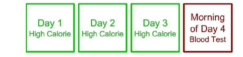
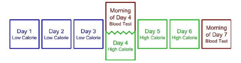

### **Модель липидной энергии**

Часто обсуждается, как жир превращается в кетоны и почему это называется кетогенной диетой. Тем не менее, это немного обманчиво, потому что предполагает, что 100% вашего жира превращается в кетоновые тела. Правда в том, что у жира есть много других путей прямой доставки к вашим клеткам. Он может доставляться через триглицериды на липопротеидах и в виде неэтерифицированных жирных кислот.

Давайте сосредоточимся на этом пути поступления триглицеридов на липопротеины. Для этого нам нужно пройтись по линиям липопротеинов. Представьте себе лодку, которая перемещает что-то гидрофобное через водную среду, которой является ваш кровоток. Хиломикрон — одна из этих линий, известная тем, что в ней есть липопротеин apoB48, который означает, что он поступает из тонкого кишечника из-за пищи, которую вы только что съели. Поэтому, если я ем пищу с большим количеством жира, она упаковывается в хиломикрон, раздутый триглицеридами и небольшим количеством холестерина. Эти триглицериды распределяются по периферическим тканям по всему телу, и очень быстро, всего за несколько минут, они становятся остатком хиломикрона и поглощаются печенью.

Этот процесс уравновешивается еще одним липопротеином, вырабатываемым печенью: ЛПОНП, которые также имеют много триглицеридов и доставляют их в периферические ткани. Это можно назвать категорией доставки энергии. Липопротеины также играют вспомогательную роль, примером которой является ЛПВП или липопротеины высокой плотности, которые связаны с улучшением сердечно-сосудистых исходов. Другой известный липопротеин, ЛПНП, также играет вспомогательную роль, хотя и менее известную.

Он принимает активное участие в иммунном ответе, связывается с патогенами, обеспечивает альфа-токоферол (витамин Е) и может эндоцитозироваться клетками для составляющих его компонентов.

Давайте упростим это, разделив липопротеины на функции доставки энергии и поддержки. Существует одна линия липопротеинов, липопротеин apoB100, которая выполняет двойную функцию. ЛПОНП обеспечивают энергию, а ЛПНП — поддержку. Большинство липопротеинов, покидающих печень, являются ЛПОНП; примерно половина поглощается печенью в виде ЛПЛ, в то время как другая половина остается в виде частиц ЛПНП. Этот контекст помогает нам понять жизненный цикл ЛПОНП и ЛПНП: ЛПОНП длятся от 30 до 60 минут, ЛПОНП — менее 30 минут, а ЛПНП — от 2 до 4 дней. Это важно, потому что это согласуется с моделью инверсии, наблюдаемой в трехдневном окне жизненного цикла ЛПНП.

Далее рассмотрим концепцию доставки энергии и оставшихся молекул. Простые молекулы, такие как глюкоза и кетоны, не оставляют многого, в то время как липопротеины оставляют, что приводит к присутствию частиц ЛПНП. Когда вы находитесь в гипокалорийном состоянии на низкоуглеводной диете или натощак, меньшее количество поступающих хиломикронов и уменьшенные запасы гликогена приводят к большему липолизу, большей секреции ЛПОНП и большему количеству частиц ЛПНП. И наоборот, потребление большого количества жиров приводит к большему количеству поступающих хиломикронов, меньшему количеству ЛПОНП, необходимых для получения энергии, и, следовательно, меньшему количеству частиц ЛПНП.

Теперь давайте обсудим стадию и темп энергии. Например, в замечательной статье о метаболизме жирных кислот в жировой ткани, мышцах и печени в норме здоровья и болезней разбиты данные обеих категорий. Жировая ткань получает около 90% своих жиров из триглицеридов на липопротеидах, в то время как скелетные мышцы получают больше из неэтерифицированных жирных кислот. Это сродни глобальной цепочке распределения (ЛПОНП и хиломикроны) и локальному распределению (неэтерифицированные жирные кислоты). ЛПОНП и хиломикроны поставляют триглицериды в жировую ткань, что помогает распределять неэтерифицированные жирные кислоты по клеткам.

Давайте рассмотрим разницу между сытым и постным государством. В сытом состоянии, особенно на низкоуглеводной диете, поступающие хиломикроны и остаточные ЛПОНП снабжают энергией различные ткани и восполняют жировую ткань. В состоянии натощак инсулин снижается, глюкагон увеличивается, а жировая ткань обеспечивает больше неэтерифицированных жирных кислот, в то время как ЛПНП обеспечивают прямую доставку энергии. ЛПОНП по-прежнему восполняют жировую ткань, подчеркивая важность доступности энергии для клеток.

При метаболической негибкости, например, в состоянии гиперинсулинемии, у вас может быть больше ЛПНП и максимальный патологический порог жира, что приводит к увеличению внематочного жира. Это связано с атерогенной дислипидемией: низким уровнем холестерина ЛПВП, высоким уровнем триглицеридов и небольшими плотными частицами ЛПНП, часто наблюдаемыми у пациентов с гиперинсулинемией, оставшимися липопротеинами, эктопическими жирами, сердечно-сосудистыми заболеваниями и повышенной смертностью от всех причин.

И наоборот, адаптированный к жирам, гибкий метаболический профиль, часто наблюдаемый у людей, сидящих на низкоуглеводной диете, показывает низкоуглеводную липидную триаду: повышенный уровень ЛПВП, снижение уровня триглицеридов и повышение уровня холестерина ЛПНП. Этот профиль, иногда шутливо называемый обратной атерогенной дислипидемией, связан с низким уровнем инсулина, низким уровнем ЛПОНП и низким содержанием остаточных липопротеинов.

Теперь давайте обратимся к последней части энергетической модели. Этот вариант немного более эзотерический, но он возвращает нас к запасам гликогена в печени. Чтобы это понять, давайте рассмотрим «эксперимент по замене углеводов». Дэйв Фельдман придерживался изокалорийной диеты, потребляя 3000 калорий в день, разделенных на 1000 калорий в 10:00 утра, 3:00 вечера и 8:00 вечера. Прием пищи представлял собой коктейли-заменители для кетогенной диеты, которые являются полноценными с точки зрения питательных веществ. Намерение состояло в том, чтобы иметь что-то, над чем я мог бы иметь очень жесткий контроль и минимальную вариативность.

В течение первых трех дней это было все, что он ел. Затем, для его вмешательства, у него было 500 калорий в виде углеводов из хлеба. На следующий день он съел тысячу калорий углеводов. Это был изокалорийный обмен, поэтому он все равно потреблял 3000 калорий в оба дня. Еще два дня он возвращался только к коктейлям. Из-за путешествий он снизил мое потребление до 2300, а затем до 1500 калорий, но остался кетогенным. Это был единственный период, в течение которого он не был кетогенным.

Что случилось? Его общий холестерин во время кетогенной диеты был постоянно высоким, от 313 до 326. На четвертый и пятый дни, когда он добавил углеводы, мой холестерин начал падать. Он не мог получить чистый расчет ЛПНП-С, потому что триглицериды были менее пятидесяти миллиграммов на децилитр, что делало расчет невозможным. Тем не менее, интересно, что даже после возвращения к кетогенной диете его уровень холестерина ЛПНП и общего холестерина продолжал снижаться, достигнув отметки около 131. Считается, что это было связано с увеличением запасов гликогена, что в конечном итоге привело к снижению уровня холестерина. Некоторые исследования показывают, что более низкие запасы гликогена в печени связаны с большей скоростью липолиза. Это может иметь смысл, поскольку это обеспечит большую кратковременную энергетическую буферизацию вместо отсутствующего гликогена, что приведет к большей секреции ЛПОНП и большему количеству частиц ЛПНП.
«Эксперимент с белым хлебом». В этом эксперименте Фельдман употреблял только белый хлеб и постное обработанное мясо, а также воду и некоторые добавки для полноты питательных веществ. Эта диета была специально выбрана из-за ее низкого качества, чтобы гарантировать, что переход от диеты с низким содержанием углеводов и высоким содержанием жиров к диете с высоким содержанием углеводов и низким содержанием жиров не будет зависеть от качества пищи.

Как чрезмерное потребление белого хлеба и обработанного мяса повлияло на его уровень холестерина? После перехода на кетогенную диету его ЛПНП составил 296. После перехода на диету из белого хлеба его ЛПНП значительно снизился за неделю: 233, 198, 160, 147 и 102, достигнув рекордно низкого уровня в 83. Это привело к снижению уровня холестерина ЛПНП на 213 мг/дл.

Это резкое падение может не иметь смысла на начальном этапе, но учтите, что вместо кетонов и триглицеридов, которые могли бы оставить больше оставшихся частиц ЛПНП, он теперь питался больше углеводами и, возможно, белком.
Однако это еще не вся история. Такие факторы, как гиперинсулинемия, прикрепление большего количества жирных кислот и снижение липолиза из-за чрезмерного потребления, также сыграли свою роль. Более того, восполнение запасов гликогена в печени было фактором. В то время как мои триглицериды и ЛПВП колебались, эти изменения также отражают динамическую природу метаболических путей.

Это приводит нас к гиперреакциям сухой массы, фенотипу, представляющему особый интерес. Этот термин относится к тем, кто придерживается низкоуглеводной диеты, у которых наблюдается резкое увеличение общего холестерина и холестерина ЛПНП в сочетании с худым и спортивным характером. Как правило, они демонстрируют очень высокий уровень холестерина ЛПВП, очень низкий уровень триглицеридов и очень высокий уровень холестерина ЛПНП. Эта триада — высокий уровень ЛПНП, высокий уровень ЛПВП и низкий уровень триглицеридов — встречается редко, но, по моим наблюдениям, она распространена среди худых, активных людей на низкоуглеводной диете.

Триада гиперреспондеров мышечной массы характеризуется очень высоким уровнем ЛПВП, очень низким уровнем триглицеридов и очень высоким уровнем ЛПНП. Показатели холестерина могут быть выше у худощавых, спортивных людей на низкоуглеводной диете из-за более низких запасов гликогена, меньшего количества жира в организме и более высоких энергетических потребностей. Это требует большего количества липопротеинов для транспортировки энергии из жира, что приводит к повышению маркеров холестерина ЛПНП.

Волек и Финни изучили спортсменов и обнаружили, что у тех, кто придерживался низкоуглеводной диеты, был более высокий уровень общего холестерина и холестерина ЛПНП. Физические упражнения обычно снижают этот уровень, но у спортсменов с низким содержанием углеводов это приводит к гиперхолестеринемии.

Эта гипотеза энергетической модели утверждает, что в состоянии голодания гиперчувствительные люди с мышечной массой, из-за более низкой общей жировой массы, должны выводить больше ЛПОНП из существующих жирных кислот, что приводит к большему количеству частиц ЛПНП. Это не является стрессом для печени, так как если бы это было так, мы бы увидели более высокие маркеры воспаления, такие как С-реактивный белок, но мы этого не делаем. Вместо этого мы наблюдаем очень низкий уровень СРБ и здоровую функцию печени.

Подтверждающие исследования этой модели показывают, что голодание повышает уровень холестерина и что уровень ЛПВП связан с оборотом триглицеридов. Например, употребление алкоголя влияет на оборот ЛПВП и триглицеридов, что наблюдается у хронических потребителей алкоголя. Даже при нервной анорексии, где у людей очень низкие запасы гликогена, мы наблюдаем более высокие уровни общего холестерина, холестерина ЛПВП и ЛПНП.

Когда худые люди садятся на диеты с очень низким содержанием углеводов, они могут заметить резкое повышение уровня холестерина ЛПНП до уровня 200, 300 или даже 500 миллиграммов на децилитр или более. Когортное исследование продемонстрировало обратную связь между массой тела и холестерином ЛПНП у лиц на низкоуглеводной диете. Другими словами, чем худее были испытуемые, тем выше был их уровень холестерина ЛПНП на уровне популяции. Примечательно, что когда это повышение уровня ЛПНП происходит, оно часто дополнительно связано с повышением уровня холестерина ЛПВП наряду с низким уровнем триглицеридов.

Модель липидной энергии не является доказанной теорией, и она не предназначена для описания всех возможных влияний, которые могут способствовать изменениям холестерина ЛПНП на низкоуглеводных диетах. Тем не менее, это полезная структура, поскольку она делает прямые и проверяемые прогнозы, которые могут быть оценены в будущих экспериментах.

Протокол снижения уровня холестерина, также известный как протокол Фельдмана, позволяет быстро снизить уровень холестерина у тех, кто следует кетогенной диете/LCHF, увеличивая количество пищевых жиров за несколько дней до анализа крови на холестерин. Этот протокол, по-видимому, имеет около 85% успеха и, следовательно, 15% неудач. Пожалуйста, имейте это в виду.

Существует две основные версии этого эксперимента:

1. Три с половиной дня, один анализ крови. Все, что вам нужно сделать, это увеличить общее количество калорий в течение трех дней, сохраняя те же соотношения макронутриентов или с более высокой долей жиров (см. ниже). Затем сдайте анализ крови на следующее утро.

2. Шесть с половиной дней, два анализа крови. Как (1) выше, но с низким содержанием калорий в течение первых трех дней, за которым следует первый анализ крови, затем высокая калорийность в течение последних трех дней, за которым следует второй анализ крови.

На протяжении всего эксперимента вы должны придерживаться либо стандартного соотношения (65% жира, 35% белка), либо соотношения с еще более высокой долей жира (например, 70% или 75% жира).

«Низким днем» будет любой день, когда вы едите очень низкое количество калорий, но при этом соблюдаете низкое соотношение углеводов и большого количества жиров. Он должен быть настолько низким, насколько вы можете разумно выдержать без фактического голодания. Например, если вы обнаружили, что можете потреблять 1/3 от своей обычной ежедневной нормы калорий, вы можете попробовать это. Например, допустим, вы обычно потребляете 2100 калорий в день. Но вы обнаружили, что можете снизить его на 2/3 до 700 калорий в день и свести концы с концами.

«Высокий день» будет похож на описанный выше «Низкий день», но с очень большим количеством калорий, но опять же, с таким же или более высоким процентом от общего количества калорий из жиров. В отличие от Низкого дня, это должно быть столько еды, сколько вы можете разумно съесть. (ПРИМЕЧАНИЕ: Чтобы быть более безопасными, мы не рекомендуем превышать уровень калорий в 3 раза.) Например, допустим, вы обычно потребляете 1500 калорий в день. Вы можете обнаружить, что можете получить примерно в 2 раза больше этой суммы до 3000 или даже в 3 раза больше за 4500.

Вы хотите запланировать свой последний прием пищи на вечер через 12-14 часов после анализа крови, который вы будете сдавать на следующее утро. Это особенно сложно в праздничные дни из-за того, сколько калорий вы пытаетесь съесть в течение дня, поэтому планируйте соответственно!
