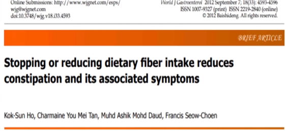
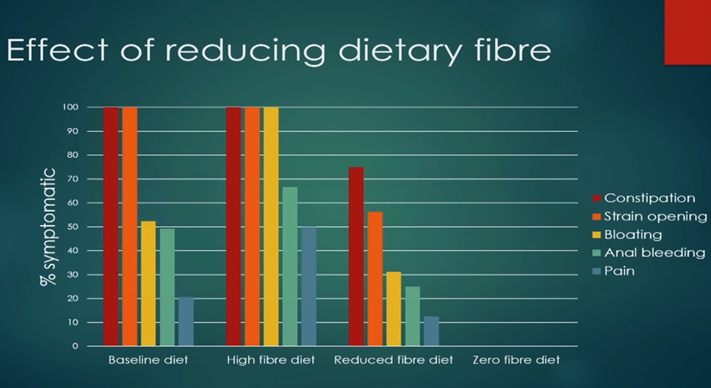
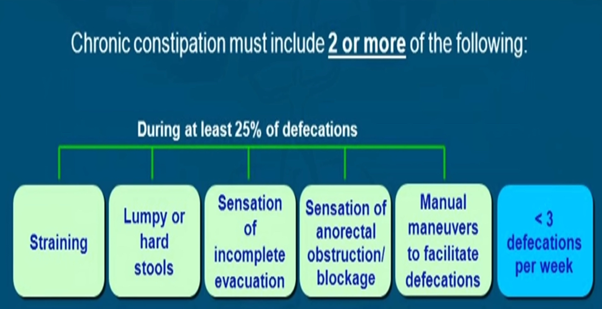
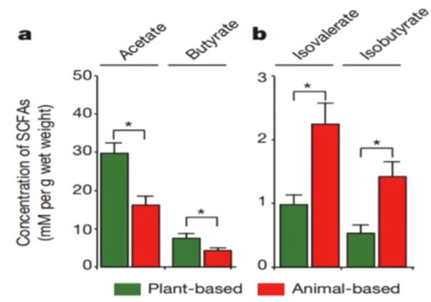

### **Клетчатка**

Клетчатка определяется как углеводная часть растительной пищи, которую мы не можем переварить. Его можно разделить на два типа: растворимая клетчатка, которая может быть легко ферментирована бактериями в нашей толстой кишке, производя газы и то, что называется короткоцепочечными жирными кислотами, и нерастворимая клетчатка, которая гораздо более устойчива к расщеплению бактериями в нашей толстой кишке. Этот тип клетчатки увеличивает объем нашего стула.

Было высказано много предположений о пользе употребления клетчатки. К ним относятся профилактика рака кишечника, профилактика дивертикулеза, помощь при геморрое, снижение уровня сахара в крови и, конечно же, лечение запоров. На самом деле, в настоящее время принято считать, что клетчатка является необходимым компонентом здорового питания. В австралийской диете злаки и хлеб с высоким содержанием углеводов составляют 45% клетчатки, которую получает среднестатистический австралиец. В настоящее время правительство считает, что клетчатка является лучшим доступным средством для лечения запоров, не имеющим себе равных. Однако это мнение не выдерживает научной проверки.

Для такого широко распространенного утверждения можно было бы подумать, что должны быть убедительные доказательства, подтверждающие его. Вот только его нет. Конечно, есть исследования, в которых изучались объемы, скорость транзита и некоторые другие вещи, но когда мы смотрим на симптомы запора, исследований просто нет.

Это было исследование типа «случай-контроль». В этом исследовании были отобраны 63 пациента с запорами, и у этих пациентов сравнивались диеты с высоким и низким содержанием клетчатки. Это также включало диету без клетчатки, которая требовала полного отказа от всех овощей, злаков, фруктов, цельнозернового хлеба и риса.

На этом графике представлен процент участников исследования до начала исследования, страдающих от каждого из симптомов, перечисленных справа.

Вы можете видеть, что до начала исследования у всех них были запоры и напряжение, чтобы открыть кишечник, а некоторые также испытывали вздутие живота, кровотечение и боль. Когда участники исследования были переведены на диету с высоким содержанием клетчатки, мы видим, что доля людей, страдающих от симптомов, на самом деле увеличилась, особенно от вздутия живота. Затем была рука с пониженным содержанием клетчатки, и здесь вы можете видеть, что те, кто придерживался диеты с пониженным содержанием клетчатки, на самом деле продемонстрировали умеренное уменьшение симптомов.

Что случилось с теми участниками исследования, у которых в рационе не было клетчатки? Ни у одного пациента на диете без клетчатки не было никаких симптомов. Эти результаты были высоко статистически значимыми. Они не были случайными.

Каждый человек в группе с нулевым содержанием клетчатки в конечном итоге имел одно опоражение кишечника в день, каждый день. Как это соотносится с показателями в группе с высоким содержанием клетчатки? Одно опознание кишечника в среднем каждые 6,83 дня.

Все еще считаете, что клетчатка полезна при запорах?

Чтобы понять, почему клетчатка уменьшает запоры и дает такие поразительные результаты, давайте рассмотрим диагностические критерии, которые врачи используют для диагностики функционального запора.

Вы заметите, что каждый критерий относится к легкости прохождения стула через анальный сфинктер, что вполне логично. Клетчатка, особенно нерастворимая клетчатка, содержащаяся в пшеничных отрубях, уже давно известна своей способностью увеличивать объем стула, увеличивая его. Но если подумать логически, действительно ли создание чего-то большего является решением, когда вы пытаетесь пропустить его через маленькое отверстие? Наполнение прямой кишки фекалиями на самом деле затрудняет выведение фекалий, поэтому использование клетчатки для помощи при запорах аналогично добавлению большего количества автомобилей для устранения пробок.

FODMAP — это углеводы, группа короткоцепочечных углеводов с некоторыми общими особенностями. Они плохо всасываются в кишечнике, попадая в толстую кишку, где могут ферментироваться бактериями, вызывая газообразование, как растворимая клетчатка. Кроме того, эти FODMAP притягивают жидкость из-за высокой осмотической активности, что приводит к водянистому стулу. Оба симптома наблюдаются при синдроме раздраженного кишечника (СРК), вызывая вздутие живота и запор, когда бактерии метаболизируют их и производят метан, который, как было показано, вызывает запор. Около трех четвертей людей с СРК отмечают значительные улучшения на диете с низким содержанием FODMAP.

В интересном исследовании, опубликованном в 2018 году, рассматривалась нецелиакическая чувствительность к глютену. Пациентам с кишечными симптомами при употреблении продуктов, содержащих глютен, но с нормальными тестами на целиакию, давали специально изготовленные батончики с фруктанами (FODMAP), глютеном или ни тем, ни другим. Их симптомы были намного хуже при приеме фруктанов, чем при приеме глютена, что позволяет предположить, что нецелиакическая чувствительность к глютену на самом деле может быть проблемой при приеме FODMAP.

Существует множество диких утверждений о пользе бутирата не только для здоровья кишечника, но и для всего организма. Во-первых, хотя бутират может производиться кишечными бактериями из клетчатки, первым местом его обнаружения было сливочное масло. Около трех-четырех процентов сливочного масла содержит масляную кислоту, поэтому, если вы съедите 100 граммов сливочного масла, вы получите от 3 до 4 граммов бутирата. Поскольку основное преимущество клетчатки заключается в бутирате, сколько мы получаем от клетчатки — это то, что нам нужно знать.

Бесконечные сторонники клетчатки утверждают, что от 5% до 15% калорий в рационе поступают из короткоцепочечных жирных кислот, и именно поэтому бутират и клетчатка так важны. Итак, допустим, 10% ваших пищевых калорий поступает из бутирата, что составляет 200 калорий для типичной рекомендуемой диеты.

Правительство ежедневно рекомендует 21 грамм клетчатки для взрослого мужчины и немного меньше для женщины, но углеводы содержат всего четыре калории на грамм. Так как же получается 200 калорий? Максимально возможное будет составлять 84 калории. На самом деле это немного больше, потому что эти значения недооценены, а углеводы на самом деле содержат 4,5 калории на грамм. Так что давайте назовем это 100 калориями, чтобы дать им полную пользу от сомнений. Мы уже потерпели неудачу, но мы все еще впереди того, чтобы просто есть немного сливочного масла каждый день, что даст около 15-20 калорий бутирата, если каждый на самом деле ест 21 грамм клетчатки. Но мало кто это делает.

Здесь есть еще одна проблема. Масляная кислота — не единственная короткоцепочечная жирная кислота, которую ваш организм вырабатывает в своем микробиоме. На самом деле, он является одним из наименее распространенных. Только 10% короткоцепочечных жирных кислот, вырабатываемых в кишечнике, являются масляной кислотой. Ой. Итак, мы снизили количество калорий с 200 калорий в заявлении, затем до 100 калорий, и теперь у нас есть только 20 процентов от этого, что составляет всего 20 калорий. Это примерно то же самое, что просто есть немного масла и сыра каждый день. Однако с этого момента все быстро выходит наперекосяк. Это только лучший сценарий, когда каждый грамм клетчатки превращается в короткоцепочечные жирные кислоты. На самом деле этого просто не происходит.

Во-первых, у вас должны быть правильные кишечные бактерии, обычно от ваших родителей, иначе этого не произойдет вообще. Если вы принимали антибиотики в какой-то момент своей жизни, очень вероятно, что вы не вырабатываете их очень много. Вы можете вообще ничего не делать. Даже если вы это сделаете, у вас будет гораздо больше пропионовой кислоты, чем масляной. Пропионовая кислота имеет химическое строение, которое требует использования карбоксилирования митохондриями для получения энергии и может иметь неблагоприятные последствия для мозга.

Этот процесс карбоксилирования пропионовой кислоты истощает уровень фолиевой кислоты, а низкий уровень фолиевой кислоты и высокий уровень пропионовой кислоты в кишечнике тесно связаны с аутизмом. На самом деле, если вы введете пропионат мыши, вы можете очень легко вызвать симптомы аутизма. Тем не менее, это гениальный совет по питанию, который нам предлагают: диета, которая максимизирует пропионат. Вы также должны знать, что многие хлебобулочные изделия, которые вы покупаете в упаковках, также содержат пропионат, поэтому будьте очень осторожны при покупке этого продукта в магазине, потому что наличие любого пропионата в рационе напрямую негативно скажется на вашем здоровье..

Вдобавок ко всему этому, подавляющее большинство волокна поступает в один конец и сразу выходит из другого, что вы, вероятно, видели сами в прошлом. Это может варьироваться, но характерно, что девяносто процентов клетчатки никогда не перевариваются в организме. Итак, теперь мы перешли от 200 калорий бутирата к двум калориям. Эта четверть грамма бутирата действительно должна делать какие-то удивительные вещи в организме, чтобы иметь все эти эффекты. Кроме того, это всего лишь одна десятая часть того, что мы можем получить на плотоядной диете, просто употребляя немного сливочного масла каждый день. Очевидно, что клетчатка совершенно незначительна в общем объеме производства бутирата. Если бы мы ели еще большее количество, у нас было бы много побочных эффектов, таких как вздутие живота и спазмы. Но необходим ли бутират организму? Нужен ли он нам для чего-нибудь? Строим ли мы свой мозг из бутирата, как мы строим его из ДГК и ЭПК, например? Нет, мы не используем его ни для чего, кроме как в качестве энергии. Как короткоцепочечная жирная кислота, бутират обладает некоторыми особыми свойствами.

Бутират может легко проникать в клеточные мембраны и даже может проникать в митохондрии, не транспортируясь внутрь. Это позволяет колоноцитам напрямую использовать энергию масляной кислоты, а также позволяет инсулинорезистентным и поврежденным клеткам использовать эту энергию, что может спасти их и позволить им снова нормально работать. Вдобавок ко всему, он также пропускает некоторые этапы процесса производства энергии, что означает, что производится меньше кислоты по сравнению с другими методами и требуется меньше очистки. Огромная часть работы вашего организма заключается в том, чтобы просто выводить кислоту из организма, особенно из нежных почек и легких. Все, что вы можете сделать, чтобы помочь этому процессу, будет очень положительно для вашего здоровья.

Звучит просто потрясающе, не правда ли? А в исследованиях было показано, что бутират значительно снижает чувство голода у мышей. Это тоже удивительно, пока вы не поймете, что в этих исследованиях на самом деле используется бутират из сливочного масла. Они не давали им клетчатки. И ни в одном исследовании, где давали дополнительную клетчатку, они не получили никакой пользы. Когда вы потребляете еще больше клетчатки, чем рекомендует правительство, вы столкнетесь с сильным вздутием живота и спазмами.

Давно известно и хорошо известно, что влажность стула не меняется независимо от того, сколько клетчатки или воды вы потребляете. Клетчатка не увлажняет стул, и хотя технически это не является диагностическим признаком запора, вздутие живота является известной проблемой, которая, как понимают многие люди, связана с чрезмерным потреблением клетчатки. Причина этого в том, что он не переваривается в тонком кишечнике. Помните, что это и есть определение клетчатки: она не способна перевариваться, поэтому она попадает в толстый кишечник, который имеет большую популяцию бактерий. Эти бактерии могут ферментировать клетчатку, особенно растворимую клетчатку, и они производят так называемые короткоцепочечные жирные кислоты, которые считаются одними из полезных для здоровья веществ. Но в процессе этого они также производят такие газы, как водород. Учитывая, что объем всего желудочно-кишечного тракта составляет всего около одного литра, требуется лишь относительно небольшое количество газообразования, прежде чем вы начнете чувствовать вздутие живота и начнете испытывать боль в животе.

Давайте обратим внимание на то, что называется короткоцепочечной жирной кислотой. Вы помните, что когда клетчатка ферментируется бактериями, она вырабатывает эти жирные кислоты, которые, как считается, приносят некоторую пользу для здоровья. Эти бактерии позволяют организму извлекать энергию из непригодного для использования источника, предоставляемого в виде жиров. Говорят, что эти короткоцепочечные жирные кислоты питают клетки, выстилающие нашу толстую кишку, называемые колоноцитами, и считается, что это помогает улучшить такие состояния, как воспалительные заболевания кишечника.

Хотя это правда, что эти клетки могут использовать короткоцепочечные жирные кислоты для получения энергии, они делают это только после того, как сначала преобразуют их в кетоны. Если кетоны, полученные из короткоцепочечных жирных кислот, полезны, разве не логично, что кетоны в циркуляции, образующиеся при пищевом кетозе или на кетогенной диете, также будут полезны для этих клеток? Они все еще могут добраться до них, и на самом деле, кетоны в циркуляции, вероятно, даже более эффективны, потому что они доставляются к каждому колоноциту, а не только к тем, кто находится в прямом контакте с ними. Это было продемонстрировано в исследованиях, сравнивающих животных, получавших короткоцепочечные жирные кислоты и кетоны, вводимые в кровоток, показав, что кетоны в кровотоке более эффективны при лечении воспаления воспалительных заболеваний кишечника.

Даже если короткоцепочечные жирные кислоты полезны, клетчатка не является единственным их источником. На этом графике показано производство короткоцепочечных жирных кислот между растительной диетой с большим количеством клетчатки и животной диетой с большим количеством аминокислот. Красным цветом видно, что производство короткоцепочечных жирных кислот на самом деле выше в животной диете, чем в растительной. Таким образом, нет ничего уникально полезного в производстве короткоцепочечных жирных кислот из клетчатки.

Что еще более важно, прежде чем вы сможете использовать бутират для получения энергии, его необходимо преобразовать в уксусную кислоту, также известную как уксус. Все эти удивительные эффекты бутирата относятся и к уксусу, но даже в большей степени. Хотя ваш микробиом не производит много бутирата, он производит довольно много уксуса, который может значительно повлиять на ваше здоровье. На самом деле, на долю уксуса приходится около 70% всех короткоцепочечных жирных кислот, производимых в микробиоме. Какая разница? Вы можете сделать немного уксуса из клетчатки, но ваш организм также может использовать другие источники топлива. Бактерии, такие как L. reuteri, которые предпочитают мясо и молочные продукты в качестве источников топлива, производят больше всего уксуса, чтобы убить другие патогенные бактерии, которые не должны находиться в кишечнике, например, те, которые производят пропионовую кислоту, вызывающую акне. Употребление чрезмерного количества углеводов снижает количество L. reuteri и других пробиотиков, что приводит к чрезмерному росту более негативных кишечных бактерий.

Вы также можете принимать уксус напрямую, который приносит пользу кишечному микробиому, колоноцитам и многим другим проблемам со здоровьем, включая кровяное давление, депрессию, чувствительность к инсулину и жировую дистрофию печени. В общем, чем больше уксуса в вашем кишечнике, тем полезнее он станет. Положительные пробиотики обычно процветают в присутствии уксуса, в то время как отрицательные кишечные бактерии погибают. Например, H. pylori требуется высокий pH для процветания, поэтому уксус, снижая pH, помогает убить эти бактерии и значительно улучшает пищеварение.

Холин, важное питательное вещество, также очень полезен для здоровья кишечника. Он увеличивает ТМАО в кишечнике. В то время как TMAO злонамеренно называют токсичными для здоровья, это верно только в том случае, если они вырабатываются в самом организме во время метаболического синдрома. В кишечнике они защищают организм и даже помогают бороться с раком. Они увеличиваются при потреблении холина и употреблении жареного мяса. Если бы диетические ТМАО были проблемой, жареная рыба была бы смертельной, потому что в ней очень много ТМАО. Но все данные указывают на то, что рыба очень полезна для здоровья, приготовленная на гриле или нет. Это указывает на то, что диетические ТМАО и холин полезны в борьбе с раком.

Означает ли все это, что клетчатка вредна? Может ли клетчатка убить вас? На самом деле, клетчатка убивает тысячи людей каждый год. Если вы принимаете добавки с клетчаткой и не употребляете с ней достаточное количество воды, это может привести к кишечной непроходимости, что приводит к удивительному количеству смертей каждый год. Вы также можете получить закупорку от употребления салата или волокнистых овощей, если волокно спутается в клубок, особенно если у вас грыжа.

Но помогает ли клетчатка ходить в туалет? Смотря как. Если вы едите много постного мяса, которое является единственным видом мяса, которое продвигают власти, это может помочь ему протолкнуть. С другой стороны, когда у вас достаточно жиров в рационе и вы не едите пищу с низким содержанием жиров, как большинство людей сегодня, у вас просто нет этой проблемы.

По иронии судьбы, некоторые утверждают, что прием большого количества клетчатки также заставит вас ходить чаще, и что это хорошо. Это может быть правдой, но я бы предпочел просто добавить немного жира в свой рацион и никогда не страдать от запоров, чем быть полным килограммов отходов в первую очередь. Пшеница и сахар являются самыми большими преступниками, когда речь идет о здоровье кишечника.

Плохие бактерии разрастаются в кишечнике, когда вы их проглатываете. Эти бактерии не хотят, чтобы их изгоняли, и они сами засоряют вас. Они даже могут оказывать влияние на мозг и вызывать у вас жажду углеводов в рационе. Существует грибок, поражающий муравьев под названием кордицепс, который превращает их в зомби, заставляя их ничего не делать, кроме как пытаться распространить грибок еще больше.

Точно так же существуют бактерии, которые превращают людей в углеводных зомби. Углеводные зомби могут очень разозлиться, когда вы предлагаете им умерить потребление углеводов, но на самом деле это просто кишечные патогены. Многие пробиотические бактерии, такие как L. reuteri, любят цельное молоко. Эти бактерии не только питаются белками, но и используют жир для производства биоцидов, которые убивают негативные бактерии, которые они затем едят. Бактерии, производящие йогурт, также производят уксус, который убивает вредные бактерии и оказывает удивительное воздействие на здоровье всего организма. Это включает в себя бактерии, вызывающие акне, которые вызывают еще более серьезные проблемы внутри организма, чем снаружи, включая нейровоспаление и даже смерть в виде сепсиса.

Пробиотики являются аэробными и, как правило, процветают в кислой среде, в то время как эти условия убивают плохих парней, таких как C. acnes и Firmicutes. Патогенные микробы, как правило, процветают в анаэробной среде с низкой кислотностью. Это печальное последствие высокоуглеводной диеты. Питание определенным образом пропагандировалось так усердно с использованием такого количества денег, что люди считают это само собой разумеющимся, но на самом деле очень неестественно постоянно иметь все эти странные продукты на тарелке.
