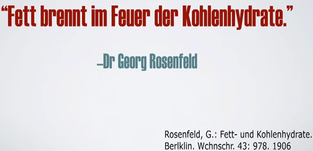

### **Калории, килоджоули и АТФ**

Давайте посмотрим на первый закон термодинамики и посмотрим, чем он является, чем не является, что он говорит, а что не говорит. Итак, во-первых, первый закон термодинамики – это явная констатация факта. Закон таков: он гласит, что ΔU равно Q минус W.

Первый закон термодинамики не гласит, что энергия сохраняется. Энергия не может быть создана, энергия не может быть уничтожена, потому что таков закон сохранения энергии. Это не первый закон термодинамики. Первый закон термодинамики является ограниченным в конкретном случае примером одного из мест, где закон сохранения энергии, по-видимому, относительно верен.

Первая часть суммы равна ΔU. Что такое ΔU? ΔU явно определяется как внутренняя энергия замкнутой термодинамической системы. Для применения этого закона необходимо, чтобы рассматриваемая система была закрыта. Это в самом определении. ΔU, внутренняя энергия остается постоянной в замкнутой термодинамической системе. Внутренняя энергия является обширным свойством. Она остается постоянной именно потому, что в случае замкнутой термодинамической системы система замкнута.

Что такое замкнутая термодинамическая система? Он способен обмениваться энергией через свою границу, но не массой. Применим ли первый закон термодинамики к человеческой системе? Является ли человеческое тело закрытым? Может ли человеческое тело обмениваться энергией с окружающей средой? Да, может. Может ли он обмениваться массой также с окружающей средой? Да, может. Следовательно, это открытая, а не закрытая система, и первый закон термодинамики не применим.

Первый закон термодинамики преподносится как делающий ряд выводов об открытых системах, но он не делает никаких явных утверждений. Это явное утверждение, которое гласит, что внутренняя энергия замкнутой системы остается постоянной. Она меняет форму от одного к другому, если существует механизм, позволяющий этой энергии менять форму от одного к другому, но он не позволяет ни создавать, ни разрушать энергию.

Это вообще ничего не говорит о еде. В ней ничего не говорится о так называемом «тепле пищи», которое и есть калория. Это вообще ничего не говорит о массе. Масса явно исключена из первого закона термодинамики именно из-за ее математической формулировки, содержащегося в ней утверждения и требования замкнутости системы.

Когда вы потребляете пищу, вы не потребляете энергию. Вы потребляете массу, которая также несет в себе некоторую химическую энергию. Что делает с этой массой организм человека? Он химически взаимодействует с ним, под контролем, с молекулярным кислородом, получаемым из окружающего воздуха. Масса присутствует в пище, а масса присутствует в кислороде.

Человеческий организм реагирует кислородом с углеводами, жирами, белками и алкоголем, химически изменяя их химические связи. Эти химические реакции являются экзотермическими, высвобождая фотоны и тепло. Эта энергия, заключенная в фотонах, высвобождаемых в результате этих экзотермических реакций, используется человеческим организмом для производства химического запаса энергии в форме АТФ. Ни один из этих процессов не включает в себя тепло, за исключением того, что тепло выделяется в виде фотонов, а перенос энергии между различными химическими веществами также происходит в виде фотонов. Однако предположение о том, что математическая эквивалентность между энергией фотонов и кинетической энергией достаточна для измерения энергии в пище, является неточным. Человеческий организм не сжигает быстро пищу с кислородом неконтролируемым образом, чтобы выделять тепло.

Даже если бы этикетки продуктов питания были абсолютно точными с точки зрения калорийности, вы все равно были бы значительно ошибаетесь при оценке того, сколько фактической метаболической энергии вы получаете от потребления пищи. И это без учета того факта, что этикетки пищевой ценности могут по закону отличаться до 20% по калорийности.

Как измерить расходуемые калории? Большинство людей используют крайне расплывчатую оценку, полученную с помощью онлайн-калькуляторов, которые спрашивают о вашем возрасте, поле, росте, весе и уровне активности. Эти оценки всего лишь оценки.

Вы не приблизитесь к точной оценке «расхода калорий», потому что не знаете свою истинную скорость основного метаболизма или фактическую энергию, затраченную во время упражнений. И каждый раз, когда вы выводите какую-либо массу из своего тела — любую массу — это потеря калорий. Выдох углекислого газа — это потеря калорий за счет потери массы.

Когда вы производите метаболическую воду и выделяете ее в виде пара с потом или мочой, это также потеря массы в виде воды, что можно интерпретировать как потерю калорий, потому что вода содержит калории, верно? Он мутит воду — в буквальном смысле. А как насчет измерения и быстрого сжигания всех ваших экскрементов в калориметре-бомбе, чтобы определить, сколько массы вы не поглотили? А как насчет изменений в мышечной или жировой массе, которые изменяют обширные свойства внутренней энергии в вашем организме? Вы учитываете это?

Килокалории — это явное измерение тепла, когда вы помещаете что-то в калориметр-бомбу, а затем эта энергия рассеивается в воде, фотонная энергия вибрирует эти молекулы воды, повышая их температуру на определенную величину — вот что такое устройство измеряет для определения количества килокалории.

Калория — это единица измерения тепловой энергии, так же как килоджоуль измеряет кинетическую энергию, а кулон измеряет поток электрического заряда. Это разные валюты понятия энергии, специфичные и явные по отношению к измеряемому физическому явлению. Обладает ли человек метаболическим механизмом, оборудованием или оборудованием для инкапсуляции тепловых фотонов определенной длины волны или диапазона и использования их энергии для метаболических процессов? Нет, мы не инкапсулируем тепло для получения энергии. Мы используем химические превращения вещества из одной формы в другую, высвобождая фотоны экзотермическим путем. Эти фотоны используются для фосфорилирования АДФ в АТФ, которая впоследствии используется для метаболических процессов — это не тепловая инкапсуляция.

Если мы возьмем 9 и разделим его на 4, то получим примерно 2,25-кратную разницу в теплоте. Многие люди думают: «Ну, вы получаете в 2,25 раза больше энергии из жиров по сравнению с углеводами». Это с точки зрения тепла; Да, если вы калориметр бомбы, то именно столько вы и получите. Люди — это не калориметры-бомбы; Это открытые системы, гормональные системы, которые регулируют энергетические субстраты. Эти субстраты могут храниться, использоваться или выбрасываться в качестве разъединения митохондрий. Все три возможности существуют, и калориметр с бомбой не может их объяснить.

Если вы положите какао в калориметр-бомбу, который очень насыщен, если вы поместите его в калориметр-бомбу, вы фактически получите уровень энергии в килокалориях 5,5, а не 9. Таким образом, разница будет заключаться в том, что если вы возьмете 5,5 и разделите это на 4, вы получите разницу 1,375. Растительные масла имеют приблизительное значение 9,14. Даже белок составляет 4,44, а не 4; Они просто округляют до 4 для удобства. Все эти измерения неточны из-за округления.

Мы видели в клинических условиях, что люди, которые не могут вырабатывать инсулин (диабет 1 типа), могут потреблять огромное количество энергии. Единственная проблема заключалась в том, что они получали значительное повышение кетонов и сахара, что мы называем кетоацидозом. Вот что произойдет; Они не добавляли никакого жира, они не могли его хранить, потому что без инсулина вы не можете его хранить.

Инсулин является анаболическим гормоном, но он выполняет и многие другие функции. Он сигнализирует мышечным клеткам о синтезе белка; Вам не нужно многого. Когда он ниже, он позволяет другим гормонам, таким как гормоночувствительная липаза и многие другие вещества, активироваться и открывать шлюзы свободных жирных кислот для вытекания из жировых клеток, чтобы вы могли использовать эту энергию.

Что использует организм? АТФ от окислительного фосфорилирования; Именно отсюда поступает большая часть нашей энергии в митохондриях. Как выход АТФ при полном окислении пальмитиновой кислоты соотносится с выходом АТФ из глюкозы по отношению к энергетическому содержанию жиров и углеводов? Можно показать, что величина соотношения энергетического содержания жира к углеводам практически идентична отношению выхода АТФ на грамм окисленной пальмитиновой кислоты по сравнению с глюкозой. Таким образом, эффективность в расчете на грамм, благодаря которой энергия становится доступной в виде АТФ, сопоставима для путей окисления жиров и углеводов, подчеркивая, что катаболические пути как для жиров, так и для углеводов в конечном итоге используют одни и те же средства генерации АТФ, а именно окислительное фосфорилирование.

Но даже АТФ может сказать вам только о том, что вы можете получить от определенного энергетического субстрата, а не о том, как именно он будет использоваться организмом. Существует так много движущихся частей, сложная сеть взаимодействий, множество систем и сигнальных путей. Он даже не скажет вам, какое соотношение энергии вырабатывается в митохондриях между этими различными субстратами. Это зависит от того, что попадает в ту или иную ячейку до того, как градиент цикла Рэндла активируется с определенной скоростью и продолжительностью.

Забавно, когда фитнес-инфлюенсеры ссылаются на законы термодинамики. Хотя законы термодинамики незыблемы, они просто не говорят то, что некоторые люди, кажется, думают.

«Калории на входе и на выходе по существу охватываются принципом сохранения массы и энергии, также известным как первый закон термодинамики». Закон сохранения массы исходит из E = mc², хотя это не совсем верно, так как масса вообще не входит в законы термодинамики, что странно упоминать, когда речь идет о потере веса.

Ваше тело производит тепло, затем тепло течет прямо из тела в воздух в земле вокруг вас. Это одна из причин, по которой сжигание калорий во время физических упражнений вводит в заблуждение, и это причина, по которой калории, поступающие в организм, могут в значительной степени не иметь отношения к тому, что остается в организме. Это верно без нарушения законов физики.

Мы можем рассчитать фактическую работу (энергию) упражнений в калориях, и это ничтожно мало даже для бега. Когда они говорят о калориях, сожженных во время физических упражнений, они обычно не измеряют их таким образом; Вместо этого они измеряют производимое тепло. Проблема здесь в том, что чем больше тепла ваши митохондрии производят сейчас, тем больше они снижают выработку тепла позже в течение дня. Когда вы тренируетесь ежедневно, медленно с течением времени, ваше тело просто перестает вырабатывать столько тепла и позволяет вам выполнять работу за него во время упражнений. На самом деле это снижает основной метаболизм, который почти полностью происходит за счет выработки митохондриального тепла.

Вы можете предположить, что производство тепла стабильно и просто постоянно поддерживает температуру тела на уровне 98,6 градусов, но, как и большинство вещей в организме, это обусловлено обратной связью и гормонами и колеблется со временем. Средняя температура тела падает; Сегодня это на 1,5 градуса меньше, чем было 50 лет назад. В основном это связано с повреждением митохондрий в результате современной диеты с высоким содержанием углеводов и белков, в которой употребляются продукты, которых даже не существовало 200 лет назад. Но чрезмерные физические нагрузки также могут вызвать проблемы в этом отношении.

Если бы «Калорийность in», «Калорийность Out» была полезной моделью, это было бы все равно, что щелкнуть выключателем. Вы едите на 3500 калорий меньше и теряете фунт жира. Однако это совсем не так. И если их надавить, то сторонники CiCo со временем заговорят об адаптации. Но они всегда будут пытаться выдать это за незначительный эффект и не имеющий никакого отношения к действительности CiCo. На самом деле, чтобы сбросить фунт жира, вам, возможно, придется съесть примерно на 3500 калорий меньше в первую неделю, но после этого вам придется есть значительно меньше, и каждую неделю это обычно меньше, чем неделей ранее. Если потеря веса достаточно велика, в конечном итоге вы просто перестанете терять вес, даже если вы крупный мужчина и едите всего 1200 или меньше калорий в день. Более того, ваше тело просто не позволит вам сбросить большое количество веса за один раз, не замедляя метаболизм.

Почти вся энергия в вашем теле вырабатывается в виде отработанного тепла, поэтому ваше тело может просто полностью отключить производство, пытаясь остановить вас от потери веса. Вашему организму на самом деле не нужны калории; Он может выжить на всего лишь 800 «калориях» практически бесконечно, если в нем достаточно витаминов.

Вашему организму нужно питание, и вы быстро умрете от дефицита многих питательных веществ, если будете недоедать. Но ни один человек никогда не умирал от недостатка калорий. Вот почему вы просто не можете морить свое тело голодом в течение длительного времени, чтобы сбросить большое количество веса, в любом случае не получая плохих результатов.

Ваше тело всегда имеет полный контроль над расходом калорий и будет препятствовать этим усилиям. Он также имеет большой контроль над поступающими в него калориями, воздействуя на вас голодом с помощью грелина, инсулина, кортизола и других гормонов, вызывающих голод. Если ему угрожает долгосрочное голодание, он также пожертвует остальными частями тела, чтобы выжить в условиях предполагаемой угрозы.

Хотя вы знаете, что можете достать пищу в любое время, в естественной среде человек будет есть ограниченное количество пищи только в течение очень длительного периода времени, если ему угрожает серьезная опасность голода.

Гормон щитовидной железы — это все, чем он должен быть? Гормон щитовидной железы очень катаболический, и хотя многие утверждают, что он является движущей силой метаболизма, на самом деле митохондрии производят большую часть основного метаболизма. Гормоны щитовидной железы в основном используются для обработки рациона пищи, и большие его количества очень вредны, даже несмотря на то, что они потребляют энергию. Если вы хотите увеличить количество митохондрий и BMR, все, что вам нужно сделать, это придерживаться низкоуглеводной диеты и/или соблюдать голодание. Показано, что оба они увеличивают функцию митохондрий и общее количество митохондрий. На самом деле, у приверженцев кето-диеты в четыре раза больше митохондрий, чем у людей, придерживающихся диет с высоким содержанием углеводов.

Еще один способ, которым CiCo нарушается, заключается в том, что ваше тело и микробиом кишечника решают, что усваивать, а что нет. Если вы едите очень много белка, ваш организм не будет слепо поглощать каждую аминокислоту, которую вы едите. В игру вступают различные транспортеры, которые отдают приоритет питательным веществам. Он не будет поглощать гигантское количество мусорных аминокислот, но он будет усердно работать, чтобы усвоить как можно больше лейцина и триптофана. Это хорошая новость для вас, так как триптофан вызывает чувство сытости в мозге, а лейцин снижает скачки сахара в крови от еды и активизирует синтез белка. Оба эти фактора, в свою очередь, помогут вам придерживаться диеты и вырабатывать больше мышечной ткани.

По правде говоря, калории из белка просто не влияют на набор веса. Усвоение жиров еще более вариабельно, чем усвоение белка. При приеме пищи с низким содержанием жира ваше тело испытывает недостаток жира и имеет тенденцию поглощать большую его часть. Но когда вы едите жирную пищу, ваше тело не будет воспринимать ее полностью. У вас есть жесткие ограничения на то, сколько жира вы можете получить из еды, и это одна из причин, по которой употребление одного приема пищи в день может быть хорошей стратегией для некоторых людей. Ваш организм может получить все, что ему нужно, из одного приема пищи, когда вы едите богатые питательными веществами продукты, такие как продукты животного происхождения, но он просто не может потреблять больше, чем ему нужно.

Когда вы садитесь на длительную диету, микробиом кишечника изменяется негативным образом, что приводит к тому, что жир усваивается гораздо быстрее. И наоборот, когда вы голодаете, вы убиваете большую часть негативных бактерий, и большая часть лишнего жира просто проходит прямо через вас. Это лишь один из многих способов, с помощью которых длительные диеты саботируют вашу способность терять жир.

Люди, придерживающиеся плотоядной диеты, как правило, либо предварительно нарезают жирные стейки, либо предварительно отмеряют измельченную говядину в соотношении 80/20. Это позволяет легко соблюдать диету так, как большинство людей никогда не смогли бы при обычном питании. И результаты полностью разрушают то, что мы ожидаем от модели CiCo. На самом деле, основная проблема людей с диетой заключается в том, что они часто едят слишком мало калорий и замедляют свой метаболизм из-за употребления постных кусков мяса. Соблюдение режима не является проблемой на этой диете.

Ваше тело любит равновесие, и оно может решить, что и в каком количестве поглощать при низком уровне инсулина. Ваша кровь наполняется жирными кислотами из-за осмотического давления. Это означает, что ваше тело просто не будет поглощать огромное количество жира, и большая его часть пройдет прямо через вас, если вы едите очень много пищи. Жиры в пище также притупляют реакцию инсулина, что способствует этому эффекту и является еще одной причиной, по которой диета с низким содержанием жиров является полной катастрофой во всех отношениях.

Чтобы научная модель обладала силой, полезностью и корректностью, она должна обладать предсказательной силой. Тем не менее, если вы будете руководствоваться моделью CiCo, вы абсолютно не сможете получить прогнозируемые результаты. Вы всегда будете работать в два или даже в десять раз усерднее, чем нужно, чтобы похудеть. Это связано с тем, что организм работает с механизмами гормональной обратной связи.

Наивные попытки похудеть за счет все более и более тяжелого сокращения калорий только усугубляют эти проблемы, пока вы не перестанете худеть совсем. Количество съеденных приемов пищи также имеет значение. Когда вы едите меньше в день при достаточном потреблении жиров, секреция инсулина сводится к минимуму, потому что жир притупляет секрецию инсулина. Это означает, что вы будете усваивать пищу медленнее, дольше оставаться сытым и усваивать меньше жира.

Когда люди придерживаются низкоуглеводной диеты, неоднократно было показано, что они теряют больше веса и в конечном итоге потребляют меньше калорий. Таким образом, даже если вы верите в CiCo, очевидно, что гормоны оказывают сильное влияние на соблюдение диеты, влияя на то, сколько вы едите. Было доказано, что простой отказ от перекусов и прием комплексных обедов во время еды приводит к меньшему потреблению калорий.

Опять же, очевидно, что поведение и уступчивость обусловлены гормонами, а не моральной распущенностью. Это лишь один из основных провалов CiCo в качестве прогностической модели. Вдобавок к этому, вы на самом деле сжигаете больше калорий на низкоуглеводной диете и получаете более функциональные митохондрии. Даже Кевин Холл, который постоянно разрабатывает финансируемые промышленностью диеты в течение одной недели, чтобы доказать CiCo, теперь признал это. Эти исследования длятся всего одну неделю, потому что это максимальное время, в течение которого вы можете обмануть себя, полагая, что углеводы и жиры оказывают одинаковое воздействие на организм, калория за калорией.

