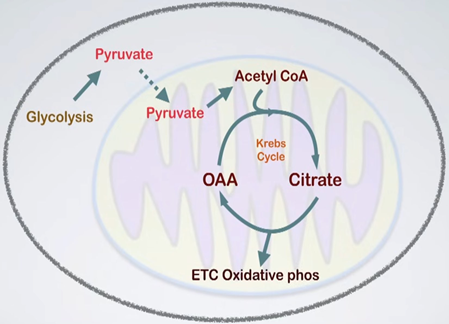
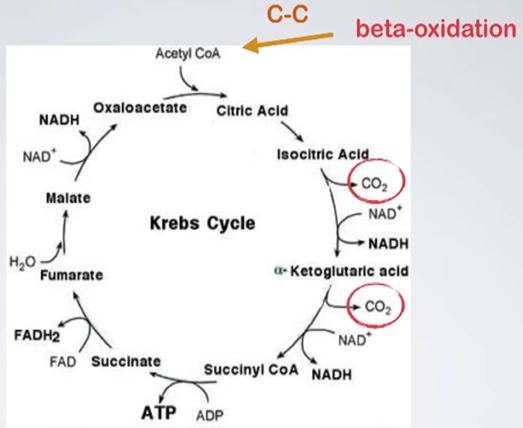
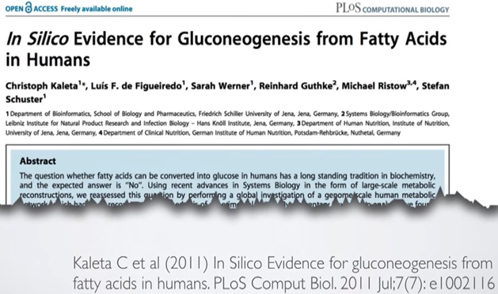

### **Сжигает ли жир в пламени углеводов?**

Действительно ли жир сгорает в пламени углеводов? Это старая поговорка, которая существует уже давно, и она берет свое начало в немецкой газете 1906 года. Некоторые утверждают, что слышали от некоторых людей, что Розенфельд услышал это от парня по имени Хершфилд, который написал статью в 1895 году.

Если вы посмотрите на это, то вот как они поняли это тогда. 

Они брали жир и понимали, что если они будут давать людям только жир, то получат кетоны. В то время они не могли измерить бета-гидроксибутират; Они могли измерить только ацетон и ацетоацетат. Они обнаружили, что эти люди вырабатывали кетоны в моче. Если они голодали люди, то получали тот же результат. Когда вы голодаете, люди едят свои собственные жиры, поэтому они тоже сидели на диете с высоким содержанием жиров. Затем они обнаружили, что если добавить углеводы в смесь, кетоны исчезнут. Поэтому они сказали: «Ага, жир горит в пламени углеводов», потому что они думали, что кетоны — это всего лишь частичные продукты распада жирового обмена. Они не понимали, что кетоны на самом деле являются важным топливом. Только монументальные исследования Джорджа Кэхилла в 1960-х годах показали, что кетоны действительно являются топливом для дыхания. До тех пор люди думали, что это просто продукты частичного расщепления жира и в некотором роде опасные.

Если вы посмотрите на современные учебники, то увидите, что зависимость от углеводов для сжигания жира является молекулярной основой поговорки о том, что «жиры сгорают в пламени углеводов». Раньше они говорили это, потому что на самом деле не понимали, что происходит, а теперь они говорят это из-за того, как работает весь цикл Кребса и гликолиз.

В клетке, начинающейся с гликолиза, молекула глюкозы распадается на пару молекул пирувата. Он проходит через митохондрии и попадает в бассейн с ацетил-КоА. Даже кетоновые тела попадают в бассейн с ацетил-КоА. Пируват попадает в бассейн ацетил-КоА, и цикл Кребса вращается, отключая некоторые мощные электроны: пару NADH с одной стороны и NADH и FADH2 с другой. Они попадают в цепь переноса электронов и проходят окислительное фосфорилирование.

Питер Митчелл в одиночку прояснил цепь переноса электронов и хемиосмотическую теорию. В своей лаборатории он прояснил всю эту цепочку переноса электронов. Так клетка дышит. Вы получаете 88-89% энергии от клетки через цепь переноса электронов.

Вернемся к окислительному фосфорилированию. Бета-окисление — это расщепление длинноцепочечных жирных кислот. Бета-окисление посылает двухуглеродные куски жира в бассейн ацетил-КоА, и пируват продолжает расти. Пируват на самом деле может вмешаться и немного помочь оксалоацетату, если это необходимо. Есть причины, по которым он может закончиться, потому что он производит другие аминокислоты, а иногда вам нужны аминокислоты.

Дело не только в аминокислотах оксалоацетата, но и в ряде других предшественников цикла Кребса, которые находятся перед оксалоацетатом, которые производят аминокислоты. Если они производят аминокислоты, они не могут производить оксалоацетат, поэтому у вас может быть снижение пула оксалоацетата, и пируват помогает восполнить этот пробел.

Допустим, что весь пируват исчезает, и мы начинаем с глюконеогенеза, потому что мы сидим на низкоуглеводной диете или голодаем. Вы должны сделать сахар, и вы делаете его из оксалоацетата. 

Опять же, это вырывает его из цикла Кребса, так что когда он вырывает его из цикла Кребса, оксалоацетат не может конденсироваться с ацетил-КоА, чтобы пройти круг и выбросить высокоэнергетические электроны. Итак, что же происходит? Ну, вы заменяете его какими-то аминокислотами. Это единственное, что вы можете сделать. Аминокислоты, конечно же, это белок, а белок составляет вашу мышечную массу тела, поэтому вы можете потерять часть мышечной массы тела. Теперь вам не нужно слишком беспокоиться об этом, если вы едите достаточно белка, потому что они заменят все, что вы принимаете, оксалоацетатом, если у вас действительно мало белка, и в этом случае вы можете потерять мышечную массу тела.

На низкоуглеводной диете вы в основном сжигаете жир, поэтому вы делаете много бета-окисления. Поскольку вы делаете много бета-окисления, вы получаете большой пул ацетил-КоА. Многие люди считают, что этот пул ацетил-КоА является триггером для кетогенеза, потому что с ним нужно что-то делать. Он не может войти в цикл Кребса, поэтому в конечном итоге вы получаете кетоны. Когда вы делаете кетоны, вы сначала производите HMG-CoA, который является интересной молекулой, а второй шаг заключается в том, что вы делаете кетоны. ГМГ-КоА является промежуточным этапом синтеза холестерина. Если вы перейдете от HMG-CoA к мевалонату, а затем к холестерину, вы создадите холестерин с его помощью. Если вы производите много кетонов с помощью массового действия, вы запускаете вещество по кетоновому пути, и вы не производите столько холестерина. Вот почему во многих случаях вы заметите, что если у вас есть пациенты с избыточным весом и гиперлипидемией, и вы посадите их на кетогенную диету, их уровень холестерина снижается, даже если они едят много жиров, потому что они не производят так много.

Люди, которые пишут учебники, обычно думают, что пул ацетил-КоА является триггером для кетогенеза. Однако это не обязательно является триггером. Одним из триггеров является мозг. Если у вас низкий уровень глюкозы, мозгу нужна либо глюкоза, либо кетоны, либо их комбинация, обычно комбинация. Мозг подает сигналы для кетонов, посылая сигнал в печень, где вырабатывается большинство кетонов. Это также объясняет, почему люди на кетогенных диетах, как правило, теряют больше веса, чем те, кто придерживается других диет. Дело не только в том, что «калория есть калория»; Вы получаете больше потери веса на кетогенной диете, как показали многочисленные исследования.
Мозг требует кетонов, а печень их вырабатывает. Некоторые кетоны теряются с дыханием и мочой, но это минимальное количество. Главное, чтобы потребности мозга и печени не были связаны друг с другом. Мозг нуждается в кетонах, печень вырабатывает их, и в процессе вырабатывает много АТФ, энергетической валюты организма. Печень должна как-то избавляться от этой АТФ. Один из способов сделать это — с помощью глицерол-3-фосфатного челнока. Этот челнок берет один продукт, использует электрон с высокой энергией для создания другого продукта, а затем использует электрон с более низкой энергией, чтобы вернуться к исходному продукту. 

В процессе он сжигает АТФ, но не выполняет никакой реальной работы, такой как перемещение бетонных блоков с одного места на другое и обратно без каких-либо реальных изменений. Это помогает создать метаболическое преимущество при кетогенной диете.

В учебнике Берга говорится, что животные не могут превращать жирные кислоты в глюкозу. В ней говорится: «Когда запасы гликогена низкие, почему организм не может использовать жировые запасы и превращать жирные кислоты в глюкозу? Потому что животные не могут влиять на чистый синтез глюкозы из жирных кислот, так как ацетил-КоА не может быть преобразован в пируват или оксалоацетат у животных».

Это цикл Кребса. «Можно ли напрямую преобразовать жир в глюкозу?» Этот вопрос мучает студентов-биохимиков на протяжении многих поколений. Ответ, который вы должны дать, будет «нет». 

Причина этого восходит к бета-окислению, расщеплению жира, в результате которого двухуглеродные соединения превращаются в ацетил-КоА. Если вы пометите эти углеродные соединения радиоактивными метками и проследите, где они выходят из цикла Кребса, вы обнаружите, что они выходят из этих двух точек CO2, что делает невозможным их переход к оксалоацетату для воссоздания глюкозы. Итак, ответ из учебника «нет», вы не можете пропустить его туда и получить глюкозу. 

Но действительно ли ответ отрицательный? Не полностью.

Именно такие запасы топлива имеются в 70-килограммовом самце. В крови, печени и мозге очень мало топлива. 

Мышцы имеют много белка, доступного в качестве топлива, а жировая ткань, конечно же, имеет много жира.

Разбивая его на углеводы, жиры и белки, вы видите этот гигантский столб жира, значительное количество белка и очень небольшое количество глюкозы. Имеет ли смысл разрабатывать систему, в которой этот большой столб жира является основным топливом, но вы не можете получить к нему доступ, не разрушая свои мышцы? Палеолитический человек нуждался в своих мышцах, чтобы преследовать добычу, поэтому он должен был быть в состоянии превращать жир в глюкозу, даже если он не потреблял глюкозу.

Частью этого жира является глицерин. Когда жиры мобилизуются из жировых клеток, жирные кислоты отделяются, а глицерин высвобождается. Высвобожденный глицерин вступает в глюконеогенез, который является одним из способов преобразования жира в глюкозу. Но есть и несколько других способов.

Вы можете сесть на кетогенную диету, хотите верьте, хотите нет, но это только картофель или весь рис, при условии, что потребление энергии низкое. Если вы не удовлетворяете свои энергетические потребности, вы в конечном итоге будете сжигать жир, и в конечном итоге вы будете находиться в кетозе некоторое время. Сэм Легг был отказником по соображениям совести во время Второй мировой войны, работая в Гражданском корпусе охраны природы, и добровольцем участвовал в исследовании голода Ансель Киз в Миннесоте. 

Он был заперт в подвале стадиона «Миннесота» в течение 24 недель на голодной диете около 1600 калорий, в основном углеводов (230-240 граммов). Посмотрите, как выглядел Сэм после 24 недель. Он потерял мышечную массу тела и жир, потому что фактически сидел на кетогенной диете из-за ограничения энергии.

Это один из путей, выявленный в 1986 году, который энергетически благоприятен для превращения ацетоацетата в глюкозу. Ацетоацетат — это кетон, который может поступать из пула ацетил-КоА, а затем регенерировать в виде глюкозы.
В другом исследовании, проведенном в 2011 году, использовался компьютерный анализ для определения 22 метаболических путей, которые могут превращать жир в глюкозу.

В исследовании, проведенном в 1979 году, людям натощак вводили меченый радиоактивными веществами ацетон и была обнаружена радиоактивность глюкозы, липидов и белков плазмы, в результате чего был сделан вывод о том, что синтез глюкозы из ацетона возможен у людей, на долю которых приходится до 11% производства глюкозы.

В учебниках часто говорится, что глюкозу нельзя производить из жира, потому что они сосредоточены на одном пути. Но на самом деле ацетон может превращаться в ацетоацетат, а ацетоацетат может превращаться в пируват. Пируват может затем превращаться в ацетил-КоА и, в конечном итоге, в глюкозу. Таким образом, жир и ацетон на самом деле могут превращаться в ацетил-КоА.

Таким образом, жир сгорает и в пламени жира. Он горит в пламени углеводов и в пламени белков. Помните, как мы видели, как белок попал в цикл Кребса и превратился в OAA, а затем попал в цикл Кребса? Итак, можно сказать, что жир сгорает в пламени аминокислот и на самом деле горит в пламени жира.

Слава Богу, авторы учебников по биохимии не занимались эволюцией, иначе мы оказались бы в мире боли. Вот цитата из Нассима Николаса Талеба: «Проблема знания в том, что книг о птицах, написанных орнитологами, гораздо больше, чем книг о птицах, написанных птицами».
Точно так же, как существует гораздо больше книг по кетозу, написанных биохимиками, которые не имеют никакого опыта работы с кетогенными диетами. Должно быть больше книг биохимиков с опытом работы с кетогенными диетами.
