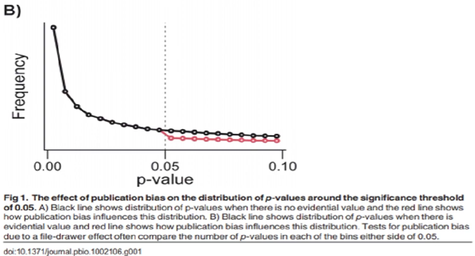
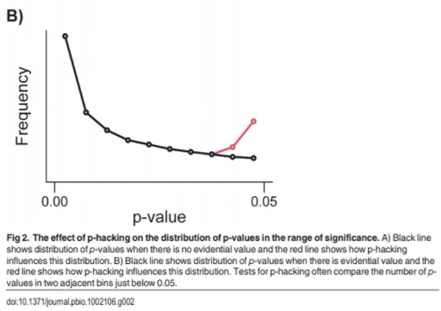
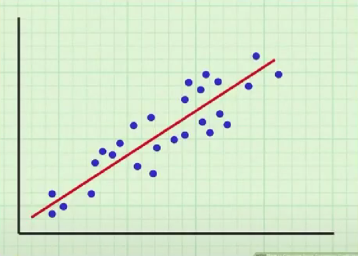
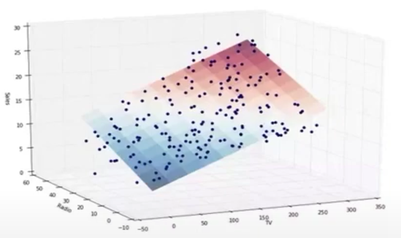

### **Недостатки эпидемиологии питания**

Эпидемиология питания вводит в заблуждение и дезинформирует общественность и используется теми, кто преследует различные цели.

Первое, что мы все должны понять, это то, что ассоциация не устанавливает причинно-следственную связь. Она не может установить причинно-следственную связь: ни сейчас, ни в прошлом, ни в будущем, ни где-либо во Вселенной, никогда. Утверждать, что одно связано с другим, — это прекрасно, но затем делать выводы или прямо утверждать, что здесь играет роль причинно-следственная связь, — это заблуждение, псевдонаука, недисциплинированное, противопоказанное и ведущее к опасным практикам.

Пример, который я вам приведу, очень прост с точки зрения ассоциации и причинно-следственной связи. Если бы вы спланировали продажу мороженого у прибрежных продавцов против нападений акул на этом пляже, вы бы обнаружили сильную положительную корреляцию между продажами мороженого и нападениями акул на большинстве пляжей. Такая связь привела бы вас к выводу о том, что между этими двумя факторами существует взаимосвязь, но не причинно-следственная связь. Смешно утверждать, что продажи мороженого вызывают нападения акул, но это то, что диетологи обычно делают.

Другой пример: размер обуви детей в возрасте от 5 до 10 лет коррелирует с их математическими способностями. Очевидно, что в возрасте от 5 до 10 лет дети становятся больше, а математические способности также увеличиваются. Таким образом, можно сделать вывод, что эти два фактора являются коррелированными, а не причинно-следственными. Если бы мы сделали вывод о причинно-следственной связи, мы могли бы абсурдно предложить генетически модифицировать детей, чтобы у них были большие ноги, чтобы улучшить их математические навыки. Это, конечно, смешно, но это сродни тому, что делают эпидемиологи по питанию.

Эпидемиология никогда не может сообщить о причинно-следственной связи. Это случайные отношения. Мы соотносим А с В, X с Y, без научного контроля. Это обсервационные исследования; Мы не запираем людей в лабораториях на всю жизнь и контролируем каждый аспект их жизни, за исключением одного, что нас интересует, например, потребления красного мяса или насыщенных жиров. Мы не делим людей на пары генетически идентичных близнецов, не запираем их в отдельных лабораториях, не контролируем все, кроме одной переменной, а затем смотрим на такие результаты, как смертность за определенный период. Это не этично, не практично и не доступно.

Еще одна проблема эпидемиологии заключается в том, что данные, используемые для определения того, что люди ели в течение того или иного периода, являются данными респондентов — опросами, в которых люди сообщают о своих пищевых привычках. Мы верим тому, что они говорят, даже несмотря на то, что люди лгут, особенно о своем питании. Это полный бред и лженаука.

Но сказав это, давайте перейдем к некоторым конкретным вопросам. **Во-первых**, произвольные критерии отбора в метааналитических исследованиях. Авторы этих исследований решают, какие исследования включить, а какие исключить, основываясь на любых критериях, которые им нравятся. Им просто нужно записать критерии в своей работе, что делает ее уязвимой для злоупотреблений. Вы можете повысить вероятность того или иного исхода, выборочно включив или исключив исследования, например, выбирая только англоязычные исследования. Это может исключить мощные исследования на других языках, которые показывают противоположные результаты. Эта форма предвзятости не очень хороша для науки.

**Во-вторых**, в эмпирических науках существует предвзятость публикаций. В науке вы должны найти что-то таким, чтобы это было опубликовано, даже если роль ученого заключается в опровержении собственной гипотезы. Если они обнаружат, что это неверно, поздравляем, они провели некоторую реальную научную работу, но обычно они не могут опубликовать это и донести до читателей. Это абсолютно, в корне нелепо, но именно так работают эти журналы.

Другой способ взглянуть на систематическую ошибку публикации выглядит следующим образом: если у вас есть что-то, что действительно имеет доказательную ценность для реального эффекта, вы должны получить график количества исследований в этом конкретном мета-анализе с различными p-значениями, что приводит к криволинейной связи (т.е. черной линии на графике). 

Если наблюдаться систематическая ошибка публикации, вы увидите, как эта линия опускается около уровня 0,05, и исследования выше этого уровня будут встречаться реже, как показано красной линией. Предвзятость публикаций подталкивает результат к положительным результатам, что приводит нас к выводу, что что-то является реальным эффектом, когда на самом деле это не так.

**Третья**  серьезная проблема метааналитических исследований, используемых в эпидемиологии, — это явление, называемое p-хакингом, которое включает в себя избыточную или недостаточную выборку для достижения p-значения менее 0,05. Ученые обычно определяют количество точек данных, которые они намерены собрать, прежде чем проводить фактическое исследование, часто на основе пилотного исследования. Это пилотное исследование дает представление о вероятной величине эффекта, что позволяет рассчитать необходимую мощность, обычно установленную на уровне 0,8 для достойного исследования. Это дает точное количество точек данных для сбора в фактическом исследовании, которое затем должно быть сообщено вместе с полученным p-значением.

К сожалению, если p-значение не соответствует контрольному показателю 0,05, исследование может не быть опубликовано. Некоторые исследователи могут заниматься p-хакингом, останавливая сбор данных на ранней стадии, если они достигают p-значения менее 0,05 до сбора всех точек данных, опасаясь, что последние 20% могут свести на нет значимость.

В качестве альтернативы, если они достигают p-значения 0,51 или 0,52 после сбора всех точек данных, они могут собрать дополнительные 20-30%, чтобы опустить p-значение ниже 0,05. Такая практика представляет собой академический проступок и искусственно изменяет общий результат мета-анализа.

Чтобы обнаружить p-hacking, мы можем посмотреть на распределение p-значений. 

Вероятность исследований, имеющих p-значения чуть ниже 0,05, подозрительно возрастает. Это часто изображается красной линией на графике, указывающей на более высокую частоту исследований чуть ниже порога 0,05. Это говорит о том, что мета-анализ, вероятно, имеет недостатки в своих общих результатах и выводах. Такие практики очень часто встречаются в этих исследованиях.

**В-четвертых**, эпидемиологи скорректируют свою статистику исходов. Они скажут, что конечным результатом нашего мета-анализа является X, Y или Z. При этом они не будут сообщать о том, что на самом деле наблюдали, потому что эпидемиологи заранее ничего не контролируют. Они не запирают людей в лабораториях, как обсуждалось. Они собирают некоторую статистику о состоянии здоровья и сравнивают ее с тем, что люди рассказали исследователям, что они едят в своем рационе, потому что эти вещи основаны на анкетах.

Итак, **А**: Они верят в то, что говорят люди, и **Б**: Затем они наблюдают, каковы результаты для здоровья. Затем они корректируют результаты для здоровья на основе процедуры, называемой многомерной регрессией. Он используется для построения линии тренда с гораздо меньшими невязками, гораздо меньшими ошибками вокруг них. Это раздувает силу результата, но более того, оно может на самом деле полностью изменить результат по сравнению с тем, что наблюдалось на самом деле, тем самым полностью отклоняясь от реальности того, что на самом деле наблюдалось — т.е. фабрикация статистики результатов.

Ученые смотрят на взаимосвязи между вещами и сообщают о том, что они увидели. Они не смотрят на взаимосвязи между вещами, а затем оценивают, что они могли бы увидеть, если бы удосужились провести некоторый контроль. Это смешно, и все же это то, что делают эпидемиологи. Я приведу вам пример: это Адвентистское исследование здоровья номер два, где они конкретно говорят о потреблении красного мяса в сравнении со смертностью от всех причин, сердечно-сосудистых заболеваний, раковых заболеваний и т.д.

Они предполагают, что у них была большая когорта адвентистов седьмого дня, за которыми они следили в течение нескольких лет, и они измеряли смертность по самым разным причинам у этих людей. Они разделили их на пять групп: была группа людей, которые ели мясо красного мяса адвентистов седьмого дня. Они разделили этих людей на четыре квартиля: самое низкое потребление мяса, второе, третье и четвертое — самое высокое потребление мяса. У них также была группа, которая была в нулевом квартиле, и это были веганы, которые вообще не ели красного мяса. Таким образом, их называли нулевой популяцией.

Затем они составили отчет о смертности этих людей в возрасте от восьми до четырнадцати лет, в зависимости от разных людей, которые присоединились к исследованию на разных стадиях. Они провели миллионы и миллионы человеко-лет наблюдения, и они сказали, что по мере роста потребления мяса в первом квартиле риск смертности от всех причин, рака, диабета и всего остального увеличивается по сравнению с нулевыми или веганами, или, по крайней мере, теми, кто не ест красное мясо.
Затем, во втором квартиле, риск смертности снова возрастает. В третьем квартиле риск смертности снова возрастает. И в четвертом квартиле он снова растет, так что в четвертом квартиле, у самых больших мясоедов, риск смертности от всех причин составил 58%, что выше, чем если бы вы вообще не ели красное мясо.

Пока вы не посмотрите на фактическую статистику исходов, которую они наблюдали в этой популяции — сколько людей на самом деле умерло, сколько свидетельств о смерти было в этих группах — и вы обнаружите, что частота смертей в этих группах была самой высокой в нулевом квартиле, ниже в первом квартиле, еще ниже во втором.  снова ниже в третьем, и еще ниже в четвертом. Другими словами, корректировка набора данных привела к тому, что они сообщили о результатах, которые на 180 градусов диаметрально противоположны тому, что они наблюдали на самом деле. Они лгали, в основном. Они говорили, что риск смерти растет, растет и растет, хотя на самом деле он снижается, уменьшается и уменьшается по мере того, как вы потребляете больше мяса.

Как это делается? Ну, в основном, когда вы смотрите на отношения между переменной X и переменной Y (вот это график слева, простой двумерный график), вы можете увидеть: X находится поперек, Y — вверх и вниз. X — экспериментальная переменная, а Y — переменная результата — в этом примере Y — смерть. Таким образом, чем выше на оси Y находится точка данных, тем больше вероятность смерти, а чем ниже на оси Y, тем ниже вероятность смерти. И по оси X, горизонтально слева направо, чем ближе вы к лево, тем ниже потребление мяса, и чем дальше вы вправо, тем выше потребление мяса — хотя, на самом деле, если бы это было так, вам пришлось бы повернуть ось X на 180 градусов, потому что на самом деле они наблюдали, что самое низкое потребление мяса было связано с наибольшим количеством смертей.  и наоборот.

Очевидно, что у адвентистов седьмого дня есть богословская и идеологическая точка зрения на потребление мяса. Их Священное Писание говорит о том, чтобы препятствовать употреблению мяса, поощрять потребление растительной или, что еще лучше, веганской жизни. И таким образом, для этих авторов сообщение о том, что они на самом деле наблюдали, не могло бы этого сделать.

Итак, давайте возьмем кучу ковариат к вероятности смерти, скажем, возрасту когорты. Поскольку они не были одинаковыми в каждом из четырех квартилей, потому что они их не контролировали, они не следили за тем, чтобы у них было четыре равных квартиля на активе, только наблюдение. Так что это оправдывает поправку на возраст. Они также внесли поправки на образование; Они делали поправки на вес с помощью индекса массы тела, а также на целую кучу других вещей.

Как это делается? Если посмотреть на связь между переменной x и переменной y (двумерный график): x представляет горизонтальную ось, а y — вертикальную. В этом примере y представляет смерть, где более высокие точки данных по оси y указывают на более высокую вероятность смерти, а более низкие точки указывают на более низкую вероятность. По оси X (горизонтально слева направо) ближе влево указывает на более низкое потребление мяса, а далее вправо — на более высокое потребление мяса.

Тем не менее, в ходе реальных наблюдений они обнаружили, что самое низкое потребление мяса было связано с наибольшим количеством смертей, и наоборот. Это наблюдение противоречило тому, что можно было бы ожидать, основываясь на прямой корреляции.

Исследователи, которые были адвентистами седьмого дня с теологическими и идеологическими убеждениями, препятствующими употреблению мяса, не смогли сообщить об этих выводах так, как они были замечены. Вместо этого они скорректировали ковариаты, такие как возраст когорты. Поскольку возраст в каждом из четырех квартилей не был одинаковым, они не контролировали его и не гарантировали, что у них есть четыре равных квартиля, это оправдывает поправку на возраст. Они также скорректировали образование и вес с помощью индекса массы тела, а также множества других факторов.

Теперь, если вы посмотрите на трехмерную диаграмму рассеяния: x и y по-прежнему представляют количество потребляемого мяса и риск смерти, соответственно. Z теперь обозначает возраст когорты. Вместо линии мы получаем плоскость, потому что имеем дело с тремя измерениями. Мы получаем поперечный разрез страницы, который показывает, что чем больше мяса вы едите, тем больше вероятность вашей смерти. Чем вы старше, тем больше вероятность вашей смерти.

Это ковариаты, поэтому мы можем математически объяснить влияние z, перемещая его вперед и назад, чтобы вернуться к двумерной линии, ситуации x-y. Но для того, чтобы это сделать, нам нужно математически скорректировать z, что изменяет значение y.

Другими словами, мы фабрикуем данные, лжем о наших наблюдениях и говорим о смертности, которая подтверждается свидетельством о смерти. Поэтому, если вы хотите говорить о смертности в связи с потреблением мяса, вы должны сообщать о том, что вы видели, а не о том, что, как вы думаете, вы бы увидели, если бы контролировали вещи.

Как мы узнаем, в какой степени смерть человека была вызвана его возрастом по сравнению с тем, сколько мяса он ел? Как вы это делаете? Все, что вы делаете, — это применяете еще одну совпадающую связь, в которой причинно-следственная связь не установлена. Мы не можем установить причинно-следственную связь с помощью случайной связи. Итак, сейчас мы используем два. Итак, мы добавляем дополнительную ошибку, мы можем добавить третью ковариату, четвертую или пятую, девятую или десятую или пятнадцатую, сколько угодно, если это приводит к значению R-квадрат для нашей линии, которое все ближе и ближе к единице. Другими словами, это делает наш прогноз лучше, но мы используем фантазию. Здесь мы используем выдуманную статистику результатов. Это не наука.

Это полностью опровергает вывод. Пример: Исследование адвентистов седьмого дня, в котором смертность снижается, уменьшается и уменьшается — все причины, рак, диабет и сердечные заболевания, все они снижаются — чем больше было употреблено красного мяса. Вот что они наблюдали. Тем не менее, они сообщили, что риск смертности растет и растет, и растет, и при всех этих вещах. Чушь полная. Это враньё. Это неправильное направление. Это заставляет людей думать, что если они едят больше красного мяса, риск смерти повышается, что не то, что показало исследование. Сумасшедший.

**Пятая**  серьезная проблема мета-анализа в эпидемиологии питания: использование относительной статистики исходов. Вот пример: если у нас есть контрольная популяция с частотой смертности 1 смерть на миллион человеко-лет наблюдения, и у нас есть экспериментальные условия, в которых частота смертей составляет 2 на один миллион человеко-лет наблюдения, мы можем сообщить о 100% относительном увеличении заболеваемости в нашей экспериментальной группе по сравнению с контрольной группой. 

Можно сказать: «Риск смерти возрастает на 100%». Это неуместно, потому что инцидент является случайным, а не причинно-следственным. Но это сразу же публикуется — огромное 100% увеличение риска, скажете вы!

Ну, на самом деле, когда вы смотрите на это, вы получаете абсолютный риск смерти от одного на миллион в год до двух на миллион в год. Таким образом, изменение риска на самом деле составляет один шанс на миллион в год. Таким образом, ценность этого для вас в течение 100 лет практически равна нулю. Поэтому нам нужно сообщать абсолютную статистику результатов.

Второй пример: у нас есть уровень заболеваемости, который составляет один на каждых двух человек, или половину из них в нашей контрольной группе, и два из двух, другими словами, все в нашей экспериментальной группе умирают. Это также 100% относительное увеличение того, что они называют риском.

На самом деле это случайность, но вот так. Тем не менее, это второе открытие гораздо более убедительно и гораздо более ценно для любого конкретного человека, чем первая ситуация, не так ли? Хотя об этом можно было бы сообщить точно таким же образом, просто используя относительную статистику результатов.

Многие эпидемиологические работы публикуются вообще без предоставления абсолютной статистики. Таким образом, эти документы не дают нам абсолютно никакой системы отсчета. Таким образом, эти статьи не имеют абсолютно никакой ценности для нас, читателей, в понимании значения этого исследования в его контексте в мире.

Эпидемиологические исследования в области питания обычно показывают, что различия между контрольными и экспериментальными популяциями обычно составляют где-то десятые или сотые тысячные доли вероятности смерти или любого другого результата на человека в год наблюдения. Опять же, умножьте это на 100 для 100 лет наблюдения за 100-летней продолжительностью жизни любого конкретного индивидуума, и пользы от этого будет примерно равна нулю. Может быть, это будет полезно для политиков, если они ошибочно предполагают, что это причинно-следственная связь, которая наблюдалась, если эти авторы действительно сообщали о том, что они на самом деле наблюдали. Может быть. Но для любого конкретного индивидуума нет никакой ценности. 

Вообще никаких.

Если вы говорите, что употребление большего количества красного мяса приводит к тому, что риск смерти в четвертом квартиле потребления мяса увеличивается на 58% — и вероятность смерти составляет 1 на 100 000 в год, а затем она возрастает до 1,5 шансов на 100 000 в год, что ж, это ничего не значит для вас. Это не будет информировать о том, какие решения вы должны принимать в отношении своей диеты, если вы хотя бы отдаленно чувствительны и понимаете это.
Итак, в чем смысл этой конкретной эпидемиологии? Никакой. Эпидемиологи всегда должны предоставлять нам систему отсчета. Они всегда должны предоставлять нам абсолютную статистику результатов в том виде, в каком она наблюдается, без корректировки, чтобы мы могли принимать собственные решения о значении этих результатов в реальном мире. Вот что должно произойти. Это не так, но именно это и должно произойти.

**Шестая** серьезная проблема эпидемиологии питания: использование терминов риск, опасность, защита и т.д. Опять же, вы не можете утверждать причинность из ассоциации. Это совпадения. Даже если они абсолютно не скорректированы — то, что мы видели, — это совпадения, это не причинно-следственные связи. Если сказать, что употребление большего количества мяса было связано с большим количеством смертей, это не означает, что причиной увеличения смертности было увеличение потребления мяса. 

Поэтому поворачиваться и говорить: «Ешьте меньше мяса, и ваши шансы на смерть уменьшатся», – это заблуждение. Ваш риск, скажет он. Нет, заболеваемость не является риском. Заболеваемость не представляет опасности. И если у вас есть негативная связь — «Ешьте больше здоровых цельнозерновых продуктов, и риск смерти снизится» — нет, это все равно ассоциация. Риск, опасность, защита — совершенно неподходящие термины для использования в отношении эпидемиологических данных о тяжелых исходах, поскольку они коррелируют с зарегистрированным потреблением пищи с пищей.

**Седьмое**: экстраполяция. Хорошо, большинство эпидемиологических исследований питания основаны на популяциях, которые были значительно старше в начале исследования, когда мы начали наблюдать за этими людьми — почему? Потому что мы знаем, что чем старше они становятся, тем больше вероятность смерти людей от любой причины, и нам нужно получить какой-то показатель заболеваемости, чтобы мы могли найти хоть что-нибудь, даже если мы не найдем практически ничего. Нам нужно изучать старые, более вероятно больные, более вероятно истощенные популяции, которые с большей вероятностью умрут.

А затем мы используем эти результаты для экстраполяции на всю популяцию. Поэтому, независимо от вашего здоровья, вашего возраста, вашего этапа жизни или чего-либо еще, вы должны есть меньше мяса, например, или меньше жира, или больше зерновых, или что-то еще. Нет, совершенно неуместно.
