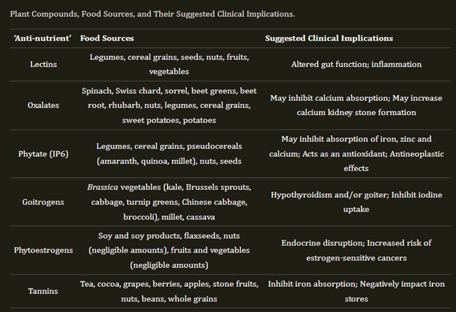

### **Растительные токсины**

Растительные токсины/фитотоксины/антинутриенты/фитоалексины являются непитательными компонентами растений, которые могут иметь множественные негативные эффекты при приеме внутрь. 

Часто эти соединения являются частью защитного механизма растения. При попадании в организм их последствия могут быть острыми или долгосрочными. 

Они могут напрямую причинять вред или косвенно мешать организму усваивать определенные питательные вещества, что приводит к косвенному вреду, который может привести к дефициту.

[Источник]([https://www.ncbi.nlm.nih.gov/pmc/articles/PMC7600777/](https://www.ncbi.nlm.nih.gov/pmc/articles/PMC7600777/))

Некоторые из этих антинутриентов потенциально могут оказывать благотворное воздействие, например, антиоксидантное действие. К таким растительным токсинам относятся полифенолы (фенольная кислота, кумарины, флавоноиды, лигнаны, стильбены, дубильные вещества и лигнины), флавоноиды, такие как халконы, флаваноны, антоцианы/проантоцианидины и флаванолы. Другие антинутриенты включают лектины, также известные как гемагглютинины, оксалаты, глюкозинолаты, сапонины, фитиновую кислоту/фитаты, гликоалкалоиды (альфа-хаконин, альфа-соланин), терпены, глиадины, афлотоксины, цианогенные гликозиды и ингибиторы протеазы.

Некоторые компоненты растения также могут оказывать негативное воздействие, влияя на гормональную систему, как в случае с изофлавонами, которые действуют как фитоэстрогены, связываясь с рецепторами эстрогена в организме человека, тем самым нарушая баланс.

Некоторые из этих питательных веществ также способствуют повреждению слизистой оболочки кишечника, делая кишечник более проницаемым и позволяя некоторым соединениям проходить, по сути, превращая их во вредные вещества, поскольку они больше не содержатся в кишечнике. Это происходит у некоторых людей, когда они потребляют пищу, содержащую глютен, организм выделяет белок под названием зонулин, который открывает соединения между клетками слизистой оболочки кишечника, делая ее более проницаемой, чем это оптимально.

Кроме того, употребление растений в пищу также подвергает организм воздействию того, чем растение было опрыскано перед сбором урожая, например, пестицидов и инсектицидов. Эти соединения, хотя и не вырабатываются растением, проникают в пищеварительный тракт и могут нанести большой ущерб различным системам организма, как краткосрочный, так и долгосрочный.
