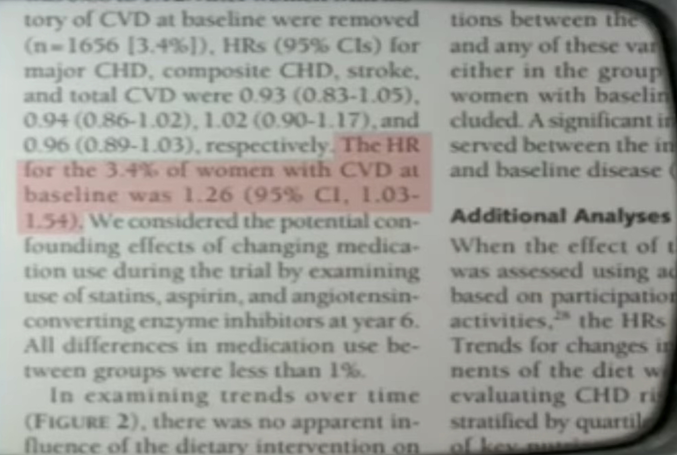

### **PUFA** животного против растительных **PUFA**

**PUFA** - это сокращение от английского "polyunsaturated fatty acids", что означает "полиненасыщенные жирные кислоты. Это группа жирных кислот, которые имеют две или более двойные связи в своей структуре.

В исследовании, проведенном в рамках Инициативы по охране здоровья женщин, перевод нездоровых участниц на диету с низким содержанием жиров в попытке вылечить их привел к значительному всплеску смертности. Независимый исследователь обнаружил исходные данные исследования в подвале и прошел тщательный процесс их анализа. Когда они проанализировали его, они обнаружили, что уровень смертности в группе, получавшей растительное и растительное масло, фактически увеличился на 62 процента. 

Это было крупномасштабное рандомизированное контрольное исследование, проводившееся в течение нескольких лет, но первоначально данные не были опубликованы. Только спустя десятилетия она была наконец опубликована.

Мы видим, что группа вмешательства была группой, получившей масло. Это контрольная группа, которая продолжила регулярное потребление насыщенных жиров. Это уровень смертности вдоль борта. Чем выше эта линия, тем хуже исход. Вы можете ясно видеть, что в группе растительных масел умерло больше людей, чем в группе, потребляющей насыщенные жиры. Такого рода данные в основном были похоронены.

У нас был Миннесотский коронарный эксперимент, который проводился между 1968 и 1973 годами. В нем приняли участие более 9 000 испытуемых, как мужчин, так и женщин. Он был очень похож по дизайну; Некоторым людям давали растительные масла, а другим – нет. Результаты не публиковались после завершения исследования, в течение 16 лет, и даже тогда не публиковали данные о смертности. Когда перед смертью они спросили одного из первоначальных исследователей, почему они не опубликовали данные, он ответил: «Это потому, что они сочли результаты разочаровывающими».

Это неопровержимое доказательство, которое в основном скрывалось от общественности в течение десятилетий и, наконец, было опубликовано в 2016 году в Британском медицинском журнале, очень авторитетном журнале. Но не думайте ни на секунду, что такого рода искажение или сокрытие результатов ограничивается только предыдущими эпохами. Мы все еще видим это в современную эпоху.

Возможно, вы слышали об исследовании Women's Health Initiative. Это обошлось более чем в 700 миллионов долларов США и преследовало 48 000 женщин в течение примерно восьми лет. Это было большое, масштабное исследование. Когда мы смотрим на результаты, если мы пролистываем таблицы результатов, мы вообще не находим никаких статистически значимых выводов. Но на странице 661 этого исследования, в одном предложении неясного текста, мы узнаем правду: у женщин с историей сердечных заболеваний, которые сидели на диете с низким содержанием жиров, вероятность осложнений, таких как сердечные приступы, была на 26 процентов выше. Это была единственная значимая находка, которая была похоронена на странице 661 этого дневника.

Эти долгосрочные экспериментальные данные, лучшая научная форма, которая у нас есть, доказали, что диета, которую продвигают власти, является худшей диетой для здоровья, но они все еще ее пропагандируют.
