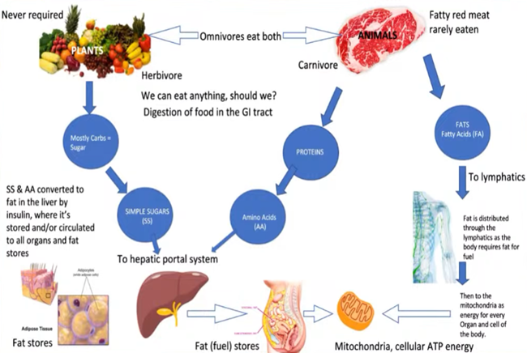
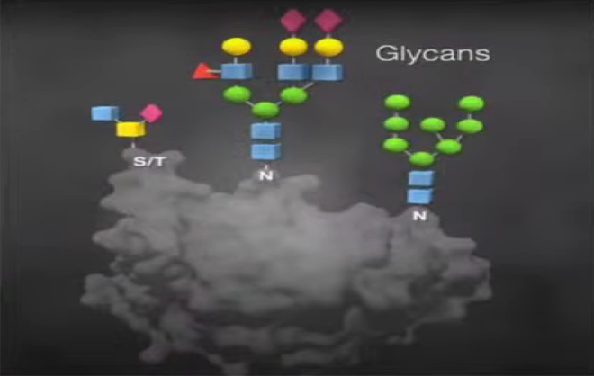
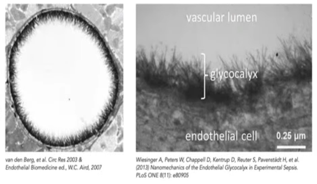

### **Гликокаликс и не только**

Сахар вреден для всех нас, а жир является источником энергии для нашего организма и митохондрий. Если сахар не является источником энергии, то для чего он нужен? Давайте узнаем о гликокаликсе.

По сути, мир без сахара и растений был бы опустошен; Никакой жизни не существовало бы. Мы знаем, что жизнь требует растений для структуры и общения. Наша окружающая среда полна растений, и их удаление приводит к эрозии и разрушению, как и в нашем организме. В нашем организме есть слой растений или сахаров, называемый гликокаликсом. Так же, как M&M, которые покрыты для защиты шоколада и арахиса, или тефлоновая сковорода, которая предотвращает прилипание, гликокаликс также выполняет структурную функцию.

Интересно, что наша ДНК содержит сахара. Кератин, внешнее покрытие нашей кожи, содержит сахара, и без них он был бы открыт, как тефлоновая сковорода с поврежденным покрытием. Коллаген, хитин и другие формы могут пробивать этот слой сахара. У сахара есть функция, которую мы часто упускаем. Растения и животные содержат аминокислоты, простые сахара и жирные кислоты. Большинство растений расщепляются на сахара и аминокислоты, которые должны поступать в печень, чтобы превратиться в жир с помощью инсулина. По мере повреждения клеток печени повышается уровень сахара и аминокислот, а также повышается уровень инсулина.

Fat запасы обеспечивают митохондриальный ацетил-КоА, и когда вы едите жир, он поступает в лимфатические сосуды и накапливается, чтобы обеспечить энергией митохондрии. Жировая ткань содержит аминокислоты, сахара и жирные кислоты, строительные блоки для каждого организма. Растительная диета вызывает воспаление из-за сахара. Сахара должны поддерживать наш метаболизм, но большинство людей не знают, что любая клеточная мембрана, фосфолипидный бислой, окружает каждую клетку нашего тела. Сахара, прикрепленные к липидной или белковой части, имеют решающее значение для регуляторных, структурных и коммуникационных функций нашего организма.

Гликобиом — это то, как организм взаимодействует с окружающей средой. Вот изображение белка в его глобулярной, трехмерной функции с этими сахарами. Различные цвета представляют моносахариды, которые связываются с образованием полисахаридов, называемых гликанами. Они действуют как штрих-коды, которые идентифицируют и вызывают воспаление, связывают сперматозоид с яйцеклеткой и создают все биологические функции в нашем организме. Мы повреждаем эти структуры, употребляя растительную пищу. При рассечении кровеносного или лимфатического сосуда обнаруживается слой гликокаликса, покрытый сахаром.

В нашем организме девять основных сахаров: N-ацетилглюкозамин, галактоза, N-ацетил-D-галактозамин, манноза, ксилоза, глюкуроновая кислота, фукоза, сиаловая кислота и N-ацетилнейраминовая кислота. 

Эти сахара ответвляются от мембраны, придавая белкам их надлежащую функцию и идентичность. С ДНК связаны сахара; Без них наш организм не функционирует нормально. РНК инструктирует рибосомы производить белки, которые затем гликозилируются. Гликозилирование – это нормальное связывание сахаров, в то время как гликирование, аномальное связывание сахаров, повреждает гликопротеины и делает их дисфункциональными.

Растения, микробы и другие организмы имеют разные штрих-коды, вызывающие аллергические реакции у человека. У человека много сиаловой кислоты, которая определяет, может ли что-то попасть в организм. Этой науке около 20 лет, и Кэролин Бертоцци недавно получила Нобелевскую премию за свою работу. При нормальной микроскопической оценке гликокаликс растворяется, но новые методы позволили нам увидеть его.

Вирусы, такие как коронавирус, изменяют сахара на своих внешних шиповидных белках, чтобы уклониться от иммунной системы. Эти сахара прикрепляются к клеткам, видоизменяют сахара и проникают в организм. Наша ДНК со временем изменяется, влияя на эпигенетическую экспрессию этих молекул. Кератин, гепарин, дерматан сульфат, хондроитин сульфат — все они требуют сахаров для правильного функционирования. Разрушение этого слоя, из-за чрезмерного употребления растительной пищи, приводит к заболеваниям.

Антитела, которые мы производим, представляют собой гликопротеины, содержащие сахара, критически важные для мечения чужеродных частиц. Они повреждаются растительной пищей, что приводит к повышенному риску смерти и заболеваний. Слизистый слой состоит из гликопротеинов, которые не пропускают микробы и другие антигены. Когда этот слой повреждается, это приводит к негерметичному кишечнику и заболеваниям.

Гликокаликс необходим для каждой клеточной мембраны и системы органов. Гликация, неправильное связывание сахаров, вызывает заболевания. Гликозилирование – это нормальное связывание сахаров. Чрезмерное потребление растений вызывает гликацию, что приводит к таким заболеваниям, как сердечно-сосудистые заболевания, диабет, болезни почек, болезнь Альцгеймера, ревматоидный артрит и многое другое.

Синтез гликокаликса зависит от местной среды ферментов, сахаров и предшественников. Растительная диета с низким содержанием животных жиров наносит вред этой окружающей среде, что приводит к заболеваниям. Гликация, аномальное связывание сахаров, повреждает коллаген и эластин, вызывая жесткость и ломкость. Он участвует в развитии диабета, сердечно-сосудистых заболеваний, болезни Альцгеймера и нефропатий.

Простые сахара из растений должны быть преобразованы в жир с помощью инсулина в печени. Они играют роль в регуляторной сигнализации, распознавании клеток и трансляции сигналов окружающей среды. Лев не нуждается в растительных сахарах для получения энергии; Они должны быть преобразованы в жир. Гликокаликс имеет решающее значение для нормального функционирования клеточных мембран. Гликация повреждает этот слой, что приводит к заболеваниям. Гликозилирование — это нормальное связывание сахаров, необходимое для здоровья и хорошего самочувствия.

Мы перегружаем организм гликацией – процессом, который происходит во всех живых клетках. Избыток молекул сахара прикрепляется к липидам или молекулам белка, образуя усовершенствованные конечные продукты гликирования (КПГ). КПГ сравнивают с ржавчиной в автомобиле: точно так же, как в автомобиле развивается коррозия при воздействии слишком большого количества воды и соли, наши клетки будут испытывать накопление клеточного мусора в виде КПГ, если мы переедаем, переедаем или едим неправильные продукты, даже в небольших количествах. Именно поэтому я против фруктов или меда в любых частых или значительных количествах.

Гликация может повредить коллаген и эластин, делая их жесткими и хрупкими. Это повреждение способствует старению кожи, вызывая грубую, мозолистую текстуру и появление коричневых следов или пятен кофе с молоком, которые мы обычно видим.

Гликация также участвует в развитии диабета и вторичных осложнений, связанных с нарушениями обмена веществ, включая сердечно-сосудистые заболевания, болезнь Альцгеймера и нефропатии.

Простое течение жизни включает в себя солнце и углекислый газ, создающие длинноцепочечные частицы углерода в фотосинтезирующих клетках. Мы можем есть эти клетки, но лучший способ потреблять их — это мясо животных, которые едят травы. В конечном счете, мы львы. Чрезмерное употребление растений, к сожалению, убьет нас и вызовет множество заболеваний. Интересно, что если вы кормите корову жиром, это убивает корову, потому что убивает микробы в кишечнике, которые им необходимы для переваривания растений.
